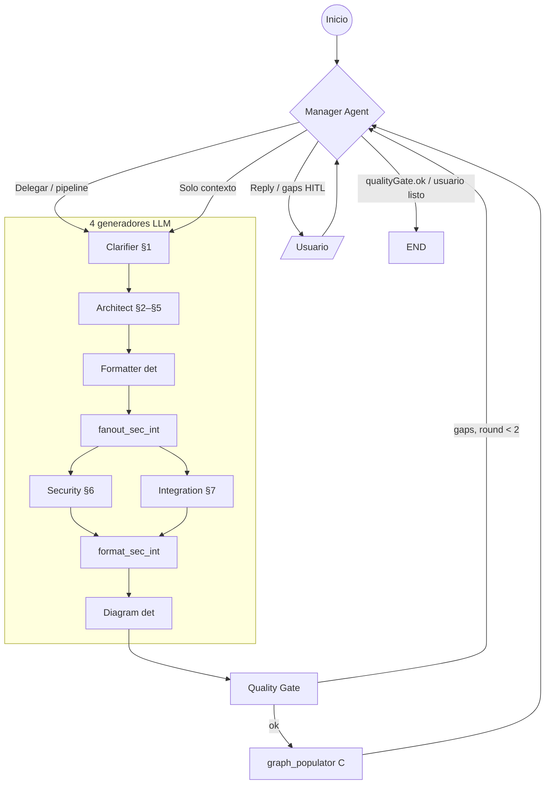

# AiAnalysisModule

Módulo de análisis agentic para **Domain Benchmark & Gap Analysis (DBGA)**. Orquesta agentes especializados (LangGraph) para investigar, scrapear y sintetizar datos de mercado a partir de una idea de usuario.

## Estructura

- **state/** – Estado compartido LangGraph (tipado estricto)
  - `dbga-state.schema.ts` – Schemas Zod y tipos: `CompetitorData`, `DBGAStatus`, `DBGAState`
  - `langgraph-state.annotation.ts` – Anotación LangGraph `DBGAStateAnnotation` para `StateGraph`
  - `index.ts` – Re-export
- **llm/** – `create-dbga-llm.ts` – Runtime BYOK/tenant del usuario. Tres factories por tier: `createDbgaLLM` (**C**, `chatModel`), `createGraphLLM` (**B**, `graphChatModel`), `createArchitectLLM` (**A**, `architectChatModel`). Fallback: architect → graph → chat. Perfiles de salida: **langgraph 16K** (nodos MDD/DBGA), **auditor 8K** (`createMddAuditorLLM`, solo auditoría manual). `auditorChatModel` deprecado; migrado a `graphChatModel`.
- **graph/** – `dbga-graph.ts` – StateGraph compilado; edges Scout → Auditor → Critic → (Scout | Synthesis) → END
- **nodes/** – Nodos por agente: Scout (con tools), Auditor (con tools), Critic, Synthesis
- **tools/** – ToolRegistry e integración externa
  - `tool-registry.ts` – `getScoutTools()` (Tavily + scrape_url), `getAuditorTools()` (scrape_url), `getAgenticRagToolset()` (SDD: Cypher lectura + supervisor + patch secciones + `propose_mdd_amendment`; TheForge legacy opcional)
  - `graph-memory/graph-memory.service.ts` – ingesta SDD por **Stage**: nodos `Stage`, `MDD_Section`, `DB_Entity`, `API_Endpoint`, relaciones `CONSUMES` / `IMPLEMENTS` (vía `syncMddToGraph` + `activeStageId` en el estado MDD)
  - `agent-sdd-tools.ts` – `query_sdd_graph` (Cypher lectura), `patch_mdd_section` (secciones 1–7)
  - `agent-theforge-tools.ts` – `ask_codebase`, `get_modification_plan`, `validate_before_edit`, `get_file_content`, `get_legacy_impact`, … (fijadas a `theforgeProjectId`); subconjunto **Arquitecto MDD** (`getMddArchitectTheForgeTools`): `get_contract_specs`, `get_implementation_details`, `get_legacy_impact`
  - `tavily.tool.ts` – Búsqueda web para Scout (`TAVILY_API_KEY`)
  - `scrape-cheerio.tool.ts` – Scrape URL → markdown + metadata (Cheerio + fetch; sin API key)
- **prompts/** – Prompts por dominio: `benchmark/` (scout, auditor, critic, synthesis), `mdd/` (clarifier, security-architect, integration-engineer, auditor; **esqueleto constitución YAGNI:** `prompts/mdd/mdd-constitution-skeleton.md` + `prompts/mdd/README.md`); `load-prompts.ts` carga desde subcarpetas (`MDD_CONSTITUTION_SKELETON_MARKDOWN`)
- **utils/** – Utilidades compartidas: `parse-json.ts` (`parseJsonOrThrow`) usada por nodos MDD; homologable con Benchmark sin cambiar su comportamiento
- **ai-analysis.service.ts** – Orquestación; `startAnalysis(idea)` invoca el grafo; `streamAnalysis(idea, projectId)` emite progreso + markdown final y, si hay `projectId`, **inferencia LLM de `complexity`** (`DiscoveryService.inferComplexity`) + `PATCH` del proyecto antes del evento `done`.
- **estimation/** – Estimación en vivo independiente del flujo de agentes
  - `estimation.types.ts` – `MDDReference`, `MDDContext`, `LiveMetricsResult` (`roles` / `rolesHours` dinámicos, `readinessHints` para UI Workshop), `PrecisionBreakdown` (con `sectionStatus` opcional para "Estado Inconsistente"), tarifas y umbrales (Rojo &lt;50%, Amarillo 51–94%, Verde 95%+)
  - `estimation.service.ts` – métricas en vivo; **trazabilidad BRD→MDD** (`consistency.util.ts` busca capacidades/UAT del BRD en §1/§4/§5 del MDD); hints separados `mddReadinessHints` vs `traceabilityHints`; snapshot en `Stage.shortTermContext.mddAuditSnapshot`.
- **ai-analysis.controller.ts** – `GET /ai-analysis/estimation?projectId=` y opcional `&stageId=` (MDD de esa etapa; sin param, etapa primaria); `POST /ai-analysis/estimation` body puede incluir `stageId`; `clear-draft` igual. `POST /ai-analysis/start` con body `{ idea, projectId? }`; `POST /ai-analysis/stream` (DBGA); `GET /ai-analysis/mdd/thread?projectId=&stageId=` — `threadId` del Manager por etapa (`AgentStateCheckpoint` único por `projectId` + `mddStageId`). `POST /ai-analysis/mdd/stream` body opcional `stageId` (borrador en vivo / checkpoint alineados a la etapa); `mdd/stream/manager` y `mdd/stream/regenerate-section` igual; `mdd/stream/resume` resuelve etapa desde el checkpoint. **`mdd/stream/manager`** y **`mdd/stream/resume`** aceptan `images` (mismo formato que chat: `parseChatImageAttachments`); el servicio fusiona visión vía `AiService.describeImagesForMddPipeline` en `lastUserMessage`. NDJSON: `progress` / `done` / `error`
- **state/state-to-markdown.ts** – `stateToMarkdown(state)` genera el documento markdown final del DBGA; `getAgentLabel(nodeName, context?)` para etiquetas de agentes DBGA y MDD
- **graph-memory/** – FalkorDB (`FALKORDB_SDD_URL`): `graph-memory.service.ts` (`syncMddToGraph`, `evaluateSddDependencyHealth` vía Cypher, `querySddGraphReadOnly`); `graph-memory.module.ts` exporta el servicio para `EngineModule` / pipeline de MDD sin ciclo con `ProjectsModule`
- **sdd-ingestor.service.ts** – Parsea MDD markdown → estructurado y sincroniza el grafo (lo dispara `AiOrchestratorService` tras chat/stream si el MDD cambió)
- **ai-analysis.module.ts** – Módulo NestJS

## Flujo MDD (Master Design Document)

El MDD generado actúa como **Constitución del proyecto** (SDD): gobierna los entregables (Blueprint, Contratos, Infra) y debe ser validado contra ellos (checklist de cumplimiento en prompts).

Pipeline **lean** de 4 generadores LangGraph + Quality Gate para generar el MDD a partir del Benchmark & Gap Analysis:

- **state/** – `mdd-state.schema.ts`, `mdd-state.annotation.ts`, `mdd-structured.schema.ts` – Estado: `dbgaContent`, `clarifiedScope`, `mddStructured`, `mddDraft`, `qualityGate` (`{ ok, blockers, gaps[] }`), `managerRound`, `mddPlan`, …
- **graph/mdd-graph.ts** – Dos variantes:
  - **`createMddGraph`** (one-shot): Clarifier → Architect → Formatter → (Security ∥ Integration) → Formatter → Diagram → Quality Gate → GraphPopulator → END.
  - **`createMddGraphWithManager`** (Workshop): START → Manager → generadores → … → Quality Gate → GraphPopulator → Manager. **Orquestación:** (1) Usuario pide solo "contexto y alcance" → `delegateTarget=clarifier_only`; tras Clarifier, **merge_section1_only** → END. (2) Usuario describe una **necesidad** en lenguaje de dominio → Manager infiere `sectionsToRun` y ejecuta solo esos nodos. (3) Pipeline completo → Clarifier → … → Quality Gate → Manager. **Perf:** Security + Integration corren en **paralelo** vía `fanout_sec_int` (sin nodo `security_integration`). El nodo **`graph_populator`** sincroniza a FalkorDB de forma **fire-and-forget** (tier C). **Diagram Injector**: deriva el erDiagram del SQL y reemplaza bloques ER del LLM en §3. **Manager delgado**: absorbe `ask_initial_topic` y `plan_approval`; sin executor 8-step ni loop auditor/delivery_gate.
- **Debug §3:** Si `DEBUG_MDD_SECTION3=1` (o `true`), en consola se loguea el cuerpo de §3 tras el Software Architect y al emitir el evento "done".
- **nodes/** – `mdd-manager.node.ts`, `mdd-clarifier.node.ts`, `mdd-software-architect.node.ts`, `mdd-security.node.ts`, `mdd-integration.node.ts`, `mdd-formatter.node.ts`, `mdd-format-sec-int.node.ts`, `mdd-diagram-injector.node.ts`, `mdd-quality-gate.node.ts`, `mdd-graph-populator.node.ts`, `mdd-merge-section1.node.ts`. **Eliminados del grafo lean:** redactor, frontend-architect, architect_critic, blackboard, cross_consistency, llm_formatter, security_integration, executor, plan_approval, ask_initial_topic, prepare_output. **`mdd-auditor.node.ts`** se conserva solo para `MddManualAuditService`.
- **nodes/integration-agent.node.ts** – **IntegrationAgent** (redactor Plan-then-Execute, *no* es nodo del StateGraph MDD): `runIntegrationAgent(...)` toma los items NEW-LEG, sondea el grafo LEGACY por item en paralelo (`ask_codebase` dirigido + `semantic_search` con keywords de dominio + `validate_before_edit`) y redacta `handoff-spec.md` contra MDD §3/§4. Lo orquesta `IntegrationAgentService` (`projects/integration/integration-agent.service.ts`). **utils/integration-intent.util.ts** – `detectLegacyIntegrationIntent` (hook preparado del Manager: sugiere «Sincronizar Especificación de Handoff» sin crear dependencia circular).
- **utils/mdd-diagram-suggestions.ts** – `suggestMddDiagrams(draft)` (reglas: CREATE TABLE → erDiagram; login/auth → stateDiagram-v2; componentes frontend → flowchart), `injectMddDiagrams(draft, suggestions)`. **`utils/mdd-component-diagram.util.ts`** – `injectProposedComponentDiagramIntoSection2(draft)`: diagrama Mermaid determinista en §2 (`### Diagrama de componentes propuesto`) a partir del stack §2, tablas §3 y endpoints §4; integrado en `prepareMddForOutput` y `mdd-diagram-injector.node.ts`. Desactivar: `MDD_PROPOSED_COMPONENT_DIAGRAM=0`. **tools/mdd-tools.ts** – `suggest_mdd_diagrams` (tool para agentes que quieran consultar sugerencias).
- **prompts/mdd/** – `manager-prompt.md`, `clarifier-prompt.md`, `clarifier-questions-only-prompt.md`, `software-architect-prompt.md`, `security-architect-prompt.md`, `integration-engineer-prompt.md`, `auditor-prompt.md`. (Frontend: cubierto por software_architect en §2; `frontend-architect-prompt.md` existe pero el nodo ya no está en el pipeline.) **render/** – `mdd-structured-to-markdown.ts`: única fuente de markdown desde `mddStructured` (json2md). **utils/** – `mdd-merge-structured.ts` (merge de slices), `mdd-markdown-to-structured.ts` (opcional: checkpoints viejos).

### Diagrama del flujo lean (con Manager)

**Notas de implementación:**

- **Estimador** no es un nodo del grafo: es `EstimationService` (setLiveDraft en cada paso del stream). Los **gaps** los produce el **Quality Gate** (`qualityGate.gaps`, `blockers`); el Manager enruta correcciones vía `mdd-manager-routing.util`. Máx. **2 rondas** Manager → generador (`MAX_MDD_ITERATIONS=2`). Sin umbrales 85/90 ni `delivery_gate` loop.
- **Manager delgado:** absorbe `ask_initial_topic` (pregunta inicial si no hay Bench/MDD) y `plan_approval` (HITL); sin executor 8-step.
- **Modificación puntual:** el Manager puede delegar directo a Clarifier o a `sectionsToRun` parcial.
- **Comandos / en el chat (solo tab MDD):** El usuario puede escribir `/` para ver la lista de secciones del MDD y elegir regenerar **solo esa sección** (el resto del documento se usa como contexto). Backend: `POST /ai-analysis/mdd/stream/regenerate-section` con `{ projectId, section: 1–7, mddContent? }`. §1 → solo agente **sintetizador de contexto** (regenera §1 desde §2–§7, sin ejecutar Clarifier ni el resto del grafo); 2–5 → Software Architect; 6 → Security; 7 → Integration. El mensaje no es obligatorio que sea un comando: si escribe texto normal (ej. rutas `/api/v1`) se envía al Manager con normalidad.
- **Servicio** – `streamMddAnalysis(dbgaContent, projectId?, stageId?)` emite progreso por nodo y al final `done` con el markdown del MDD. Usa `recursionLimit` (default 25; `LANGGRAPH_RECURSION_LIMIT` en env, 10–500). Máx 2 ciclos de corrección (`MAX_MDD_ITERATIONS=2`). El grafo compila con `TheForgeService` para que el **Arquitecto** en proyectos legacy reciba herramientas MCP adicionales. Durante el stream actualiza `EstimationService.setLiveDraft` para métricas en vivo. SSE incluye alias `qualityGate` (y campos legacy `auditor`/`deliveryGate` una release).
- **Frontend** – En Paso 0 (Benchmark), botón "Generar MDD con agentes" llama a `POST /ai-analysis/mdd/stream`. La columna derecha consume `GET /ai-analysis/estimation?projectId=`. "Generar Entregables" se habilita cuando el snapshot Quality Gate / semáforo está en verde. Chat `direct_edit` en tab MDD delega a job de sección (`workshopStore` + `pollMddJob`).

### Contrato por paso (Specification-driven)

Cada agente recibe un **contrato explícito** para su paso: qué sección(es) debe cumplir y qué directiva del usuario aplicar. La directiva se inyecta como **ACCIÓN REQUERIDA** (prioridad máxima cuando afecta a la sección del agente). Matriz: Clarifier → §1; Software Architect → §2–§5; Security → §6; Integration → §7. Si `acceptedProposalDirective` afecta §6 (seguridad, MFA, RBAC, etc.) o §7 (infraestructura, Docker, CI/CD), Security e Integration reciben además un bloque "Prioridad (léelo primero)". El Arquitecto de Software tiene prioridad inviolable para §3/§4 cuando el usuario pide cambios en modelo de datos o contratos. Ver [docs/notebooklm/MDD-PATRONES-FLUJO.md](../../../../docs/notebooklm/MDD-PATRONES-FLUJO.md) para el mapa completo de patrones.

### Patrón Manager + Quality Gate

El flujo MDD lean es **Manager delgado + 4 generadores + Quality Gate**, no Planner–Executor en sentido estricto. Ver [docs/archive/plan-mdd-planner-executor.md](../../../../docs/archive/plan-mdd-planner-executor.md) para el diagnóstico histórico.

- **Qué tenemos:** Manager sin herramientas (orquesta, no ejecuta); interpreta intención y delega a generadores; plan explícito `mddPlan` con goals por paso; HITL con gaps del Quality Gate y `acknowledgeGaps`; routing de correcciones vía `mdd-manager-routing.util`. Sin executor 8-step, architect_critic ni delivery_gate loop.
- **Migración:** ver [docs/notebooklm/mdd-lean-migration.md](../../../../docs/notebooklm/mdd-lean-migration.md).

## Estado (DBGAState)

- `rawIdea: string` – Idea de usuario
- `competitors: CompetitorData[]` – Del Research Agent (Market Scout); cada competidor con `url` verificada
- `techStackInsights: string[]` – Del Tech Agent (Tech Auditor)
- `userPainPoints: string[]` – Del Voice Agent
- `gapAnalysis: string` – Del Synthesis Agent
- `status: "idle" | "researching" | "analyzing" | "finalizing"`

## Roadmap

1. **Boilerplate + State** – Hecho
2. **LangGraph** – Hecho: `StateGraph` en `graph/dbga-graph.ts`, nodos en `nodes/` (Scout → Auditor → Critic → Synthesis). Critic tiene arista condicional a Scout (re-research) o Synthesis. Prompts en `prompts/`.
3. **Tools** – Hecho: ToolRegistry en `tools/`. Scout usa TavilySearch + scrape_url (Cheerio); Auditor usa scrape_url. Nodos con loop agentic (bindTools + tool_calls). Env: `TAVILY_API_KEY` (opcional para búsqueda); scrape con Cheerio sin API key.
4. **Modelo agnóstico** – Hecho: `createDbgaLLM()` usa `resolvePrimaryChatRuntime()` → OpenRouter + `ChatOpenAI` (`baseURL` OpenRouter). Nodos tipados con `BaseChatModel`.
5. **Integración Workshop** – `POST /ai-analysis/stream` con body `{ idea, projectId }` devuelve stream NDJSON: eventos `{ type: "progress", agent, message }`, `{ type: "done", markdown }`, `{ type: "error", message }`. El frontend (Workshop) consume el stream, muestra el progreso de agentes en el chat y persiste el markdown final en `project.dbgaContent`.
6. **Memoria persistente** – (1) Checkpointer: PostgresSaver en `checkpoint/checkpointer.service.ts`; tabla `AgentStateCheckpoint` (threadId por proyecto). Invocar con `projectId` para retomar Fase 0. (2) Memoria semántica: `POST /ai/preferences/learn-from-mdd` guarda preferencias; se inyectan en Scout y en el Master Prompt (HISTORIAL_DE_APRENDIZAJE).

## Referencia

Ver [docs/notebooklm/ai-agents-dbga.md](../../../../docs/notebooklm/ai-agents-dbga.md).
