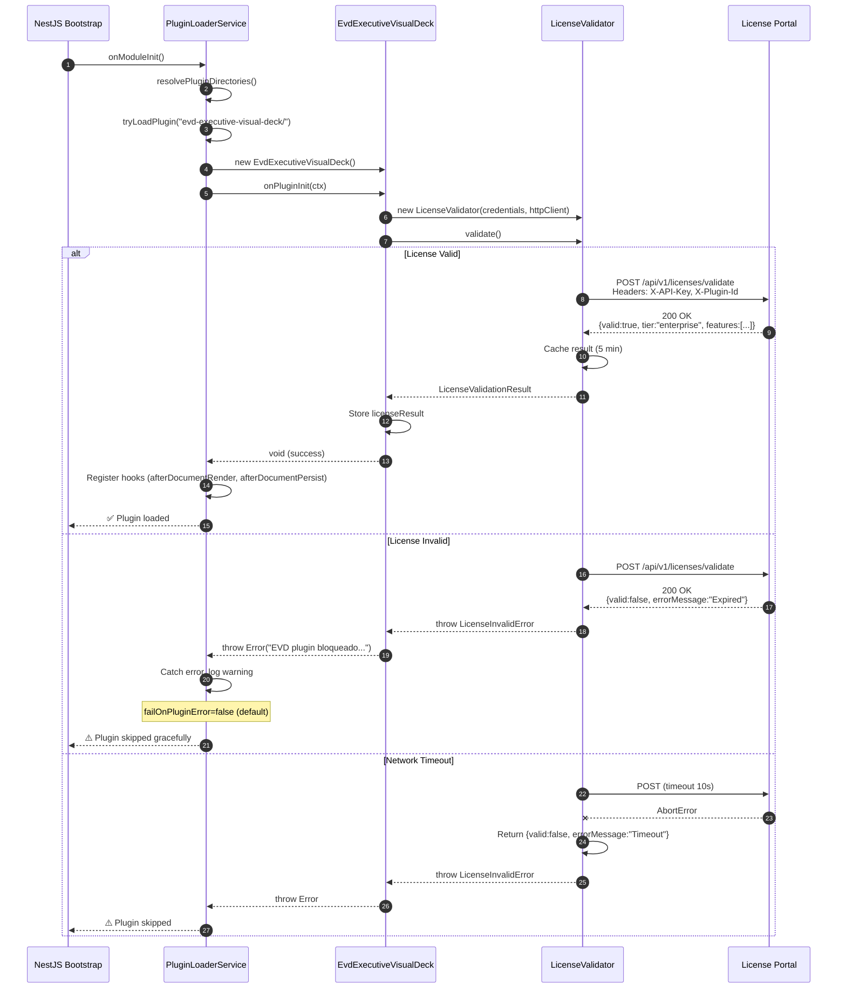
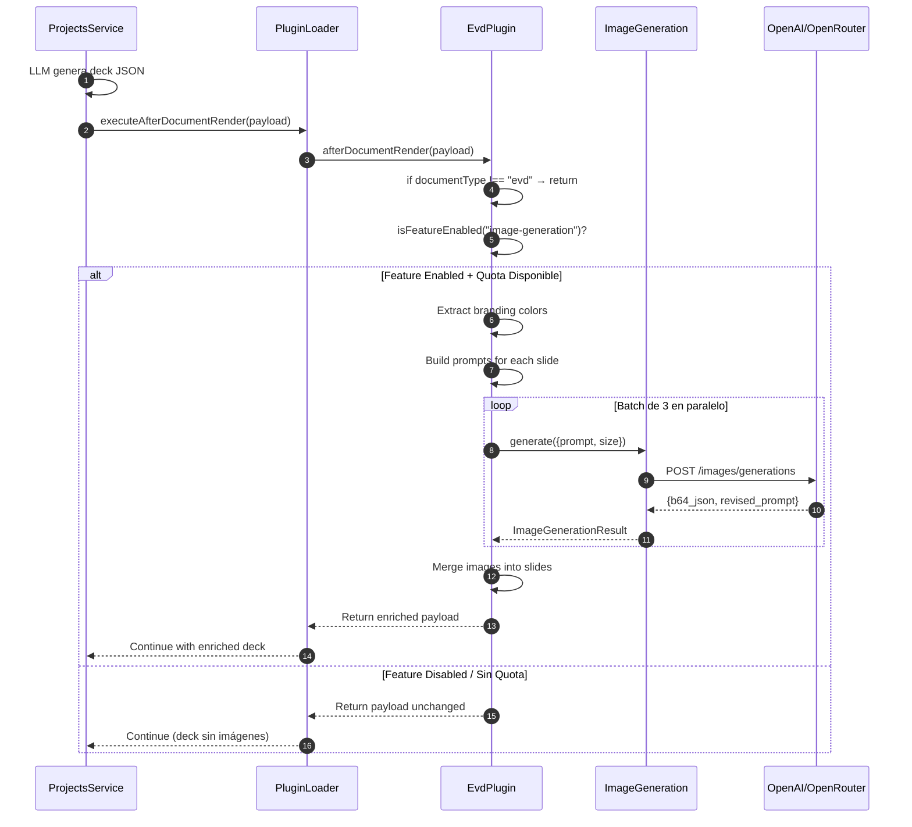

# Arquitectura del Plugin Comercial: Executive Visual Deck (EVD)

**Versión:** 1.0.0  
**Estado:** Implementación Completa — Fase 3: Desacoplamiento  
**Autor:** Arquitecto de Software Senior  
**Fecha:** 2026-07-13

---

## 1. Visión General

El **Executive Visual Deck (EVD)** es el primer plugin comercial 100% desacoplado del core de The Forge. Implementa:

- **Arquitectura de Plugins (DI + Hooks)**: Comunicación con el core vía `ITheForgePlugin` — cero imports estáticos hacia el core.
- **Control de Acceso por Licencia**: Validación en caliente contra portal externo. Sin licencia = graceful skip.
- **Servicios Autocontenidos**: Sistema de diseño, generación de imágenes con IA (OpenAI + OpenRouter), exportación PDF/PPTX.
- **Distribución Independiente**: Paquete npm privado con `peerDependencies` del core.

```mermaid
flowchart TB
    subgraph Core["🗿 The Forge Core"]
        PL[PluginLoaderService]
        PS[ProjectsService]
        AI[AIService]
    end

    subgraph Plugin["📦 @theforge/evd-executive-visual-deck"]
        EP[EvdExecutiveVisualDeck]
        LV[LicenseValidator]
        IS[EvdImageGenerationService]
        DS[DesignSystem]
        PDF[EvdPdfService]
    end

    subgraph Portal["🔐 Portal de Licencias"]
        API[/api/v1/licenses/validate\]
    end

    PL -->|dynamic import| EP
    EP -->|POST X-API-Key| API
    API -->|{valid, tier, features}| EP
    PS -->|executeAfterDocumentRender| PL
    PL -->|afterDocumentRender| EP
    EP -->|Generar prompts| IS
    IS -->|Fetch| AI
    EP -->|buildTheme| DS
    EP -->|generatePDF| PDF
```

---

## 2. Principios Arquitectónicos

| Principio | Implementación |
|-----------|---------------|
| **Inversión de Dependencias** | El plugin depende de la abstracción `ITheForgePlugin`, no del core concreto |
| **Zero Static Imports** | `PluginLoader` usa `await import()` — el core nunca referencia clases del plugin en tiempo de compilación |
| **Fail Graceful** | Si el plugin falla (licencia inválida, error, etc.), el core continúa sin él |
| **Autocontenido** | Toda la lógica de negocio vive en el paquete del plugin. Sin código EVD en el core |
| **Monetización por Feature Flag** | Cada feature (`image-generation`, `pdf-export`, etc.) se valida contra la licencia |

---

## 3. Estructura de Paquete

```text
packages/evd-executive-visual-deck/
├── src/
│   ├── core/
│   │   ├── plugin-sdk.ts              ⭐ Contrato con el core (ITheForgePlugin + payloads)
│   │   └── license-validator.ts     🔐 Cliente HTTP del portal de licencias
│   ├── services/
│   │   ├── image-generation.service.ts   📸 OpenAI + OpenRouter con fallback
│   │   ├── design-system.ts              🎨 Sistema de diseño + utilidades de color
│   │   ├── pdf.service.ts                📄 Renderizado HTML → PDF (puppeteer)
│   │   └── chart.service.ts (STAGE 2)    📊 ECharts SSR → SVG
│   ├── types/
│   │   └── evd-types.ts                🏷️ Tipos de slides, branding, charts
│   ├── evd-plugin.ts                  🎯 Implementación principal (afterDocumentRender)
│   └── index.ts                        🚪 Entry point (export default)
├── dist/                               📦 Salida de tsc
├── package.json                        📋 peerDependencies + scripts
├── tsconfig.json                       ⚙️ TypeScript config
├── README.md                           📖 Documentación del plugin
└── LICENSE.md                          ⚖️ Licencia comercial
```

---

## 4. Flujo de Validación de Licencia

### 4.1 Secuencia de Inicialización



### 4.2 Estructura de la Petición HTTP

```http
POST /api/v1/licenses/validate HTTP/1.1
Host: licenses.theforge.dev
Content-Type: application/json
X-Plugin-Id: evd-executive-visual-deck
X-API-Key: tk_prod_xxxxxxxxxxxx

{
  "apiKey": "tk_prod_xxxxxxxxxxxx",
  "pluginId": "evd-executive-visual-deck",
  "timestamp": "2026-07-13T12:00:00Z"
}
```

### 4.3 Respuesta del Portal

```typescript
interface LicenseValidationResult {
  valid: boolean;                    // true = licencia activa
  tier: "personal" | "team" | "enterprise";
  expiresAt: "2026-12-31T23:59:59Z"; // ISO 8601
  features: string[];                // features habilitadas
  usage?: {
    rendersThisMonth: number;
    rendersLimit: number;            // -1 = ilimitado
  };
  errorMessage?: string;             // solo si valid=false
}
```

---

## 5. Arquitectura de Hooks

### 5.1 Hook: `afterDocumentRender`



### 5.2 Decisiones de Diseño por Slide Type

| Slide Type | Background | Illustration | Style |
|-----------|------------|-------------|-------|
| `title` | ✅ Full-slide | ✅ Icono principal | `geometric` |
| `problem_statement` | ✅ Full-slide | ✅ Icono de problema | `organic` |
| `solution_vision` | ✅ Full-slide | ✅ Icono de solución | `minimal` |
| `process_flow` | ✅ Full-slide | ❌ (tiene diagrama) | `data-driven` |
| `automations` | ✅ Full-slide | ❌ (tiene chart) | `data-driven` |
| `cta` | ✅ Full-slide | ✅ Icono CTA | `geometric` |
| Otros | ✅ Full-slide | ❌ | `minimal` |

### 5.3 Proceso de Generación de Imágenes

```
┌──────────────┐     ┌──────────────┐     ┌────────────────────┐
│  EvdPlugin   │────▶│ decideStyle()│────▶│ LLM → JSON prompts  │
│ (per slide)  │     │  (heurística)│     │ background + illust │
└──────────────┘     └──────────────┘     └────────────────────┘
                                                   │
                           ┌───────────────────────┼───────────────┐
                           ▼                       ▼               ▼
                    ┌──────────────┐      ┌──────────────┐  ┌──────────────┐
                    │ Background   │      │ Illustration │  │ Fallback     │
                    │ 1792x1024    │      │ 1024x1024    │  │ (null)       │
                    └──────────────┘      └──────────────┘  └──────────────┘
                           │                       │               │
                           └───────────────────────┼───────────────┘
                                                   ▼
                                          ┌──────────────┐
                                          │ Merge to     │
                                          │ slide object │
                                          └──────────────┘
```

#### Prompt de Background (ejemplo):
```text
Professional title presentation slide background,
corporate modern style, clean minimal design,
non-photorealistic, abstract geometric patterns,
color palette: #2563EB, #1E40AF, #3B82F6,
soft gradients, no text, no logos,
high-end business aesthetic, subtle depth,
16:9 aspect ratio, 1792x1024
```

#### Prompt de Illustration (ejemplo):
```text
Minimal line-art illustration for title business slide,
corporate iconography style, flat design,
non-photorealistic, clean shapes,
color accents: #2563EB, #3B82F6,
no text, no labels, abstract representation,
neutral light background
```

---

## 6. Sistema de Diseño

### 6.1 Generación de Paleta desde Brand Color

```typescript
// buildTheme() — Genera tema completo desde branding parcial
const theme = buildTheme({
  primaryColor: "#2563EB",
  secondaryColor: "#1E40AF",
  accentColor: "#3B82F6",
  highlightColor: "#F59E0B",
  bgColor: "#F8FAFC",
  textColor: "#1E293B",
  fontFamily: "Inter, system-ui, sans-serif",
});

// theme.palette.primary → ["#2563EB", "#3B82F6", "#60A5FA", "#93C5FD", "#BFDBFE"]
// theme.gradients.hero → linear-gradient(135deg, #2563EB 0%, #1E40AF 50%, #3B82F6 100%)
```

### 6.2 Utilidades de Color

| Función | Input | Output |
|---------|-------|--------|
| `lighten(hex, 0.2)` | `#2563EB` | `#6B9AFA` |
| `darken(hex, 0.2)` | `#2563EB` | `#1E4FBC` |
| `generatePalette(hex)` | `#2563EB` | `Array<5 shades>` |

### 6.3 CSS para Exportación PDF

```css
@page { size: A4 landscape; margin: 0; }
.slide {
  width: 297mm; height: 210mm;
  position: relative; overflow: hidden;
}
.slide-bg { position: absolute; inset: 0; z-index: 0; }
.slide-bg-overlay { 
  position: absolute; inset: 0; z-index: 1; 
  background: rgba(255,255,255,0.92); 
}
.slide-content { position: relative; z-index: 2; }
```

---

## 7. Control de Tier y Monetización

### 7.1 Feature Flags por Tier

```typescript
const TIER_FEATURES = {
  personal: ["image-generation"],
  team: ["image-generation", "premium-templates", "pdf-export"],
  enterprise: [
    "image-generation",
    "premium-templates", 
    "pdf-export",
    "pptx-export",
    "unlimited-renders"
  ],
};
```

### 7.2 Flujo de Monetización

```mermaid
flowchart LR
    subgraph Free["🆓 Sin Licencia"]
        F1[Modo demo]
        F2[Watermark visible]
        F3[Solo backgrounds básicos]
    end

    subgraph Personal["👤 Personal ($9/mo)"]
        P1[image-generation]
        P2[10 renders/mes]
        P3[Standard templates]
    end

    subgraph Team["👥 Team ($29/mo)"]
        T1[image-generation]
        T2[premium-templates]
        T3[pdf-export]
        T4[100 renders/mes]
    end

    subgraph Enterprise["🏢 Enterprise ($99/mo)"]
        E1[Todas las features]
        E2[pptx-export]
        E3[unlimited-renders]
        E4[API access]
        E5[White-label]
    end

    Free -->|Upgrade| Personal
    Personal -->|Upgrade| Team
    Team -->|Upgrade| Enterprise
```



### 7.3 Lógica de `isFeatureEnabled()`

```typescript
private isFeatureEnabled(feature: string): boolean {
  if (!this.licenseResult) {
    // Sin licencia = solo demo features
    return ["image-generation"].includes(feature);
  }
  return this.licenseResult.features.includes(feature);
}
```

---

## 8. Conexión al Core

### 8.1 Dependencias (peerDependencies)

```json
{
  "peerDependencies": {
    "@nestjs/common": "^10.0.0",
    "@nestjs/core": "^10.0.0",
    "pptxgenjs": "^4.0.0",
    "echarts": "^5.0.0",
    "puppeteer-core": "^24.0.0"
  }
}
```

### 8.2 Contrato: `ITheForgePlugin`

```typescript
export interface ITheForgePlugin {
  readonly id: string;        // "evd-executive-visual-deck"
  readonly version: string;   // "1.0.0"
  readonly name: string;      // "Executive Visual Deck"
  readonly description: string;

  onPluginInit(context: PluginContext): Promise<void>;
  onPluginDestroy?(): Promise<void> | void;
  
  beforeDocumentRender?(payload): Promise<BeforeDocumentRenderPayload>;
  afterDocumentRender?(payload): Promise<AfterDocumentRenderPayload>;
  afterDocumentPersist?(payload): Promise<void>;
  
  onProjectCreate?(payload): Promise<void>;
  onProjectUpdate?(payload): Promise<void>;
}
```

### 8.3 Payload: `AfterDocumentRenderPayload`

```typescript
interface AfterDocumentRenderPayload {
  documentType: "evd";     // El plugin filtra por esto
  projectId: string;
  rawContent: string;       // JSON crudo del LLM
  parsedContent: EvdDeck;   // Deck parseado
  originalContext: BeforeDocumentRenderPayload;
}
```

---

## 9. Manejo de Errores

### 9.1 Matriz de Errores

| Escenario | Acción | Impacto en Core |
|-----------|--------|-----------------|
| Licencia inválida | Lanza `LicenseInvalidError` | Plugin skipped, core continúa |
| Licencia vencida | Lanza `LicenseInvalidError` | Plugin skipped, core continúa |
| Timeout en portal | Lanza `LicenseInvalidError` | Plugin skipped, core continúa |
| Error en generación de imgs | Log warning, continúa | Deck sin imágenes (degraded) |
| Error en generación de PDF | Log warning, continúa | Sin pre-cache de PDF |
| Cuota agotada | Log warning, retorna payload | Deck sin nuevas imágenes |

### 9.2 Estrategia de Fallback

```typescript
// En el hook afterDocumentRender:
try {
  const enrichedSlides = await this.generateAllImages(slides, colors);
  return { ...payload, parsedContent: { ...deck, slides: enrichedSlides } };
} catch (err) {
  // Si falla generación de imágenes, retornar payload original
  this.logger.warn(`Generación de imágenes falló: ${err}`);
  return payload;  // Core recibe deck sin imágenes
}
```

---

## 10. Distribución

### 10.1 Como Paquete npm Privado

```bash
# Publicar en registro privado
npm publish --access restricted --registry https://npm.theforge.dev

# Instalar en el core
pnpm add @theforge/evd-executive-visual-deck \
  --registry https://npm.theforge.dev
```

### 10.2 Como Git Submodule

```bash
# En el repo del core
git submodule add \
  https://github.com/theforge/evd-executive-visual-deck.git \
  plugins-enabled/evd-executive-visual-deck
```

### 10.3 Como Directorio Copiado (Docker)

```dockerfile
# Dockerfile del core
FROM theforge/api-base:latest

# Copiar plugin desde build context
COPY plugins-enabled/evd-executive-visual-deck \
     /app/plugins-enabled/evd-executive-visual-deck

ENV EVD_LICENSE_KEY=${EVD_LICENSE_KEY}
ENV EVD_LICENSE_PORTAL_URL=https://licenses.theforge.dev
```

---

## 11. Roadmap

| Versión | Feature | Descripción |
|---------|---------|-------------|
| **v1.0** | MVP | Generación de backgrounds + validación de licencia |
| **v1.1** | Charts | Integración ECharts SSR para gráficos de datos |
| **v1.2** | PPTX | Exportación completa a PowerPoint (pptxgenjs) |
| **v1.3** | Mermaid | Renderizado de diagramas de flujo |
| **v1.4** | Analytics | Tracking de uso para billing |
| **v2.0** | Multi-tenant | Soporte de múltiples organizaciones |

---

## 12. Referencias

- [Plugin SDK](../apps/api/src/plugins/interfaces/the-forge-plugin.interface.ts)
- [Plugin Loader](../apps/api/src/plugins/plugin-loader.service.ts)
- [Plan EVD](../docs/PLAN_EVD.md)
- [Plan Monetización](../PLAN_EVD_MONETIZAR.md)

---

```
Copyright (c) 2026 The Forge Inc.
Licencia Comercial — Ver LICENSE.md
```
