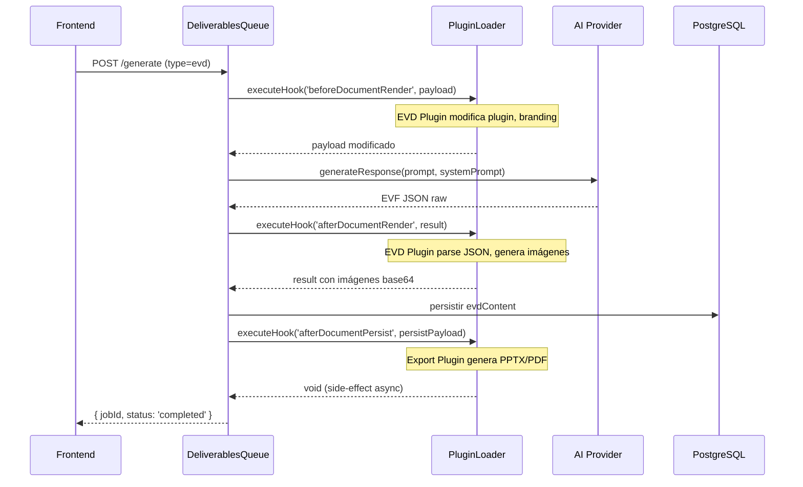

# The Forge — Sistema de Plugins Dinámicos
## Propuesta de Diseño Arquitectónico (REVISIÓN PENDIENTE)

> **Versión:** 1.0.0  
> **Autor:** Arquitecto de Software Senior  
> **Fecha:** 2026-07-13  
> **Rama:** `feat/evd-executive-visual-deck` (derivada de `master`)  
> **Estado:** 🟡 EN REVISIÓN — No implementar código hasta aprobación

---

## 1. Visión y Objetivos

### 1.1 Problema Actual
The Forge tiene lógica de negocio hardcodeada en el core (e.g., generación de EVD, PDFs, PPTX) que:
- **Acopla el core a funcionalidades comerciales** (monetización, export formats)
- **Impide la extensibilidad** sin modificar el código fuente del core
- **Viola el Principio de Responsabilidad Única** y la Inversión de Dependencias

### 1.2 Objetivo
Crear un **sistema de plugins dinámicos en runtime** que permita:
- Cargar funcionalidades comerciales como plugins independientes
- Que el core sea **100% agnóstico** a cualquier lógica de negocio específica
- Permitir hooks en el ciclo de vida de documentos/entregables
- Que el core permanezca **open source** mientras los plugins pueden ser privados

### 1.3 Alcance
Esta propuesta cubre:
- ✅ Interfaz de plugin (`ITheForgePlugin`)
- ✅ Cargador dinámico (`PluginLoaderService`)
- ✅ Hooks en el pipeline de entregables (spec, tasks, evd, etc.)
- ✅ Documentación para desarrolladores de plugins

No cubre (futuras iteraciones):
- 🔲 Plugin marketplace / registry
- 🔲 Hot-reload de plugins sin reiniciar
- 🔲 Sandbox/aislamiento de plugins (security)

---

## 2. Principios de Diseño (Non-Negotiable)

| Principio | Aplicación |
|-----------|-----------|
| **Inversión de Dependencias (DIP)** | El core depende de abstracciones (`ITheForgePlugin`), nunca de implementaciones concretas |
| **Open/Closed** | El core está cerrado a modificación, abierto a extensión vía plugins |
| **YAGNI** | Si no hay plugins, el core ejecuta sin overhead ni cambios de comportamiento |
| **Zero Static Imports** | Ningún import hardcodeado hacia lógica de plugins en el core |
| **100% Agnóstico** | El core no conoce "EVD", "PDF", "PPTX" — solo conoce "hooks" y "payloads" |

---

## 3. Interfaz del Plugin (`ITheForgePlugin`)

### 3.1 Contrato TypeScript

```typescript
/**
 * Ciclo de vida completo de un plugin The Forge.
 * Cada plugin es una clase que implementa esta interfaz.
 * El core nunca depende de implementaciones, solo de esta abstracción.
 */
export interface ITheForgePlugin {
  /** Identificador único del plugin. Ej: "evd-executive-visual-deck" */
  readonly id: string;

  /** Versión semántica del plugin. Ej: "2.1.0" */
  readonly version: string;

  /** Nombre legible para humanos. Ej: "Executive Visual Deck" */
  readonly name: string;

  /** Descripción de la funcionalidad que proporciona. */
  readonly description: string;

  // ─────────── Ciclo de Vida ───────────

  /**
   * Invocado una única vez cuando el PluginLoaderService detecta y carga el plugin.
   * Útil para inicializar recursos, validar configuración, registrar schemas.
   * @param context Contexto de inyección de dependencias de NestJS
   * @throws Si el plugin no puede inicializarse (ej: falta API key)
   */
  onPluginInit(context: PluginContext): Promise<void> | void;

  /**
   * Invocado cuando el plugin va a ser descargado o reemplazado.
   * Útil para limpiar recursos, cerrar conexiones, etc.
   */
  onPluginDestroy?(): Promise<void> | void;

  // ─────────── Hooks del Pipeline de Documentos ───────────

  /**
   * Hook: ANTES de que el LLM genere un documento/entregable.
   * Permite modificar el prompt, contexto, o anexar instrucciones adicionales.
   * @param payload Contexto completo de la generación
   * @returns Payload modificado
   */
  beforeDocumentRender?(
    payload: BeforeDocumentRenderPayload
  ): Promise<BeforeDocumentRenderPayload> | BeforeDocumentRenderPayload;

  /**
   * Hook: DESPUÉS de que el LLM devuelve un documento/entregable.
   * Permite post-procesar, enriquecer, validar o transformar el output.
   * @param payload Documento generado + contexto original
   * @returns Documento modificado
   */
  afterDocumentRender?(
    payload: AfterDocumentRenderPayload
  ): Promise<AfterDocumentRenderPayload> | AfterDocumentRenderPayload;

  /**
   * Hook: DESPUÉS de que un entregable se persiste en DB.
   * Útil para side-effects: export, notificación, analytics.
   * @param payload Documento persistido + metadatos
   */
  afterDocumentPersist?(
    payload: AfterDocumentPersistPayload
  ): Promise<void> | void;

  // ─────────── Hooks del Proyecto ───────────

  /**
   * Hook: Cuando se crea un nuevo proyecto.
   * Permite inicializar recursos, crear directorios, etc.
   */
  onProjectCreate?(
    payload: ProjectLifecyclePayload
  ): Promise<void> | void;

  /**
   * Hook: Cuando un proyecto es actualizado (post-save).
   */
  onProjectUpdate?(
    payload: ProjectLifecyclePayload
  ): Promise<void> | void;
}

// ─────────── Tipos de Payload ───────────

/**
 * Contexto de inyección de dependencias proporcionado por el core.
 * El plugin puede usar este contexto para resolver servicios del core.
 */
export interface PluginContext {
  /** Token de DI de NestJS para resolver servicios */
  getService: <T>(token: string | symbol) => T;
  /** Logger global del core */
  logger: Logger;
  /** Configuración del core (sin secretos) */
  config: Record<string, unknown>;
}

/**
 * Payload para beforeDocumentRender.
 */
export interface BeforeDocumentRenderPayload {
  /** Tipo de documento: 'spec' | 'tasks' | 'evd' | 'architecture' | ... */
  documentType: string;
  /** ID del proyecto */
  projectId: string;
  /** Prompt que se enviará al LLM */
  prompt: string;
  /** System prompt que se usará */
  systemPrompt: string;
  /** Contexto adicional: MDD, Blueprint, etc. */
  context: Record<string, string | null>;
  /** Runtime del LLM resuelto (provider, model, apiKey) */
  llmRuntime: UserLLMRuntime;
}

/**
 * Payload para afterDocumentRender.
 */
export interface AfterDocumentRenderPayload {
  /** Tipo de documento */
  documentType: string;
  /** ID del proyecto */
  projectId: string;
  /** Contenido raw generado por el LLM */
  rawContent: string;
  /** Contenido parseado/estructurado (si aplica) */
  parsedContent?: unknown;
  /** Contexto original enviado al LLM */
  originalContext: BeforeDocumentRenderPayload;
}

/**
 * Payload para afterDocumentPersist.
 */
export interface AfterDocumentPersistPayload {
  /** Tipo de documento */
  documentType: string;
  /** ID del proyecto */
  projectId: string;
  /** Contenido final persistido */
  finalContent: string;
  /** Metadatos de la generación */
  metadata: {
    durationMs: number;
    tokensUsed?: number;
    provider: string;
    model: string;
  };
}

/**
 * Payload para eventos de ciclo de vida del proyecto.
 */
export interface ProjectLifecyclePayload {
  projectId: string;
  projectName: string;
  /** Usuario que realizó la acción */
  userId: string;
  /** Timestamp */
  timestamp: Date;
}
```

### 3.2 Características Clave de la Interfaz

1. **Todas las funciones son opcionales** `(?)`: un plugin solo implementa los hooks que necesita
2. **Inmutabilidad por defecto**: los hooks reciben payload y devuelven nuevo payload
3. **No hay acceso directo a DB**: el plugin interactúa solo a través de los payloads
4. **Contexto limitado**: `getService` solo expone servicios que el core decide exponer

---

## 4. PluginLoaderService

### 4.1 Responsabilidad
Servicio de NestJS que:
1. Escanée un directorio configurado en busca de paquetes de plugin
2. Carga dinámicamente cada plugin vía `await import()`
3. Valida que el plugin implementa `ITheForgePlugin`
4. Inyecta el plugin en el ciclo de vida del core
5. Gestiona errores de forma graceful (YAGNI)

### 4.2 Diseño del Servicio

```typescript
@Injectable()
export class PluginLoaderService implements OnModuleInit {
  private readonly logger = new Logger(PluginLoaderService.name);
  private readonly plugins = new Map<string, ITheForgePlugin>();
  private readonly hooks = {
    beforeDocumentRender: [] as Array<ITheForgePlugin['beforeDocumentRender']>,
    afterDocumentRender: [] as Array<ITheForgePlugin['afterDocumentRender']>,
    afterDocumentPersist: [] as Array<ITheForgePlugin['afterDocumentPersist']>,
    onProjectCreate: [] as Array<ITheForgePlugin['onProjectCreate']>,
    onProjectUpdate: [] as Array<ITheForgePlugin['onProjectUpdate']>,
  };

  constructor(
    private readonly configService: ConfigService,
    private readonly moduleRef: ModuleRef,
  ) {}

  async onModuleInit(): Promise<void> {
    const pluginDirs = this.resolvePluginDirectories();
    
    for (const dir of pluginDirs) {
      if (!existsSync(dir)) continue;
      
      const entries = readdirSync(dir, { withFileTypes: true })
        .filter(e => e.isDirectory())
        .map(e => join(dir, e.name));
      
      for (const pluginPath of entries) {
        await this.tryLoadPlugin(pluginPath);
      }
    }

    this.logger.log(
      `PluginLoader: ${this.plugins.size} plugins cargados: ${[...this.plugins.keys()].join(', ')}`
    );
  }

  private async tryLoadPlugin(pluginPath: string): Promise<void> {
    try {
      const indexPath = join(pluginPath, 'index.js');
      if (!existsSync(indexPath)) return;

      // Dynamic import — el core NUNCA tiene static imports a plugins
      const module = await import(indexPath);
      
      // Soporta export default o export named
      const PluginClass = module.default ?? module.TheForgePlugin;
      
      if (!PluginClass || typeof PluginClass !== 'function') {
        this.logger.warn(`Plugin en ${pluginPath} no exporta una clase. Saltando.`);
        return;
      }

      const instance = new PluginClass() as ITheForgePlugin;
      
      // Validación mínima del contrato
      if (!instance.id || !instance.version) {
        this.logger.warn(`Plugin en ${pluginPath} no implementa id/version. Saltando.`);
        return;
      }

      // Contexto de inyección limitado
      const context: PluginContext = {
        getService: <T>(token: string | symbol) => this.moduleRef.get<T>(token),
        logger: new Logger(`Plugin:${instance.id}`),
        config: this.configService.get('plugins') ?? {},
      };

      // Inicialización
      await instance.onPluginInit(context);

      // Registro
      this.plugins.set(instance.id, instance);
      this.registerHooks(instance);

      this.logger.log(`✅ Plugin cargado: ${instance.name} v${instance.version} (${instance.id})`);
    } catch (err) {
      this.logger.error(
        `❌ Error cargando plugin ${pluginPath}: ${err instanceof Error ? err.message : String(err)}`
      );
      // FALLA GRACEFUL: el core continúa sin este plugin
    }
  }

  private registerHooks(plugin: ITheForgePlugin): void {
    if (plugin.beforeDocumentRender) {
      this.hooks.beforeDocumentRender.push(plugin.beforeDocumentRender.bind(plugin));
    }
    if (plugin.afterDocumentRender) {
      this.hooks.afterDocumentRender.push(plugin.afterDocumentRender.bind(plugin));
    }
    if (plugin.afterDocumentPersist) {
      this.hooks.afterDocumentPersist.push(plugin.afterDocumentPersist.bind(plugin));
    }
    if (plugin.onProjectCreate) {
      this.hooks.onProjectCreate.push(plugin.onProjectCreate.bind(plugin));
    }
    if (plugin.onProjectUpdate) {
      this.hooks.onProjectUpdate.push(plugin.onProjectUpdate.bind(plugin));
    }
  }

  // ─────────── API pública para el core ───────────

  async executeHook<T extends keyof typeof this.hooks>(
    hookName: T,
    payload: Parameters<NonNullable<(typeof this.hooks)[T][number]>>[0]
  ): Promise<Parameters<NonNullable<(typeof this.hooks)[T][number]>>[0]> {
    let currentPayload = payload;

    for (const handler of this.hooks[hookName]) {
      try {
        const result = await handler(currentPayload);
        if (result !== undefined) {
          currentPayload = result;
        }
      } catch (err) {
        this.logger.error(`Hook ${hookName} falló en plugin: ${err}`);
        // Falla graceful: continúa con el payload sin modificar
      }
    }

    return currentPayload;
  }

  getPluginCount(): number {
    return this.plugins.size;
  }

  getPlugin(id: string): ITheForgePlugin | undefined {
    return this.plugins.get(id);
  }
}
```

### 4.3 Configuración

```typescript
// apps/api/src/config/plugins.config.ts
export default () => ({
  plugins: {
    /** Directorios donde escanear plugins */
    directories: [
      process.env.THEFORGE_PLUGINS_DIR || '/app/plugins-enabled',
      resolve(process.cwd(), '../plugins-enabled'),
    ],
    /** Si true, falla el arranque si un plugin no puede cargarse */
    failOnPluginError: process.env.NODE_ENV === 'development',
  },
});
```

### 4.4 Estrategia de Carga

```
/plugins-enabled/
├── evd-executive-visual-deck/     ← Directorio del plugin
│   ├── index.js                    ← Entry point (export default class)
│   ├── package.json                ← Opcional: dependencias del plugin
│   └── assets/                     ← Recursos estáticos del plugin
└── premium-export-formats/
    ├── index.js
    └── ...
```

**Reglas:**
1. El servicio busca directorios en la ruta configurada
2. Cada directorio debe tener `index.js` (o `index.ts` si activa ts-node/register)
3. El `index.js` exporta **una clase** que implementa `ITheForgePlugin`
4. Si el directorio no tiene `index.js`, se ignora silenciosamente (YAGNI)

---

## 5. Integración con el Pipeline de Entregables

### 5.1 Punto de Inyección: `DeliverablesQueueService`

El pipeline actual de entregables es:
```
Request → Validaciones → LLM Call → Post-Proceso → Persistir en DB
```

Con plugins se convierte en:
```
Request → Validaciones → [Hook: beforeDocumentRender] → LLM Call → 
[Hook: afterDocumentRender] → Post-Proceso → Persistir → [Hook: afterDocumentPersist]
```

### 5.2 Código de Integración (pseudo)

```typescript
// En DeliverablesQueueService.runJob()
private async runJob(data: GenerateJobData, progressCb: ProgressCallback): Promise<Project> {
  // ... validaciones previas ...

  // 1. ANTES: Construir payload y permitir que plugins modifiquen
  let renderPayload: BeforeDocumentRenderPayload = {
    documentType: data.type,
    projectId: data.projectId,
    prompt: this.buildPrompt(data),
    systemPrompt: this.buildSystemPrompt(data),
    context: this.buildContext(data),
    llmRuntime: await this.resolveLLMRuntime(data.projectId),
  };

  renderPayload = await this.pluginLoader.executeHook('beforeDocumentRender', renderPayload);

  // 2. LLAMADA AL LLM
  const rawContent = await this.ai.generateResponse(
    renderPayload.prompt,
    renderPayload.systemPrompt,
    { /* options */ }
  );

  // 3. DESPUÉS: Permitir post-procesamiento por plugins
  let renderResult: AfterDocumentRenderPayload = {
    documentType: data.type,
    projectId: data.projectId,
    rawContent,
    parsedContent: this.tryParse(data.type, rawContent),
    originalContext: renderPayload,
  };

  renderResult = await this.pluginLoader.executeHook('afterDocumentRender', renderResult);

  // 4. PERSISTIR
  const finalContent = typeof renderResult.parsedContent === 'string' 
    ? renderResult.parsedContent 
    : JSON.stringify(renderResult.parsedContent);
    
  await this.persistDocument(data.type, data.projectId, finalContent);

  // 5. POST-PERSIST: Side-effects (export, notificación)
  await this.pluginLoader.executeHook('afterDocumentPersist', {
    documentType: data.type,
    projectId: data.projectId,
    finalContent,
    metadata: this.buildMetadata(data),
  });

  return this.projects.assertProjectAccess(data.projectId);
}
```

### 5.3 Diagrama de Flujo



---

## 6. Estructura de Directorios Propuesta

```
apps/api/src/
├── modules/
│   └── ... (módulos existentes)
├── plugins/
│   ├── core/                     ← Agnóstico, parte del open source
│   │   ├── interfaces/
│   │   │   └── the-forge-plugin.interface.ts
│   │   ├── plugin-loader.service.ts
│   │   ├── plugin.module.ts
│   │   └── types/
│   │       └── plugin-payloads.ts
│   └── registry.ts              ← Central export
├── plugins-enabled/             ← Carpeta montada para plugins de negocio
│   ├── evd-executive-visual-deck/
│   │   ├── index.js
│   │   ├── evd-pptx.service.ts  ← Refactorizado desde modules/evd/
│   │   ├── evd-pdf.service.ts
│   │   ├── evd-image-generation.service.ts
│   │   └── package.json
│   └── premium-export-formats/
│       ├── index.js
│       └── ...
└── app.module.ts                 ← Importa PluginModule
```

---

## 7. Refactorización del EVD a Plugin

### 7.1 Estrategia
El código EVD actual (`modules/evd/`) se convierte en el **primer plugin oficial**:

**Antes (hardcodeado en core):**
```
modules/evd/
├── evd-visual-stylist.service.ts
├── evd-image-generation.service.ts
├── evd-pptx.service.ts
├── evd-pdf.service.ts
└── ...
```

**Después (como plugin agnóstico):**
```
plugins-enabled/evd-executive-visual-deck/
├── index.ts                         ← Entry point, exporta la clase Plugin
├── src/
│   ├── evd-plugin.ts               ← Implementa ITheForgePlugin
│   ├── services/
│   │   ├── visual-stylist.service.ts
│   │   ├── image-generation.service.ts
│   │   ├── pptx-export.service.ts
│   │   └── pdf-export.service.ts
│   └── interfaces/
│       └── evd-slide.interface.ts
├── package.json
└── tsconfig.json
```

### 7.2 Flujo del Plugin (afterDocumentRender)

```typescript
// evd-plugin.ts
export class EvdPlugin implements ITheForgePlugin {
  readonly id = 'evd-executive-visual-deck';
  readonly version = '2.0.0';
  readonly name = 'Executive Visual Deck';
  readonly description = 'Genera presentaciones ejecutivas con IA coreografía visual';

  private imageGen!: ImageGenerationService;
  private visualStylist!: VisualStylistService;

  async onPluginInit(context: PluginContext): Promise<void> {
    // Resolve orchestrator service para acceder a AI
    const aiFactory = context.getService<AIFactory>('AIFactory');
    this.imageGen = new ImageGenerationService(aiFactory);
    this.visualStylist = new VisualStylistService(this.imageGen, aiFactory);
  }

  async afterDocumentRender(payload: AfterDocumentRenderPayload): Promise<AfterDocumentRenderPayload> {
    if (payload.documentType !== 'evd') return payload;

    const deck = JSON.parse(payload.rawContent);
    
    // Generar imágenes
    const images = await this.visualStylist.generateAllImages(
      deck.slides,
      deck.branding,
      payload.projectId,
    );

    // Inyectar imágenes en slides
    images.forEach((result, idx) => {
      deck.slides[idx].backgroundB64 = result.backgroundB64;
      deck.slides[idx].illustrationB64 = result.illustrationB64;
    });

    return {
      ...payload,
      parsedContent: deck,
    };
  }

  async afterDocumentPersist(payload: AfterDocumentPersistPayload): Promise<void> {
    // Side-effect: generar PPTX/PDF en background (async fire-and-forget)
    // El core nunca sabe que existe PPTX o PDF
  }
}
```

---

## 8. Análisis de Impacto

### 8.1 Qué cambia

| Componente | Antes | Después |
|-----------|-------|---------|
| Core API | 50+ líneas de lógica EVD hardcodeada | 0 líneas. Solo hooks genéricos |
| `DeliverablesQueue` | Conoce EVD como caso especial | Agnóstico. Ejecuta hooks |
| `ProjectsService` | `generateEvd()` método nativo | `afterDocumentRender` hook vía plugin |
| `Dockerfile` | Build incluye todo el monolito | Build del core + montaje de plugins en runtime |
| Testing | Pruebas EVD en suite del API | Pruebas EVD en suite del plugin |

### 8.2 Qué NO cambia

- ✅ Intefaz de usuario (frontend)
- ✅ Esquema de DB (evdContent sigue existiendo)
- ✅ API REST (mismo endpoint `/api/projects/:id/generate/evd`)
- ✅ Cola de BullMQ (mismo job type `evd`)

---

## 9. Roadmap de Implementación

### Fase 1: Foundation (2-3 días)
1. Crear `PluginModule` con interfaces y `PluginLoaderService`
2. Definir tipos de payload
3. Integrar hooks en `DeliverablesQueueService`
4. Tests unitarios del loader

### Fase 2: Refactor EVD a Plugin (3-4 días)
1. Crear directorio `plugins-enabled/evd-executive-visual-deck/`
2. Mover servicios desde `modules/evd/`
3. Implementar `EvdPlugin` que consume hooks
4. Validar E2E: generar EVD con plugin

### Fase 3: Cleanup (1 día)
1. Eliminar código EVD hardcodeado del core
2. Validar que core compila sin EVD
3. Documentación de la guía de plugins

---

## 10. Decisiones Pendientes

| # | Decisión | Opciones |
|---|----------|----------|
| 1 | **¿Plugins en proceso o proceso separado?** | A) Node.js `worker_threads` para aislamiento B) Mismo proceso (simpler) |
| 2 | **¿Plugins en JS compilado o TS on-the-fly?** | A) Pre-built JS (`tsc` antes de deploy) B) `ts-node/register` en runtime C) SWC/esbuild para JIT |
| 3 | **¿Persistencia de estado de plugin?** | A) Sin estado (stateless, puro) B) Key-val Redis por plugin C) Tabla `PluginState` en DB |
| 4 | **¿Sandbox de seguridad?** | A) Sin sandbox (confiar en plugins propios) B) `vm2` C) `isolated-vm` (más seguro, más lento) |
| 5 | **¿Hot-reload sin reiniciar?** | A) Reiniciar contenedor tras cada deploy de plugin B) File watcher + reload dinámico |

**Recomendación del arquitecto:**
- Decisión 1: **Opción B** (mismo proceso) — simple, sin overhead
- Decisión 2: **Opción A** (pre-built JS) — más robusto, menos dependencias en runtime
- Decisión 3: **Opción A** (stateless) — plugins gestionan su propio estado si lo necesitan
- Decisión 4: **Opción A** (sin sandbox) — asumir que plugins son de nuestra organización
- Decisión 5: **Opción A** (reiniciar contenedor) — más predecible, kubernetes-style

---

## 11. Métricas de Éxito

| Métrica | Target |
|---------|--------|
| Tiempo carga de plugins | < 500ms en frío |
| Overhead por hook | < 10ms de latencia añadida |
| Prueba: core sin plugins | El core arranca y funciona 100% |
| Líneas de lógica comercial en core | 0 |
| Cobertura de tests del loader | > 90% |

---

## 12. Riesgos

| Riesgo | Probabilidad | Impacto | Mitigación |
|--------|-------------|---------|-----------|
| Plugin roto bloquea arranque | Baja | Alto | try/catch + skip en `tryLoadPlugin`; flag `failOnPluginError` |
| Plugin modifica payload corrupto | Media | Alto | Validación schema post-hook; rollback posible |
| Dos plugins conflictivos | Media | Medio | Orden determinista por directorio; documentar prioridad |
| Performance regresión | Baja | Medio | Benchmarks previos/post; métricas 
| Debug difícil de plugin | Media | Medio | Logger prefix `Plugin:X`; verbose mode; stacktraces completas |

---

## Aprobación

| Rol | Nombre | Fecha | Estado |
|-----|--------|-------|--------|
| Arquitecto | (tú) | 2026-07-13 | 🟡 En revisión |
| Tech Lead | (tú) | — | ⬜ Pendiente |
| Product Owner | (tú) | — | ⬜ Pendiente |

**Instrucciones:**
1. Revisa esta propuesta de diseño
2. Responde con "APROBADO" si quieres que comience la implementación
3. O indica cambios específicos que necesites
4. Una vez aprobada, la implementación se hará commit por commit con PRs atomic

---

*
*Nota: Este documento es la propuesta de diseño. El código de implementación se generará SOLO tras aprobación explícita.*
