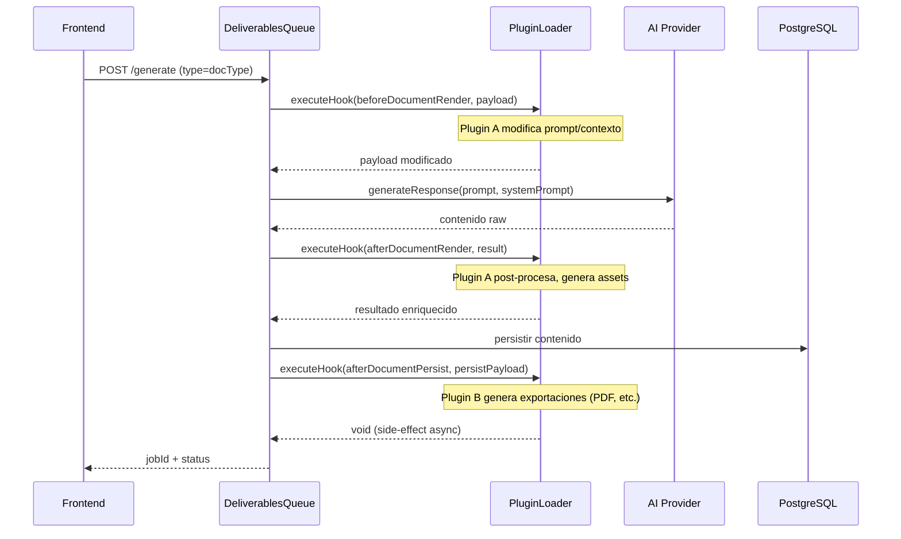
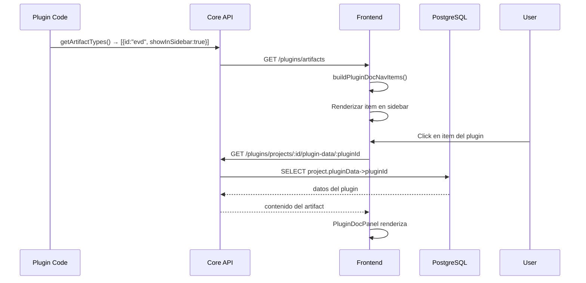

# The Forge — Sistema de Plugins Dinámicos
## Documentación de Arquitectura

> **Versión:** 1.0.0  
> **Fecha:** 2026-07-13  
> **Estado:** ✅ Implementado — Framework de plugins listo para uso

---

## 1. Visión y Objetivos

### 1.1 Problema Actual
The Forge tiene lógica de negocio hardcodeada en el core (e.g., generación de presentaciones, exportaciones a PDF/PPTX) que:
- **Acopla el core a funcionalidades comerciales** (monetización, export formats)
- **Impide la extensibilidad** sin modificar el código fuente del core
- **Viola el Principio de Responsabilidad Única** y la Inversión de Dependencias

### 1.2 Objetivo
Crear un **sistema de plugins dinámicos en runtime** que permita:
- Cargar funcionalidades comerciales como plugins independientes
- Que el core sea **100% agnóstico** a cualquier lógica de negocio específica
- Permitir hooks en el ciclo de vida de documentos/entregables
- Que el core permanezca **open source** mientras los plugins pueden ser privados

### 1.3 Alcance
Esta propuesta cubre:
- ✅ Interfaz de plugin (`ITheForgePlugin`)
- ✅ Cargador dinámico (`PluginLoaderService`)
- ✅ Hooks en el pipeline de entregables (spec, tasks, architecture, etc.)
- ✅ Documentación para desarrolladores de plugins

No cubre (futuras iteraciones):
- 🔲 Plugin marketplace / registry
- 🔲 Hot-reload de plugins sin reiniciar
- 🔲 Sandbox/aislamiento de plugins (security)

---

## 2. Principios de Diseño (Non-Negotiable)

| Principio | Aplicación |
|-----------|-----------|
| **Inversión de Dependencias (DIP)** | El core depende de abstracciones (`ITheForgePlugin`), nunca de implementaciones concretas |
| **Open/Closed** | El core está cerrado a modificación, abierto a extensión vía plugins |
| **YAGNI** | Si no hay plugins, el core ejecuta sin overhead ni cambios de comportamiento |
| **Zero Static Imports** | Ningún import hardcodeado hacia lógica de plugins en el core |
| **100% Agnóstico** | El core no conoce "PDF", "PPTX", "presentaciones" — solo conoce "hooks" y "payloads" |

---

## 3. Interfaz del Plugin (`ITheForgePlugin`)

### 3.1 Contrato TypeScript

```typescript
/**
 * Ciclo de vida completo de un plugin The Forge.
 * Cada plugin es una clase que implementa esta interfaz.
 * El core nunca depende de implementaciones, solo de esta abstracción.
 */
export interface ITheForgePlugin {
  /** Identificador único del plugin. Ej: "mi-plugin-nombre" */
  readonly id: string;

  /** Versión semántica del plugin. Ej: "2.1.0" */
  readonly version: string;

  /** Nombre legible para humanos. Ej: "Mi Plugin Premium" */
  readonly name: string;

  /** Descripción de la funcionalidad que proporciona. */
  readonly description: string;

  // ─────────── Ciclo de Vida ───────────

  /**
   * Invocado una única vez cuando el PluginLoaderService detecta y carga el plugin.
   * Útil para inicializar recursos, validar configuración, registrar schemas.
   * @param context Contexto de inyección de dependencias de NestJS
   * @throws Si el plugin no puede inicializarse (ej: falta API key)
   */
  onPluginInit(context: PluginContext): Promise<void> | void;

  /**
   * Invocado cuando el plugin va a ser descargado o reemplazado.
   * Útil para limpiar recursos, cerrar conexiones, etc.
   */
  onPluginDestroy?(): Promise<void> | void;

  // ─────────── Hooks del Pipeline de Documentos ───────────

  /**
   * Hook: ANTES de que el LLM genere un documento/entregable.
   * Permite modificar el prompt, contexto, o anexar instrucciones adicionales.
   * @param payload Contexto completo de la generación
   * @returns Payload modificado
   */
  beforeDocumentRender?(
    payload: BeforeDocumentRenderPayload
  ): Promise<BeforeDocumentRenderPayload> | BeforeDocumentRenderPayload;

  /**
   * Hook: DESPUÉS de que el LLM devuelve un documento/entregable.
   * Permite post-procesar, enriquecer, validar o transformar el output.
   * @param payload Documento generado + contexto original
   * @returns Documento modificado
   */
  afterDocumentRender?(
    payload: AfterDocumentRenderPayload
  ): Promise<AfterDocumentRenderPayload> | AfterDocumentRenderPayload;

  /**
   * Hook: DESPUÉS de que un entregable se persiste en DB.
   * Útil para side-effects: export, notificación, analytics.
   * @param payload Documento persistido + metadatos
   */
  afterDocumentPersist?(
    payload: AfterDocumentPersistPayload
  ): Promise<void> | void;

  // ─────────── Hooks del Proyecto ───────────

  /**
   * Hook: Cuando se crea un nuevo proyecto.
   * Permite inicializar recursos, crear directorios, etc.
   */
  onProjectCreate?(
    payload: ProjectLifecyclePayload
  ): Promise<void> | void;

  /**
   * Hook: Cuando un proyecto es actualizado (post-save).
   */
  onProjectUpdate?(
    payload: ProjectLifecyclePayload
  ): Promise<void> | void;

  // ─────────── Registro de Artifacts ───────────

  /**
   * Registra los tipos de documento/artifact que este plugin genera.
   * El core expone esta información vía GET /api/plugins/artifacts
   * para que el frontend renderice paneles dinámicos en el sidebar y Workshop.
   * @returns Lista de definiciones de artifact (vacío si no aplica)
   */
  getArtifactTypes?(): ArtifactTypeDefinition[];
}

// ─────────── Tipos de Payload ───────────

/**
 * Contexto de inyección de dependencias proporcionado por el core.
 * El plugin puede usar este contexto para resolver servicios del core.
 */
export interface PluginContext {
  /** Token de DI de NestJS para resolver servicios */
  getService: <T>(token: string | symbol) => T;
  /** Logger global del core */
  logger: Logger;
  /** Configuración del core (sin secretos) */
  config: Record<string, unknown>;
}

/**
 * Payload para beforeDocumentRender.
 */
export interface BeforeDocumentRenderPayload {
  /** Tipo de documento: 'spec' | 'tasks' | 'architecture' | 'useCases' | ... */
  documentType: string;
  /** ID del proyecto */
  projectId: string;
  /** Prompt que se enviará al LLM */
  prompt: string;
  /** System prompt que se usará */
  systemPrompt: string;
  /** Contexto adicional: MDD, Blueprint, etc. */
  context: Record<string, string | null>;
  /** Runtime del LLM resuelto (provider, model, apiKey) */
  llmRuntime: UserLLMRuntime;
}

/**
 * Payload para afterDocumentRender.
 */
export interface AfterDocumentRenderPayload {
  /** Tipo de documento */
  documentType: string;
  /** ID del proyecto */
  projectId: string;
  /** Contenido raw generado por el LLM */
  rawContent: string;
  /** Contenido parseado/estructurado (si aplica) */
  parsedContent?: unknown;
  /** Contexto original enviado al LLM */
  originalContext: BeforeDocumentRenderPayload;
}

/**
 * Payload para afterDocumentPersist.
 */
export interface AfterDocumentPersistPayload {
  /** Tipo de documento */
  documentType: string;
  /** ID del proyecto */
  projectId: string;
  /** Contenido final persistido */
  finalContent: string;
  /** Metadatos de la generación */
  metadata: {
    durationMs: number;
    tokensUsed?: number;
    provider: string;
    model: string;
  };
}

/**
 * Payload para eventos de ciclo de vida del proyecto.
 */
export interface ProjectLifecyclePayload {
  projectId: string;
  projectName: string;
  /** Usuario que realizó la acción */
  userId: string;
  /** Timestamp */
  timestamp: Date;
}

/**
 * Definición de un artifact type que un plugin puede registrar.
 * El core expone esto para que el frontend muestre paneles dinámicos.
 */
export interface ArtifactTypeDefinition {
  /** Identificador único del artifact (ej: "evd", "ppt-export") */
  id: string;
  /** Label legible para humanos (ej: "Executive Visual Deck") */
  label: string;
  /** Nombre del ícono Lucide (ej: "Presentation", "FileText") */
  icon?: string;
  /** Si true, aparece en el sidebar de documentos del Workshop */
  showInSidebar?: boolean;
}
```

### 3.2 Características Clave de la Interfaz

1. **Todas las funciones son opcionales** `(?)`: un plugin solo implementa los hooks que necesita
2. **Inmutabilidad por defecto**: los hooks reciben payload y devuelven nuevo payload
3. **No hay acceso directo a DB**: el plugin interactúa solo a través de los payloads
4. **Contexto limitado**: `getService` solo expone servicios que el core decide exponer

---

## 4. PluginLoaderService

### 4.1 Responsabilidad
Servicio de NestJS que:
1. Escanée un directorio configurado en busca de paquetes de plugin
2. Carga dinámicamente cada plugin vía `await import()`
3. Valida que el plugin implementa `ITheForgePlugin`
4. Inyecta el plugin en el ciclo de vida del core
5. Gestiona errores de forma graceful (YAGNI)

### 4.2 Diseño del Servicio

```typescript
@Injectable()
export class PluginLoaderService implements OnModuleInit {
  private readonly logger = new Logger(PluginLoaderService.name);
  private readonly plugins = new Map<string, ITheForgePlugin>();
  private readonly hooks = {
    beforeDocumentRender: [] as Array<ITheForgePlugin['beforeDocumentRender']>,
    afterDocumentRender: [] as Array<ITheForgePlugin['afterDocumentRender']>,
    afterDocumentPersist: [] as Array<ITheForgePlugin['afterDocumentPersist']>,
    onProjectCreate: [] as Array<ITheForgePlugin['onProjectCreate']>,
    onProjectUpdate: [] as Array<ITheForgePlugin['onProjectUpdate']>,
  };

  constructor(
    private readonly configService: ConfigService,
    private readonly moduleRef: ModuleRef,
  ) {}

  async onModuleInit(): Promise<void> {
    const pluginDirs = this.resolvePluginDirectories();
    
    for (const dir of pluginDirs) {
      if (!existsSync(dir)) continue;
      
      const entries = readdirSync(dir, { withFileTypes: true })
        .filter(e => e.isDirectory())
        .map(e => join(dir, e.name));
      
      for (const pluginPath of entries) {
        await this.tryLoadPlugin(pluginPath);
      }
    }

    this.logger.log(
      `PluginLoader: ${this.plugins.size} plugins cargados: ${[...this.plugins.keys()].join(', ')}`
    );
  }

  private async tryLoadPlugin(pluginPath: string): Promise<void> {
    try {
      const indexPath = join(pluginPath, 'index.js');
      if (!existsSync(indexPath)) return;

      // Dynamic import — el core NUNCA tiene static imports a plugins
      const module = await import(indexPath);
      
      // Soporta export default o export named
      const PluginClass = module.default ?? module.TheForgePlugin;
      
      if (!PluginClass || typeof PluginClass !== 'function') {
        this.logger.warn(`Plugin en ${pluginPath} no exporta una clase. Saltando.`);
        return;
      }

      const instance = new PluginClass() as ITheForgePlugin;
      
      // Validación mínima del contrato
      if (!instance.id || !instance.version) {
        this.logger.warn(`Plugin en ${pluginPath} no implementa id/version. Saltando.`);
        return;
      }

      // Contexto de inyección limitado
      const context: PluginContext = {
        getService: <T>(token: string | symbol) => this.moduleRef.get<T>(token),
        logger: new Logger(`Plugin:${instance.id}`),
        config: this.configService.get('plugins') ?? {},
      };

      // Inicialización
      await instance.onPluginInit(context);

      // Registro
      this.plugins.set(instance.id, instance);
      this.registerHooks(instance);

      this.logger.log(`✅ Plugin cargado: ${instance.name} v${instance.version} (${instance.id})`);
    } catch (err) {
      this.logger.error(
        `❌ Error cargando plugin ${pluginPath}: ${err instanceof Error ? err.message : String(err)}`
      );
      // FALLA GRACEFUL: el core continúa sin este plugin
    }
  }

  private registerHooks(plugin: ITheForgePlugin): void {
    if (plugin.beforeDocumentRender) {
      this.hooks.beforeDocumentRender.push(plugin.beforeDocumentRender.bind(plugin));
    }
    if (plugin.afterDocumentRender) {
      this.hooks.afterDocumentRender.push(plugin.afterDocumentRender.bind(plugin));
    }
    if (plugin.afterDocumentPersist) {
      this.hooks.afterDocumentPersist.push(plugin.afterDocumentPersist.bind(plugin));
    }
    if (plugin.onProjectCreate) {
      this.hooks.onProjectCreate.push(plugin.onProjectCreate.bind(plugin));
    }
    if (plugin.onProjectUpdate) {
      this.hooks.onProjectUpdate.push(plugin.onProjectUpdate.bind(plugin));
    }
  }

  // ─────────── API pública para el core ───────────

  async executeHook<T extends keyof typeof this.hooks>(
    hookName: T,
    payload: Parameters<NonNullable<(typeof this.hooks)[T][number]>>[0]
  ): Promise<Parameters<NonNullable<(typeof this.hooks)[T][number]>>[0]> {
    let currentPayload = payload;

    for (const handler of this.hooks[hookName]) {
      try {
        const result = await handler(currentPayload);
        if (result !== undefined) {
          currentPayload = result;
        }
      } catch (err) {
        this.logger.error(`Hook ${hookName} falló en plugin: ${err}`);
        // Falla graceful: continúa con el payload sin modificar
      }
    }

    return currentPayload;
  }

  getPluginCount(): number {
    return this.plugins.size;
  }

  getPlugin(id: string): ITheForgePlugin | undefined {
    return this.plugins.get(id);
  }
}
```

### 4.3 Configuración

```typescript
// apps/api/src/config/plugins.config.ts
export default () => ({
  plugins: {
    /** Directorios donde escanear plugins */
    directories: [
      process.env.THEFORGE_PLUGINS_DIR || '/app/plugins-enabled',
      resolve(process.cwd(), '../plugins-enabled'),
    ],
    /** Si true, falla el arranque si un plugin no puede cargarse */
    failOnPluginError: process.env.NODE_ENV === 'development',
  },
});
```

### 4.4 Estrategia de Carga

```
/plugins-enabled/
├── mi-plugin-premium/              ← Directorio del plugin
│   ├── index.js                    ← Entry point (export default class)
│   ├── package.json                ← Opcional: dependencias del plugin
│   └── assets/                     ← Recursos estáticos del plugin
└── otro-plugin-export/
    ├── index.js
    └── ...
```

**Reglas:**
1. El servicio busca directorios en la ruta configurada
2. Cada directorio debe tener `index.js` (o `index.ts` si activa ts-node/register)
3. El `index.js` exporta **una clase** que implementa `ITheForgePlugin`
4. Si el directorio no tiene `index.js`, se ignora silenciosamente (YAGNI)

---

## 5. Integración con el Pipeline de Entregables

### 5.1 Punto de Inyección: `DeliverablesQueueService`

El pipeline actual de entregables es:
```
Request → Validaciones → LLM Call → Post-Proceso → Persistir en DB
```

Con plugins se convierte en:
```
Request → Validaciones → [Hook: beforeDocumentRender] → LLM Call → 
[Hook: afterDocumentRender] → Post-Proceso → Persistir → [Hook: afterDocumentPersist]
```

### 5.2 Código de Integración (pseudo)

```typescript
// En DeliverablesQueueService.runJob()
private async runJob(data: GenerateJobData, progressCb: ProgressCallback): Promise<Project> {
  // ... validaciones previas ...

  // 1. ANTES: Construir payload y permitir que plugins modifiquen
  let renderPayload: BeforeDocumentRenderPayload = {
    documentType: data.type,
    projectId: data.projectId,
    prompt: this.buildPrompt(data),
    systemPrompt: this.buildSystemPrompt(data),
    context: this.buildContext(data),
    llmRuntime: await this.resolveLLMRuntime(data.projectId),
  };

  renderPayload = await this.pluginLoader.executeHook('beforeDocumentRender', renderPayload);

  // 2. LLAMADA AL LLM
  const rawContent = await this.ai.generateResponse(
    renderPayload.prompt,
    renderPayload.systemPrompt,
    { /* options */ }
  );

  // 3. DESPUÉS: Permitir post-procesamiento por plugins
  let renderResult: AfterDocumentRenderPayload = {
    documentType: data.type,
    projectId: data.projectId,
    rawContent,
    parsedContent: this.tryParse(data.type, rawContent),
    originalContext: renderPayload,
  };

  renderResult = await this.pluginLoader.executeHook('afterDocumentRender', renderResult);

  // 4. PERSISTIR
  const finalContent = typeof renderResult.parsedContent === 'string' 
    ? renderResult.parsedContent 
    : JSON.stringify(renderResult.parsedContent);
    
  await this.persistDocument(data.type, data.projectId, finalContent);

  // 5. POST-PERSIST: Side-effects (export, notificación)
  await this.pluginLoader.executeHook('afterDocumentPersist', {
    documentType: data.type,
    projectId: data.projectId,
    finalContent,
    metadata: this.buildMetadata(data),
  });

  return this.projects.assertProjectAccess(data.projectId);
}
```

### 5.3 Diagrama de Flujo



### 5.4 Registro de Artifact Types

Los plugins pueden registrar sus propios tipos de documento (artifacts) para que aparezcan como paneles en el sidebar del Workshop. Esto permite que un plugin genere un entregable propio y el frontend lo muestre sin modificar el core.

#### Discovery Endpoint

```
GET /api/plugins/artifacts → ArtifactTypeDefinition[]
```

El frontend consulta este endpoint al montar un proyecto y genera items de navegación dinámicos para cada artifact con `showInSidebar: true`.

#### Almacenamiento de Datos

Cada plugin puede leer y escribir datos propios por proyecto:

| Método | Endpoint | Propósito |
|--------|----------|-----------|
| GET | `/api/plugins/projects/:id/plugin-data/:pluginId` | Leer datos del plugin |
| PUT | `/api/plugins/projects/:id/plugin-data/:pluginId` | Guardar datos del plugin |

Los datos se persisten en el campo `pluginData` (JSON) del modelo `Project` en PostgreSQL. Cada plugin tiene su propia clave dentro del mapa.

#### Flujo Extremo a Extremo



#### Ejemplo de Implementación en un Plugin

```typescript
class MiPluginConPanel implements ITheForgePlugin {
  readonly id = "com.miempresa.panel-plugin";
  readonly version = "1.0.0";
  readonly name = "Plugin con Panel UI";
  readonly description = "Aparece en el sidebar con su propio panel";

  getArtifactTypes(): ArtifactTypeDefinition[] {
    return [{
      id: "mi-panel",
      label: "Mi Panel",
      icon: "Presentation",
      showInSidebar: true,
    }];
  }

  async afterDocumentPersist(payload: AfterDocumentPersistPayload): Promise<void> {
    // Guardar datos del artifact usando el endpoint PUT
    // El frontend los leerá cuando el usuario abra el panel
  }
}
```

---

## 6. Estructura de Directorios Propuesta

```
apps/api/src/
├── modules/
│   └── ... (módulos existentes)
├── plugins/
│   ├── core/                     ← Agnóstico, parte del open source
│   │   ├── interfaces/
│   │   │   └── the-forge-plugin.interface.ts
│   │   ├── plugin-loader.service.ts
│   │   ├── plugin.module.ts
│   │   └── types/
│   │       └── plugin-payloads.ts
│   └── registry.ts              ← Central export
├── plugins-enabled/             ← Carpeta montada para plugins de negocio
│   ├── mi-plugin-premium/
│   │   ├── index.js
│   │   ├── src/
│   │   │   ├── plugin.ts        ← Implementa ITheForgePlugin
│   │   │   └── services/
│   │   └── package.json
│   └── otro-plugin-export/
│       ├── index.js
│       └── ...
└── app.module.ts                 ← Importa PluginModule
```

---

## 7. Ejemplo de Implementación

### 7.1 Estructura de un Plugin

Un plugin genérico sigue esta estructura:

```
plugins-enabled/mi-plugin/
├── index.ts                         ← Entry point, exporta la clase Plugin
├── src/
│   ├── mi-plugin.ts                 ← Implementa ITheForgePlugin
│   └── services/
│       └── mi-servicio.ts           ← Lógica del plugin
├── package.json
└── tsconfig.json
```

### 7.2 Ejemplo: Plugin que genera exports

```typescript
// mi-plugin.ts
export class MiPlugin implements ITheForgePlugin {
  readonly id = 'mi-plugin-export';
  readonly version = '1.0.0';
  readonly name = 'Mi Plugin de Export';
  readonly description = 'Genera exportaciones premium a PDF/PPTX';

  async onPluginInit(context: PluginContext): Promise<void> {
    // Inicializar recursos del plugin
  }

  async afterDocumentRender(payload: AfterDocumentRenderPayload): Promise<AfterDocumentRenderPayload> {
    if (payload.documentType !== 'spec') return payload;

    // Post-procesar el documento generado
    const enriched = this.enrichContent(payload.rawContent);
    return { ...payload, parsedContent: enriched };
  }

  async afterDocumentPersist(payload: AfterDocumentPersistPayload): Promise<void> {
    // Side-effect: generar archivo de exportación en background
  }
}
```

---

## 8. Análisis de Impacto

### 8.1 Qué cambia

| Componente | Antes | Después |
|-----------|-------|---------|
| Core API | Lógica de negocio hardcodeada | 0 líneas de lógica comercial. Solo hooks genéricos |
| `DeliverablesQueue` | Conoce cada tipo de export como caso especial | Agnóstico. Ejecuta hooks sin conocer el contenido |
| `ProjectsService` | Métodos nativos para cada funcionalidad premium | Hooks vía plugin, core libre de lógica comercial |
| `Dockerfile` | Build incluye todo el monolito | Build del core + montaje de plugins en runtime |
| Testing | Pruebas de funcionalidad premium en suite del API | Pruebas del plugin en suite independiente |

### 8.2 Qué NO cambia

- ✅ Esquema de DB existente (campos de entregables siguen igual)
- ✅ API REST existente (mismos endpoints)
- ✅ Cola de BullMQ (mismos job types)

### 8.3 Qué se añade

| Componente | Descripción |
|-----------|-------------|
| `PluginsController` | Endpoints de discovery y almacenamiento de artifacts |
| `PluginsApiModule` | Módulo NestJS que expone los endpoints REST |
| `pluginData` (JSON) | Campo en Project para datos de plugins por proyecto |
| `getArtifactTypes()` | Método opcional en ITheForgePlugin para registrar artifacts |
| `PluginDocPanel` | Componente React que renderiza paneles de plugins dinámicamente |

---

## 9. Roadmap de Implementación

### Fase 1: Foundation (2-3 días)
1. Crear `PluginModule` con interfaces y `PluginLoaderService`
2. Definir tipos de payload
3. Integrar hooks en `DeliverablesQueueService`
4. Tests unitarios del loader

### Fase 2: Primer Plugin (3-4 días)
1. Crear directorio `plugins-enabled/mi-plugin/`
2. Implementar `ITheForgePlugin` con lógica del plugin
3. Integrar hooks específicos del dominio
4. Validar E2E: funcionalidad completa del plugin

### Fase 3: Cleanup (1 día)
1. Eliminar código de lógica de negocio hardcodeado del core
2. Validar que core compila sin dependencias de plugins
3. Documentación de la guía de plugins

---

## 10. Decisiones Pendientes

| # | Decisión | Opciones |
|---|----------|----------|
| 1 | **¿Plugins en proceso o proceso separado?** | A) Node.js `worker_threads` para aislamiento B) Mismo proceso (simpler) |
| 2 | **¿Plugins en JS compilado o TS on-the-fly?** | A) Pre-built JS (`tsc` antes de deploy) B) `ts-node/register` en runtime C) SWC/esbuild para JIT |
| 3 | **¿Persistencia de estado de plugin?** | A) Sin estado (stateless, puro) B) Key-val Redis por plugin C) Tabla `PluginState` en DB |
| 4 | **¿Sandbox de seguridad?** | A) Sin sandbox (confiar en plugins propios) B) `vm2` C) `isolated-vm` (más seguro, más lento) |
| 5 | **¿Hot-reload sin reiniciar?** | A) Reiniciar contenedor tras cada deploy de plugin B) File watcher + reload dinámico |

**Recomendación del arquitecto:**
- Decisión 1: **Opción B** (mismo proceso) — simple, sin overhead
- Decisión 2: **Opción A** (pre-built JS) — más robusto, menos dependencias en runtime
- Decisión 3: **Opción A** (stateless) — plugins gestionan su propio estado si lo necesitan
- Decisión 4: **Opción A** (sin sandbox) — asumir que plugins son de nuestra organización
- Decisión 5: **Opción A** (reiniciar contenedor) — más predecible, kubernetes-style

---

## 11. Métricas de Éxito

| Métrica | Target |
|---------|--------|
| Tiempo carga de plugins | < 500ms en frío |
| Overhead por hook | < 10ms de latencia añadida |
| Prueba: core sin plugins | El core arranca y funciona 100% |
| Líneas de lógica comercial en core | 0 |
| Cobertura de tests del loader | > 90% |

---

## 12. Riesgos

| Riesgo | Probabilidad | Impacto | Mitigación |
|--------|-------------|---------|-----------|
| Plugin roto bloquea arranque | Baja | Alto | try/catch + skip en `tryLoadPlugin`; flag `failOnPluginError` |
| Plugin modifica payload corrupto | Media | Alto | Validación schema post-hook; rollback posible |
| Dos plugins conflictivos | Media | Medio | Orden determinista por directorio; documentar prioridad |
| Performance regresión | Baja | Medio | Benchmarks previos/post; métricas 
| Debug difícil de plugin | Media | Medio | Logger prefix `Plugin:X`; verbose mode; stacktraces completas |

---

## Estado Actual

| Componente | Estado |
|-----------|--------|
| `ITheForgePlugin` interfaz | ✅ Implementada (incluye `getArtifactTypes()`) |
| `PluginLoaderService` | ✅ Implementado (incluye `getArtifactTypes()`) |
| `PluginModule` | ✅ Implementado |
| `PluginsController` | ✅ Implementado (GET /plugins/artifacts + project data CRUD) |
| `PluginDocPanel` (frontend) | ✅ Implementado (panel dinámico en Workshop) |
| `pluginData` (DB) | ✅ Implementado (campo JSON en Project) |
| Documentación PLUGINS.md | ✅ Creada |
| Documentación ARCHITECTURE_PLUGINS.md | ✅ Este documento |

---

*
*Nota: Este documento es la propuesta de diseño. El código de implementación se generará SOLO tras aprobación explícita.*
