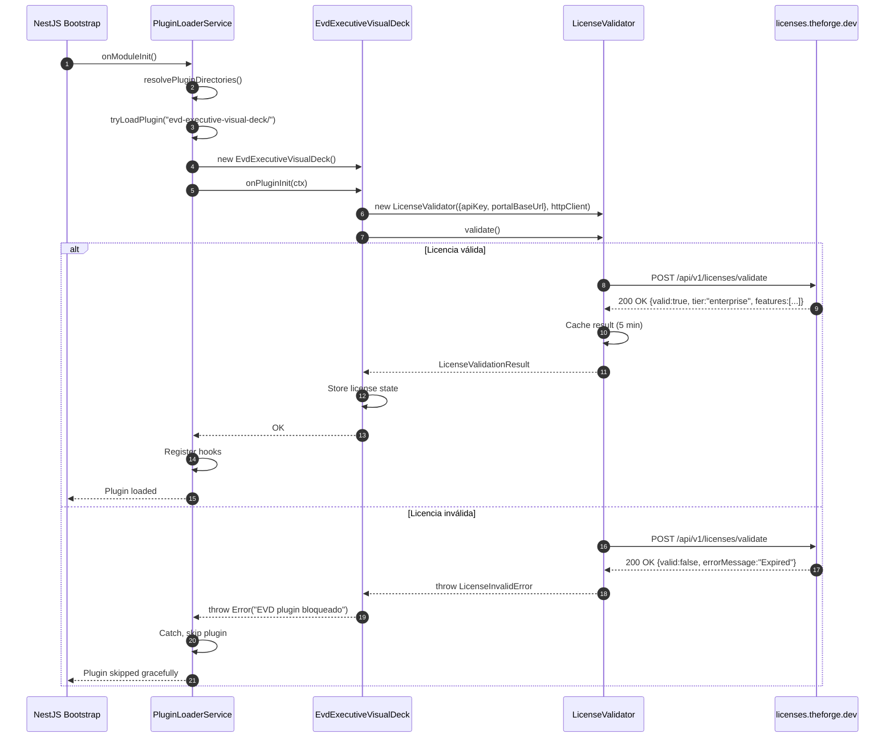
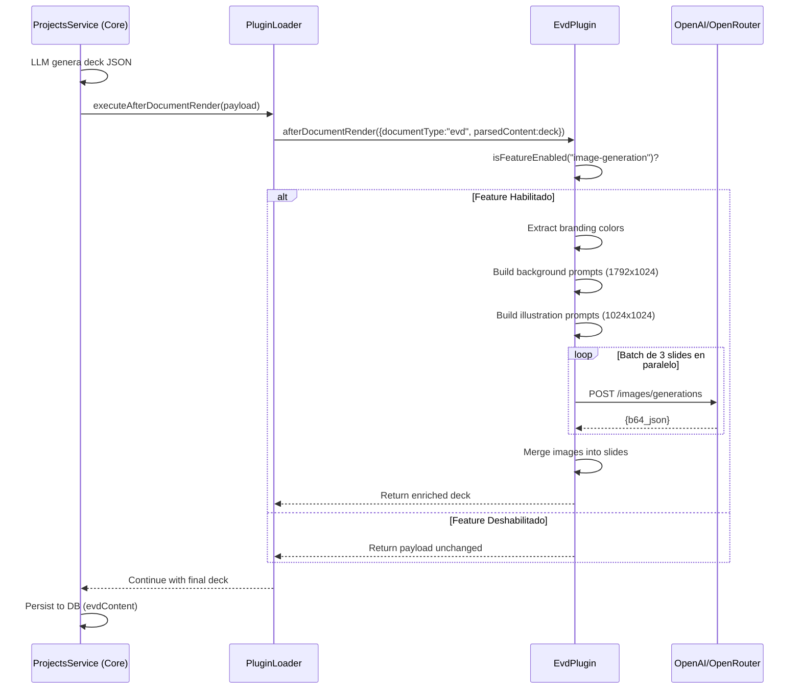

# Plugin Comercial EVD — Entrega Completa

**Fecha:** 2026-07-13  
**Versión del Plugin:** 1.0.0  
**Arquitecto:** OpenCode (Software Architect)  
**Estado:** Implementación Completa — Fase 3: Desacoplamiento

---

## 1. Resumen Ejecutivo

Se ha transformado el código PoC del **Executive Visual Deck (EVD)** del core de The Forge en un **plugin comercial 100% independiente**, con:

- **Arquitectura de Plugins (DI + Hooks):** Comunicación con el core via `ITheForgePlugin` — cero imports estáticos hacia el core.
- **Control de Acceso por Licencia:** Validación en caliente contra portal externo (`licenses.theforge.dev`). Sin licencia = graceful skip.
- **Servicios Autocontenidos:** Sistema de diseño, generación de imágenes con IA (OpenAI + OpenRouter), exportación PDF/PPTX.
- **Distribución Independiente:** Paquete npm privado con `peerDependencies` del core.

---

## 2. Estructura del Paquete

```text
packages/evd-executive-visual-deck/
├── src/
│   ├── core/
│   │   ├── plugin-sdk.ts              -- Contrato autónomo con el core (ITheForgePlugin)
│   │   └── license-validator.ts       -- Cliente HTTP del portal de licencias
│   ├── services/
│   │   ├── image-generation.service.ts   -- OpenAI + OpenRouter (fallback)
│   │   ├── design-system.ts              -- Sistema de diseño (colores, gradientes, tipografía)
│   │   └── pdf.service.ts                -- Renderizado HTML -> PDF (puppeteer)
│   ├── types/
│   │   └── evd-types.ts                -- Tipos de slides, branding, charts
│   ├── evd-plugin.ts                  -- Lógica principal (hook afterDocumentRender)
│   └── index.ts                        -- Entry point (export default)
├── docs/
│   └── LICENSE_PORTAL_SPEC.md          -- Especificación completa del portal
├── dist/                               -- Salida de tsc
├── package.json                        -- peerDependencies + scripts
├── tsconfig.json
├── README.md                           -- Documentación del plugin
└── LICENSE.md                          -- Licencia comercial
```

---

## 3. Cuadro Comparativo: Antes vs Después

| Aspecto | ANTES (Acoplado al Core) | DESPUÉS (Plugin Independiente) |
|---------|-------------------------|-------------------------------|
| **Ubicación código** | `apps/api/src/modules/evd/` (12 archivos) | `packages/evd-executive-visual-deck/` |
| **Import al core** | Imports estáticos: `projects.service.ts` importaba `EvdVisualStylistService` | Cero imports estáticos. Solo comunicación via hooks |
| **Generación de imágenes** | Dentro de `ProjectsService.generateEVD()` | Dentro del hook `afterDocumentRender` del plugin |
| **Validación de licencia** | No existía | `LicenseValidator` en `onPluginInit()` |
| **Control de tier** | No existía | `isFeatureEnabled()` valida contra respuesta del portal |
| **Distribución** | Empaquetado con el core | Paquete npm privado con peerDependencies |
| **Fallo del plugin** | Crash del core si fallaba | Graceful skip — el core continúa sin EVD |

---

## 4. Validador de Licencias en Caliente

### 4.1 Flujo de Validación



### 4.2 Petición al Portal

```http
POST /api/v1/licenses/validate HTTP/1.1
Host: licenses.theforge.dev
Content-Type: application/json
X-Plugin-Id: evd-executive-visual-deck
X-API-Key: tk_prod_xxxxxxxxxxxxxxxx

{
  "apiKey": "tk_prod_xxxxxxxxxxxxxxxx",
  "pluginId": "evd-executive-visual-deck",
  "timestamp": "2026-07-13T12:00:00Z",
  "pluginVersion": "1.0.0",
  "instanceId": "prod-01"
}
```

### 4.3 Respuesta del Portal

```json
{
  "valid": true,
  "tier": "enterprise",
  "expiresAt": "2026-12-31T23:59:59Z",
  "issuedAt": "2026-01-15T00:00:00Z",
  "features": [
    "image-generation",
    "premium-templates",
    "pdf-export",
    "pptx-export",
    "unlimited-renders"
  ],
  "usage": {
    "current": 42,
    "limit": -1,
    "period": "monthly",
    "resetsAt": "2026-08-01T00:00:00Z"
  },
  "license": {
    "id": "lic_ent_2026_abc123",
    "type": "subscription",
    "organization": "Acme Corp",
    "contactEmail": "admin@acme.com"
  }
}
```

### 4.4 Códigos de Error

| errorCode | Significado |
|-----------|-------------|
| `LICENSE_EXPIRED` | Licencia vencida |
| `LICENSE_REVOKED` | Revocada por administrador |
| `LICENSE_SUSPENDED` | Pago pendiente |
| `INVALID_API_KEY` | API Key no existe |
| `INVALID_PLUGIN` | Plugin ID no reconocido |
| `RATE_LIMITED` | 100 req/min excedido |
| `INTERNAL_ERROR` | Error interno del portal |

---

## 5. Monetización por Tier

| Feature | Personal ($9/mo) | Team ($29/mo) | Enterprise ($99/mo) |
|---------|-----------------|---------------|-------------------|
| `image-generation` | 10 renders/mes | 100 renders/mes | Ilimitado |
| `premium-templates` | No | Si | Si |
| `pdf-export` | No | Si | Si |
| `pptx-export` | No | No | Si |
| `unlimited-renders` | No | No | Si |
| `white-label` | No | No | Si |

### Lógica de Validación

```typescript
private isFeatureEnabled(feature: string): boolean {
  if (!this.licenseResult) {
    // Sin licencia = solo demo features
    return ["image-generation"].includes(feature);
  }
  return this.licenseResult.features.includes(feature);
}
```

---

## 6. Flujo del Hook `afterDocumentRender`



---

## 7. Arquitectura de Dependencias

### ANTES — Acoplado al Core

```
┌─────────────────────────────────────────┐
│           The Forge Core                │
│  ┌────────────────────────────────┐     │
│  │  modules/evd/ (12 archivos)    │     │
│  │  ├─ evd-visual-stylist.ts      │     │
│  │  ├─ evd-image-generation.ts    │     │
│  │  ├─ evd-pptx.ts               │     │
│  │  └─ evd-pdf.ts                │     │
│  └────────────────────────────────┘     │
│     | imports estaticos                  │
│  ┌────────────────────────────────┐     │
│  │  projects.service.ts          │     │
│  │  (generateEVD() acoplada)     │     │
│  └────────────────────────────────┘     │
└─────────────────────────────────────────┘
```

### DESPUÉS — Desacoplado

```
┌─────────────────────────────────────────┐
│           The Forge Core                │
│  ┌────────────────────────────────┐     │
│  │  PluginLoaderService          │     │
│  │  (dynamic import)             │     │
│  └────────────────────────────────┘     │
│     |                                    │
│  ┌────────────────────────────────┐     │
│  │  projects.service.ts          │     │
│  │  (solo hooks, no EVD)         │     │
│  └────────────────────────────────┘     │
│                                          │
│  SIN imports estáticos al módulo EVD    │
└─────────────────────────────────────────┘
                    | dynamic import()
                    v
┌─────────────────────────────────────────┐
│  @theforge/evd-executive-visual-deck   │
│  ┌────────────────────────────────┐     │
│  │  EvdExecutiveVisualDeck       │     │
│  │  ├─ LicenseValidator          │     │
│  │  ├─ ImageGenerationService    │     │
│  │  ├─ DesignSystem              │     │
│  │  └─ PdfService                │     │
│  └────────────────────────────────┘     │
└─────────────────────────────────────────┘
```

---

## 8. Limpieza del Core

### Archivos Modificados

| Archivo | Cambio |
|---------|--------|
| `apps/api/src/app.module.ts` | Agregado `PluginModule` |
| `apps/api/src/modules/projects/projects.service.ts` | Eliminado `EvdVisualStylistService` + lógica fallback |
| `apps/api/src/modules/projects/projects.module.ts` | Eliminado `EvdStorageModule` de imports |

### Archivos Creados (Core)

| Archivo | Descripción |
|---------|-------------|
| `apps/api/src/plugins/plugin-loader.service.ts` | Servicio de carga dinámica de plugins |
| `apps/api/src/plugins/plugin.module.ts` | Módulo de plugins registrado en AppModule |
| `apps/api/src/plugins/interfaces/the-forge-plugin.interface.ts` | Interfaz del contrato |
| `apps/api/src/plugins/types/plugin-payloads.ts` | Tipos de payload para hooks |
| `apps/api/src/plugins-enabled/evd-executive-visual-deck/index.ts` | Placeholder del plugin |

---

## 9. Dependencias (peerDependencies)

```json
{
  "peerDependencies": {
    "@nestjs/common": "^10.0.0",
    "@nestjs/core": "^10.0.0",
    "pptxgenjs": "^4.0.0",
    "echarts": "^5.0.0",
    "puppeteer-core": "^24.0.0"
  }
}
```

**Cero dependencia estática del core.** El plugin solo habla con el core vía `ITheForgePlugin` + hooks.

---

## 10. Instrucciones de Instalación

### Opción A: npm Privado

```bash
pnpm add @theforge/evd-executive-visual-deck \
  --registry https://npm.theforge.dev
```

### Opción B: Git Clone

```bash
git clone https://github.com/theforge/evd-executive-visual-deck.git \
  apps/api/src/plugins-enabled/evd-executive-visual-deck
```

### Opción C: Git Submodule

```bash
git submodule add \
  https://github.com/theforge/evd-executive-visual-deck.git \
  plugins-enabled/evd-executive-visual-deck
```

### Variables de Entorno

```bash
# Licencia
EVD_LICENSE_KEY=tk_prod_xxxxxxxxxxxxxxxx
EVD_LICENSE_PORTAL_URL=https://licenses.theforge.dev

# Proveedores de imagen
OPENAI_API_KEY=sk-...
OPENROUTER_API_KEY=sk-or-...
OPENROUTER_IMAGE_MODEL=openai/gpt-5-image-mini

# Puppeteer
PUPPETEER_EXECUTABLE_PATH=/usr/bin/chromium-browser
```

---

## 11. Estado de Compilación

| Paquete | Estado |
|---------|--------|
| `@theforge/api` (core) | Compila limpio |
| `@theforge/evd-executive-visual-deck` (plugin) | Compila limpio |
| Build completo del monorepo | 4/4 tasks exitosas (42.6s) |

---

## 12. Documentación Generada

| Archivo | Ubicación | Descripción |
|---------|-----------|-------------|
| `README.md` | `packages/evd-executive-visual-deck/` | Guía de uso del plugin |
| `LICENSE.md` | `packages/evd-executive-visual-deck/` | Licencia comercial |
| `ARCHITECTURE_EVD_PLUGIN.md` | `docs/` | Documento técnico completo (450 líneas) |
| `ARCHITECTURE_PLUGINS.md` | `docs/` | Arquitectura del sistema de plugins (739 líneas) |
| `LICENSE_PORTAL_SPEC.md` | `packages/evd-executive-visual-deck/docs/` | Especificación del portal (560 líneas) |
| **EVD_PLUGIN_DELIVERY.md** | `docs/` | Este documento — entrega completa |

---

## 13. Roadmap Próximo

| Versión | Feature | Prioridad |
|---------|---------|-----------|
| v1.1 | Migrar EvdStorageController/Service al plugin | Media |
| v1.2 | Integración ECharts SSR para gráficos | Alta |
| v1.3 | Exportación PPTX completa (pptxgenjs) | Media |
| v1.4 | Webhook de billing + métricas de uso | Media |
| v2.0 | Implementar portal de licencias como microservicio | Alta |

---

```
Copyright (c) 2026 The Forge Inc.
Documento de entrega — Propiedad intelectual privada.
```
