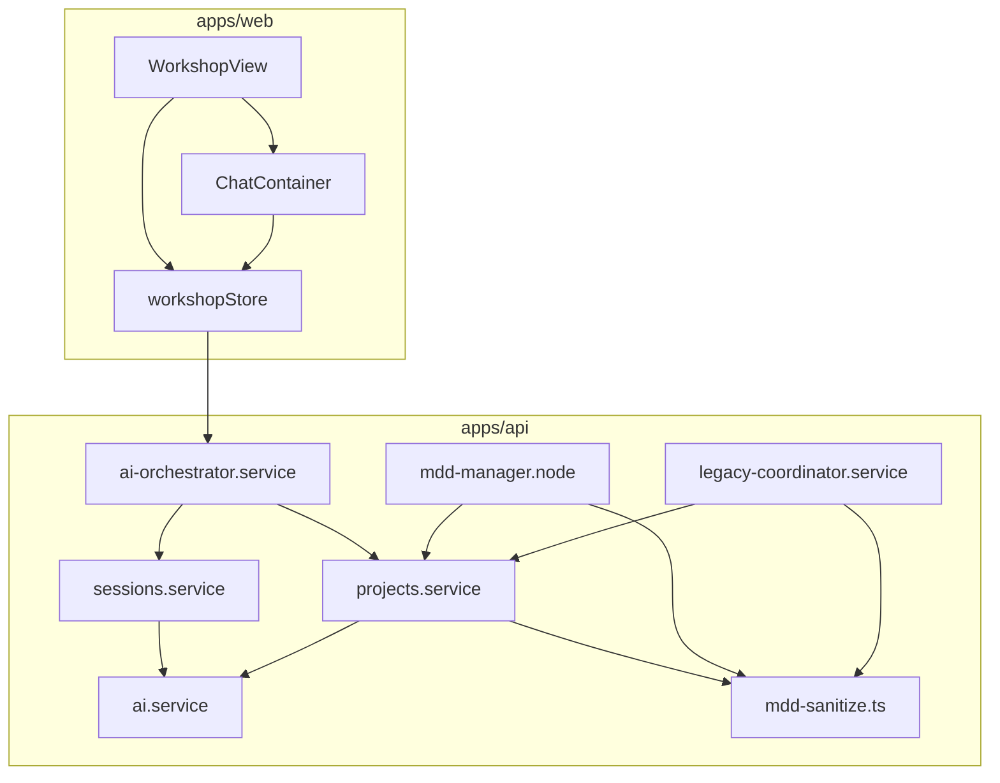

# Diagnóstico de God Functions — The Forge

> **Fecha:** 2026-07-19  
> **Alcance:** monorepo `apps/api`, `apps/web`, `packages/shared-types`, `packages/mcp-server`  
> **Objetivo:** inventariar unidades con demasiadas responsabilidades, priorizarlas y definir un plan de extracción **incremental** que no rompa contratos públicos ni flujos de producción.

---

## 1. Criterios de detección

Se considera **god function / god unit** cualquier función, closure, componente React o módulo que cumpla **dos o más** de:

| Señal | Umbral usado |
|-------|----------------|
| Tamaño | > 200 líneas en una sola función/closure, o > 800 líneas en archivo/módulo cohesivo |
| Responsabilidades | Mezcla dominios distintos (persistencia + LLM + routing + UI + side-effects) |
| Acoplamiento | > 5 dependencias directas de otros módulos de negocio |
| Duplicación | Misma lógica copiada en variantes sync/stream o tab/documento |
| Testabilidad | Sin spec dedicado o imposible de probar sin mock masivo |
| API pública ancha | > 30 métodos exportados o > 50 acciones de store |

**Nota:** archivos grandes **data-driven** (listas de reglas, prompts, referencias de diseño) se marcan como deuda de organización, no como god function clásica, salvo que contengan funciones monolíticas dentro.

---

## 2. Resumen ejecutivo

| Tier | Unidades | Riesgo si no se refactoriza |
|------|----------|-----------------------------|
| **P0 — Crítico** | 6 | Regresiones en MDD, Workshop y chat; imposible revisar PRs; onboarding lento |
| **P1 — Alto** | 8 | Duplicación sync/stream; cascadas de entregables frágiles; legacy inmantenible |
| **P2 — Medio** | 10+ | Deuda acumulada en UI admin, utilidades compartidas y MCP |

**Hallazgo principal:** el núcleo del producto concentra deuda en tres ejes:

1. **Workshop frontend** — `WorkshopView.tsx` + `workshopStore.ts` absorben casi toda la UX.
2. **Pipeline MDD** — `mdd-sanitize.ts` + `createMddManagerNode` concentran reglas deterministas y orquestación LangGraph.
3. **Capa de aplicación API** — `ProjectsService`, `SessionsService` y `LegacyCoordinatorService` mezclan CRUD, generación, gates y side-effects.

**Buenas noticias:** ya existen extracciones parciales (`tasks-generation-pipeline.service.ts`, `project-estimation-recalc.service.ts`, `WorkshopMetricsColumnInner.tsx`, decenas de `*.util.ts` en `projects/`). El plan **extiende** ese patrón; no reinventa arquitectura.

---

## 3. Inventario P0 — Crítico

### 3.1 `WorkshopView.tsx` (~5 917 L)

**Ubicación:** `apps/web/src/views/WorkshopView.tsx`  
**Tipo:** God Component  
**Tests:** ninguno

| Métrica | Valor |
|---------|-------|
| Componente principal | ~5 556 L (L361–5916) |
| `useEffect` | 25 |
| `useState` | 31 |
| `useCallback` | 34 |
| `useMemo` | 24 |
| Imports de `useWorkshopStore` | ~100 referencias en el archivo |

**Responsabilidades mezcladas:**

- Layout 3 columnas (chat, documento, métricas)
- Toolbar por tab (MDD, DBGA, Spec, BRD, Blueprint, Tasks, …)
- Modales (ayuda, stages, integración, legacy, AEM, gobernanza)
- Polling MDD jobs, sync, dirty state del editor
- Handlers de generación/descarga/export por entregable
- Lógica de gates legacy, semáforo inline, plan approval

**Extracción previa:** `WorkshopMetricsColumnInner.tsx` (~1 288 L) — patrón a replicar.

**Riesgo de refactor:** alto en UX; bajo en API si se mantienen props/store contracts.

---

### 3.2 `workshopStore.ts` (~5 319 L)

**Ubicación:** `apps/web/src/store/workshopStore.ts`  
**Tipo:** God Store (Zustand)  
**Tests:** ninguno (solo utils periféricos con spec)

| Métrica | Valor |
|---------|-------|
| Factory `create(...)` | ~3 778 L (L1541–5318) |
| Acciones estimadas | ~100+ |
| Consumidores | 18+ componentes/hooks |

**Responsabilidades mezcladas:**

- Estado de proyecto/sesión/stage activo
- CRUD de todos los documentos del Workshop
- Envío de chat (stream y no-stream)
- Generación de entregables (blueprint, API, tasks, infra, …)
- Polling de jobs MDD y generation status
- Legacy debug, plugins, plan validation, documentation gaps

**Funciones helper ya extraídas** (mantener): `workshopFlatFromStage`, `workshopDeliverableStorePatch`, `applyMddEditorBaselineToWorkshop`, etc. en el mismo archivo — candidatas a mover a `store/helpers/`.

---

### 3.3 `mdd-sanitize.ts` (~6 065 L, 128 exports)

**Ubicación:** `apps/api/src/modules/ai-analysis/utils/mdd-sanitize.ts`  
**Tipo:** God Module  
**Tests:** `mdd-sanitize.spec.ts` (~2 349 L) — buena red de seguridad

**God functions internas:**

| Función | ~Líneas | Rol |
|---------|---------|-----|
| `jsonSectionToMarkdown` | 1 278 | JSON estructurado → markdown por sección |
| `fixSecurityManifestCoherence` | 1 284 | Coherencia manifest §7 vs §6 (LDAP, MFA, JWT, …) |
| `prepareMddMarkdownForPersist` | 23 | Orquestador (debería ser el único entry público de persist) |

**Responsabilidades:** sanitización, reparación SQL/Mermaid, gobernanza, merge de secciones, gates pre-entrega, logging de nodos, export.

**Consumidores críticos:** `mdd-manager.node.ts`, `projects.service.ts`, `legacy-coordinator.service.ts`, pipeline de persistencia MDD.

---

### 3.4 `createMddManagerNode` (~1 007 L)

**Ubicación:** `apps/api/src/modules/ai-analysis/nodes/mdd-manager.node.ts` (L537–1543)  
**Tipo:** God Closure (nodo LangGraph)  
**Tests:** indirectos vía grafo MDD

**Responsabilidades en un solo closure:**

- Routing por score del auditor, iteraciones, stop patterns
- Aprobación de plan HITL (`pendingPlanApproval`)
- Regeneración por sección (`parseRegenerateSectionNumber`)
- Delegación a executor / clarifier / search_memory
- Invocación LLM structured output + tools (TheForge, RAG)
- Impact analysis, legacy integration intent
- Normalización y persistencia parcial del draft

**Helpers ya extraídos** (reutilizar): `buildMddPlan`, `expandSectionsToRun`, `resolveCorrectionAgents`, `mdd-manager-routing.util.ts`.

---

### 3.5 `ProjectsService` (~3 809 L, ~94 métodos)

**Ubicación:** `apps/api/src/modules/projects/projects.service.ts`  
**Tipo:** God Service  
**Tests:** specs en utils satélite; **sin** `projects.service.spec.ts`

**Métodos más grandes:**

| Método | ~Líneas | Problema |
|--------|---------|----------|
| `update` | 282 | Persist MDD + gates + semáforo + snapshots + plugins |
| `createStage` | 101 | Stage + estimación + legacy bootstrap |
| `repairUxUiGuideYaml` | 109 | LLM + lint + persist |
| `runCascadePostPassRetry` | 102 | Post-cascade heurístico |
| `generateApiContracts` | 95 | Generación + conformance + retry |
| `generateBlueprint` | 76 | Idem |
| `generateDeliverablesCascade` | ~120 | Orquestación multi-ola |

**Extracciones ya hechas** (no duplicar):

```
tasks-generation-pipeline.service.ts
project-estimation-recalc.service.ts
project-merge.service.ts
sdd-integration.service.ts
plan-validation.service.ts
deliverables-queue.service.ts
project-generation-guard.service.ts
+ ~20 *.util.ts
```

**Acoplamiento:** importa engine, ai-analysis, ui-mcp, sessions, document-snapshot, shared-types governance.

---

### 3.6 `SessionsService.chat` + `chatStream` (~652 + ~649 L)

**Ubicación:** `apps/api/src/modules/sessions/sessions.service.ts`  
**Tipo:** God Methods (duplicados)  
**Tests:** ninguno directo

**Responsabilidades compartidas (duplicadas entre sync y stream):**

- Resolución de contenido por tab activo
- Vision enrichment de imágenes
- Invocación `AiService.generateResponse*`
- Parsing de delimitadores `---FIN_*---` por documento
- Persistencia condicional (MDD, DBGA, Spec, BRD, …)
- Dual Output Protocol v2 (`documentAst`, `documentVersion`)
- Refinamiento DBGA en benchmark tab

**Olores:** `chat` termina en L1276; `chatStream` en L1925 — ~1 300 L de lógica de chat en un solo servicio.

---

## 4. Inventario P1 — Alto

### 4.1 `LegacyCoordinatorService.generateDeliverables` (~823 L)

**Ubicación:** `apps/api/src/modules/legacy-flow/legacy-coordinator.service.ts` (L1378–2200)

Orquesta entregables legacy con contexto Ariadne, retries 429, agent supervisor, gates SDD, trazas debug. Archivo total ~2 311 L con fuerte acoplamiento a `ProjectsService` y `TheForgeService`.

**Relacionado:** `generateMdd` (~326 L, L1052–1377) — grande pero acotado.

---

### 4.2 `AiService.generateResponse` + `generateResponseStream` (~201 + ~248 L)

**Ubicación:** `apps/api/src/modules/ai/ai.service.ts` (~2 089 L total)

Construcción masiva de system prompt por tab (MDD, DBGA, Spec, BRD, …), covenant de delimitadores, modo exploración vs edición. **~80% del cuerpo de ambos métodos es idéntico** — deuda de duplicación explícita.

---

### 4.3 `AiOrchestratorService.chat` (~241 L)

**Ubicación:** `apps/api/src/modules/ai-orchestrator/ai-orchestrator.service.ts`

Punto de entrada Workshop: HITL complejidad, routing supervisor, persistencia preemptiva por tab, legacy TheForge context, delegación a `SessionsService.chat`, post-proceso UX guide y evaluator.

**Riesgo:** es el **contrato HTTP** del Workshop; cualquier extracción debe preservar forma de respuesta `{ session, project, uxUiGuideContent?, evaluatorCritique? }`.

---

### 4.4 `AiAnalysisService` (~2 227 L)

Concentra arranque de jobs MDD, contexto de agentes, estimación, upstream sync. Menos monolítico que `ProjectsService`, pero sigue siendo hub del grafo.

---

### 4.5 `agent-governance.util.ts` (~2 279 L)

Utilidad compartida parse/serialize de gobernanza IA. Candidata a split por artefacto (rules, skills, hooks, agents).

---

### 4.6 `packages/shared-types/src/mermaid.ts` (~2 835 L)

Reparación/normalización Mermaid. Data + heurísticas. God **module**; funciones individuales más pequeñas pero densas.

---

### 4.7 `packages/mcp-server/src/index.ts` (~2 257 L)

Monolito de registro de tools MCP. Alineado con deuda descrita en `docs/MODULARIZATION-LICENSING.md`.

---

### 4.8 `TheForgeService` (~1 322 L)

Proxy MCP Ariadne — muchos métodos finos (< 110 L c/u) pero clase hub. Prioridad menor si se mantiene como fachada.

---

## 5. Inventario P2 — Medio (vigilar)

| Unidad | ~Líneas | Notas |
|--------|---------|-------|
| `App.tsx` | 1 667 | Routing + layout + providers |
| `IntegrationPanel.tsx` | 1 572 | Panel legacy/integration |
| `ChatContainer.tsx` | 1 400 | Chat + composer + plan approval |
| `WorkshopMetricsColumnInner.tsx` | 1 288 | Ya extraído; aún grande |
| `UsersList.tsx` | 1 459 | Admin CRUD |
| `DashboardSidebar.tsx` | 1 303 | Navegación + favoritos |
| `estimation.service.ts` | 1 198 | Cálculo live + snapshots |
| `project-integration.service.ts` | 1 183 | Handoff repo |
| `sdd-integration.service.ts` | 1 130 | SDD sync |
| `repair-pasted-markdown.ts` | 1 297 | Ver `docs/FORMATTER_IMPROVEMENT_PLAN.md` |
| `mdd-software-architect.node.ts` | 958 | Nodo grafo |
| `user-providers.service.ts` | 980 | Config proveedores |

---

## 6. Mapa de dependencias (simplificado)



**Regla de extracción:** mover hojas primero (sanitizers, prompt builders, slices de store), luego servicios satélite, **nunca** romper ports (`projects-service.port.ts`, `theforge-service.port.ts`) hasta el final.

---

## 7. Plan detallado de refactorización (sin romper nada)

### Principios transversales

1. **Strangler fig:** nuevo código en archivos/colaboradores; el export público delega al legacy hasta eliminar el cuerpo viejo.
2. **Contratos congelados:** mismas firmas HTTP, mismos shapes Zod/DTO, mismos eventos de store.
3. **Un PR = una extracción vertical** acotada (< 400 L netas movidas).
4. **Tests antes o durante:** snapshot/golden tests para MDD sanitize; contract tests para orchestrator chat.
5. **Feature flags solo si hay riesgo UX** — preferir delegación pura sin bifurcar comportamiento.
6. **No tocar** `packages/business-rules` (fórmula MXN) ni adapters LLM salvo mover prompts.

---

### Fase 0 — Red de seguridad (1–2 semanas, prerequisito)

| Acción | Archivo objetivo | Entregable |
|--------|------------------|------------|
| Golden tests MDD | `mdd-sanitize.spec.ts` | Fixtures `fixtures/mdd/*.md` in/out por función P0 |
| Contract test orchestrator | nuevo `ai-orchestrator.chat.contract.spec.ts` | Mock sessions/projects; assert shape respuesta |
| Contract test sessions chat | nuevo `sessions.chat.contract.spec.ts` | Tabs mdd/dbga/spec; delimitadores |
| Smoke Workshop store | nuevo `workshopStore.actions.smoke.spec.ts` | Assert que acciones existen y tipos |
| Baseline métricas | este doc | LOC por unidad; revisar en cada fase |

**Criterio de salida:** CI verde con ≥ 5 fixtures golden MDD y 2 contract tests HTTP internos.

---

### Fase 1 — `mdd-sanitize.ts` (2–3 semanas)

#### STEP 1 — Inventario (hecho)

Funciones existentes relacionadas: 128 exports en un solo archivo; consumidores en manager, projects, legacy.

#### STEP 2 — Plan de cambio

| Campo | Detalle |
|-------|---------|
| **Reused Code** | `prepareMddMarkdownForPersist`, `storeMddMarkdownForPersist`, `finalizeMddDeliverable`, `normalizeMddFormat` — mantener como fachada pública |
| **Deprecated/Dead Code** | Ninguno al inicio; eliminar solo duplicados detectados tras mover |
| **New Logic** | Submódulos por dominio bajo `utils/mdd-sanitize/` |
| **Strategy** | Re-export barrel `mdd-sanitize.ts` delgado (~150 L) para no romper imports |

**Estructura propuesta:**

```
apps/api/src/modules/ai-analysis/utils/mdd-sanitize/
  index.ts                    # re-exports (API estable)
  json-section-to-markdown.ts # extraer jsonSectionToMarkdown
  security-manifest.ts        # fixSecurityManifestCoherence + helpers LDAP/MFA/JWT
  sql-repair.ts               # sanitizeSql*, repairSql*
  section-merge.ts            # merge/replace/preserve section*
  mermaid-fences.ts           # strip/fix mermaid
  persist-pipeline.ts         # prepare/store/sanitize at persist
  cross-consistency.ts        # applyCrossConsistencyPatches, detect*
```

**Orden interno:**

1. `jsonSectionToMarkdown` (mejor spec coverage)
2. `fixSecurityManifestCoherence`
3. SQL + Mermaid
4. Section merge/preserve
5. Orquestadores persist

**Criterio de salida:** `mdd-sanitize.ts` raíz < 200 L; specs verdes; cero cambios en firmas exportadas.

---

### Fase 2 — `createMddManagerNode` (2 semanas)

| Campo | Detalle |
|-------|---------|
| **Reused Code** | `mdd-manager-routing.util.ts`, helpers L83–536 del mismo archivo |
| **Deprecated/Dead Code** | Bloques inline duplicados de plan building tras extraer |
| **New Logic** | Máquina de estados explícita |
| **Strategy** | Closure final < 150 L; delega a handlers |

**Extracciones:**

```
nodes/mdd-manager/
  manager-node.ts           # createMddManagerNode (fachada)
  manager-state-handlers.ts # score/end, plan approval, regen section
  manager-delegate.ts       # build Command → executor
  manager-llm-turn.ts       # structured output + tools round
  manager-plan.ts           # buildMddPlan, goalForStep (mover desde node)
```

**Compatibilidad:** mismo export `createMddManagerNode` desde `mdd-manager.node.ts`.

**Tests:** unit tests por handler con `MDDStateType` fixtures; un test integración grafo existente.

---

### Fase 3 — Capa chat API (2–3 semanas)

#### 3a. `AiService` — prompt building

| Campo | Detalle |
|-------|---------|
| **Reused Code** | Prompts en `apps/api/src/modules/ai/prompts/` |
| **New Logic** | `buildWorkshopSystemPrompt(options): string` en `ai/workshop-system-prompt.builder.ts` |
| **Strategy** | `generateResponse` y `generateResponseStream` llaman al builder; eliminar duplicación |

#### 3b. `SessionsService` — unificar chat

| Campo | Detalle |
|-------|---------|
| **Reused Code** | `document-content.util.ts`, `dbga-edit.util.ts`, helpers privados existentes |
| **New Logic** | `SessionChatTurnService` o `session-chat-turn.runner.ts` |
| **Strategy** | `chat` y `chatStream` comparten `runChatTurn(ctx, { streaming })` |

**Extracciones de `runChatTurn`:**

- `resolveActiveDocumentContext(options)` — por tab
- `parseAssistantDocumentOutputs(raw, tab)` — delimitadores + AST
- `persistDocumentOutputs(projectId, outputs)` — escribe vía ProjectsService

**Contrato:** respuesta de `AiOrchestratorService.chat` **sin cambios**.

---

### Fase 4 — `ProjectsService` ✅ (2026-07-19)

Refactor incremental completado. `projects.service.ts` pasó de **~3 809 L → ~420 L** (fachada + CRUD ligero).

| Extracción | Servicio |
|------------|----------|
| Persistencia MDD | `project-mdd-persist.service.ts` |
| Cascade | `deliverables-cascade.service.ts` |
| Generadores | `project-deliverable-generators.service.ts` |
| Stage CRUD + detalle | `project-stage.service.ts` |
| UX Guide | `project-ux-guide.service.ts` |
| Gates + semáforo | `project-deliverable-gate.service.ts` |
| Conformance / audit | `project-conformance.service.ts` |
| BRD greenfield | `project-brd.service.ts` |
| PATCH / snapshots | `project-update.service.ts` |
| Complejidad HITL | `project-complexity.service.ts` |
| Phase 0 Deep Research | `project-phase0.service.ts` |
| SDD post-regen | `project-sdd-reconcile.service.ts` |
| Create / clone | `project-lifecycle.service.ts` |

**Fachada:** `ProjectsService` conserva la API pública HTTP/MCP y `IOrchestratorProjectsPort` (`findOne`, `update`, `tryConfirmComplexityFromChatMessage`, `patchStage`).

**Pendiente opcional:** deduplicar `toApiProject` en merge/notion-portability; specs de integración de fachada.

---

### Fase 5 — Workshop frontend (4–6 semanas)

#### 5a. `workshopStore` — slices Zustand

```
apps/web/src/store/workshop/
  index.ts                 # useWorkshopStore (compose slices)
  slice-project.ts         # project, stage, fetchProject
  slice-session-chat.ts    # sendMessage, clearChat, fetchWelcome
  slice-mdd.ts             # mddContent, persistMdd, jobs
  slice-deliverables.ts    # generate*, persist* por entregable
  slice-legacy-debug.ts    # legacy MCP debug
  slice-ui.ts              # panels, modals, busy flags
  helpers/                 # mover helpers puros del archivo actual
```

**Strategy:** `create<WorkshopState>()((...a) => ({ ...projectSlice(...a), ...mddSlice(...a) }))` — API del hook **idéntica**.

#### 5b. `WorkshopView` — descomposición UI

Orden sugerido (de menor a mayor riesgo):

1. `WorkshopDocToolbar` + hints (L242–325 region)
2. `WorkshopHeaderBar` — acciones globales
3. `WorkshopDocPanel` — editor + tabs (por tab lazy)
4. `WorkshopModals` — agrupar dialogs
5. Columna central/chat — ya parcialmente en `ChatContainer`

**Meta:** `WorkshopView.tsx` < 800 L como compositor puro.

**Tests:** RTL smoke por panel; Playwright e2e existente (si hay) como gate manual.

---

### Fase 6 — Legacy y MCP (2 semanas, paralelo posible)

| Unidad | Acción |
|--------|--------|
| `generateDeliverables` | Extraer `legacy-deliverables-orchestrator.ts` |
| `generateMdd` | Extraer `legacy-mdd-generation.service.ts` |
| `mcp-server/index.ts` | Un tool por archivo bajo `tools/` |
| `agent-governance.util.ts` | Split por tipo de artefacto |

---

## 8. Orden de ejecución recomendado

```
Fase 0 (tests)
    ↓
Fase 1 (mdd-sanitize)     ← mayor ROI, specs existentes
    ↓
Fase 2 (mdd-manager)
    ↓
Fase 3 (chat API)         ← elimina duplicación sync/stream
    ↓
Fase 4 (projects)         ← en sub-PRs por servicio
    ↓
Fase 5 (Workshop UI)      ← después de API estable
    ↓
Fase 6 (legacy/MCP)
```

**Evitar paralelizar** Fase 1 y 2 en el mismo sprint (mismo grafo MDD).

---

## 9. Checklist anti-regresión por PR

- [ ] ¿Imports públicos siguen resolviendo? (barrels sin romper paths)
- [ ] ¿DTOs / shared-types intactos?
- [ ] ¿Semáforo y estimación MXN sin cambios de fórmula?
- [ ] ¿Delimitadores `---FIN_*---` siguen parseándose igual?
- [ ] ¿Jobs BullMQ MDD mantienen progreso/eventos?
- [ ] ¿Legacy flow + TheForge MCP sin cambio de contrato?
- [ ] ¿OpenRouter solo vía adapters?
- [ ] ¿Specs + build + lint CI verdes?

---

## 10. Métricas de éxito

| Métrica | Actual (2026-07-19) | Objetivo |
|---------|---------------------|----------|
| `WorkshopView.tsx` | 5 917 L | < 800 L |
| `workshopStore.ts` | 5 319 L | < 600 L (compose + helpers fuera) |
| `mdd-sanitize.ts` | 6 065 L | < 200 L (barrel) |
| `createMddManagerNode` | 1 007 L | < 150 L |
| `projects.service.ts` | 3 809 L → **~420 L** | < 1 500 L ✅ |
| `sessions.chat` + stream | ~1 300 L | < 400 L combinados (resto en runner) |
| Duplicación prompt AI | ~2× ~200 L | 1 builder, 2 callers |
| Contract tests Workshop | 0 | ≥ 2 |
| Golden fixtures MDD | parcial | ≥ 20 pares in/out |

---

## 11. Qué NO refactorizar (ahora)

| Unidad | Motivo |
|--------|--------|
| `packages/business-rules/*` | Fuente única tarifas MXN — prohibido alterar sin acuerdo |
| `apps/api/src/modules/ai/adapters/*` | IA agnóstica; solo OpenRouter |
| `design-references.ts` (~1 124 L) | Data catalog; bajo ROI |
| Prompts `.md` | Contenido, no estructura |
| `packages/database` generated | Auto-generado Prisma |

---

## 12. Referencias internas

- `docs/MODULARIZATION-LICENSING.md` — deuda modular y ports
- `docs/FORMATTER_IMPROVEMENT_PLAN.md` — plan remark/repair markdown (complementa Fase 1 sanitize)
- `docs/notebooklm/THEFORGE-INDEX.md` — semáforo, flujo Workshop
- `.cursor/skills/theforge/SKILL.md` — contratos IA, Workshop, Docker
- Extracciones previas: `tasks-generation-pipeline.service.ts`, `WorkshopMetricsColumnInner.tsx`

---

## 13. Próximo paso concreto

~~Abrir **PR-1:** Fase 0 + extracción de `jsonSectionToMarkdown`~~

**Fase 0 completada en rama `refactor-god-functions`** (2026-07-19):

| Entregable | Estado |
|------------|--------|
| `docs/GOD-REFACTOR.md` | ✅ |
| `docs/god-refactor-baseline.json` | ✅ |
| 5 golden fixtures MDD | ✅ `apps/api/.../fixtures/mdd/` |
| `mdd-sanitize.golden.spec.ts` | ✅ 6 tests |
| `ai-orchestrator.chat.contract.spec.ts` | ✅ 2 tests |
| `sessions.chat.contract.spec.ts` | ✅ 3 tests |
| `workshopStore.actions.smoke.spec.ts` | ✅ 2 tests |
| `workshop-store.contract.ts` | ✅ contrato de acciones |

**PR-1 (Fase 1 — en curso):** extracción modular de `mdd-sanitize.ts`.

| Paso | Estado |
|------|--------|
| `json-section-to-markdown.ts` + re-export | ✅ |
| `section-body.util.ts` (`extractMddSectionBody`) | ✅ |
| `security-manifest.ts` (`fixSecurityManifestCoherence`, `fixIntegrationMetadataCoherence`, `draftUsesLdapPrimaryAuth`) | ✅ |
| `sql-repair.ts` (7 exports SQL + `sqlBlockContainsProseArtifact` interno) | ✅ |
| `section-merge.ts` (merge/preserve/dedupe §1–§7, validateMddStructure) | ✅ |
| `mermaid-fences.ts` + `brace.util.ts` | ✅ |
| `persist-pipeline.ts` + `persist-format.util.ts` | ✅ |
| `cross-consistency.ts` | ✅ |
| `contratos-format.ts` | ✅ |
| `draft-normalize.ts` | ✅ |
| `infra-manifest.ts` | ✅ |
| `section-structured.ts` | ✅ |
| Barrel `mdd-sanitize.ts` &lt; 200 L | ✅ (~115 L) |
| `internal.ts` &lt; 800 L | ✅ (~665 L) |

**PR-2 (Fase 2 — en curso):** extracción modular de `createMddManagerNode`.

| Paso | Estado |
|------|--------|
| `manager-constants.ts` | ✅ |
| `manager-context.util.ts` | ✅ |
| `manager-heuristics.ts` | ✅ |
| `manager-plan.ts` (`buildMddPlan`, `expandSectionsToRun`, `generateMddPlanWithLLM`) | ✅ |
| `manager-llm-turn.ts` | ✅ |
| `manager-state-handlers.ts` | ✅ |
| `manager-delegate.ts` | ✅ |
| `manager-types.ts` | ✅ |
| `mdd-manager.node.ts` &lt; 150 L (fachada) | ✅ (~60 L) |

### Fase 3 — Capa chat API

| Ítem | Estado |
|------|--------|
| `workshop-system-prompt.builder.ts` (`buildWorkshopSystemPrompt`, `appendUxGuideStitchPolicy`) | ✅ |
| `ai.service.ts` delega sync/stream al builder | ✅ (~1 620 L, −~470 L) |
| `workshop-system-prompt.builder.spec.ts` | ✅ 3 tests |
| `session-chat-llm-options.util.ts` | ✅ |
| `session-chat-response-parse.util.ts` | ✅ |
| `session-chat-turn.runner.ts` (`processSessionChatTurnOutcome`, `prepareSessionChatTurn` flow) | ✅ |
| `sessions.service.ts` — `prepareSessionChatTurn`, `completeSessionChatTurn`, slim `chat`/`chatStream` | ✅ (~1 650 L) |
| `runChatTurn` unificado (setup LLM + stream buffer en runner) | ✅ |
| `sessions.chat.contract.spec.ts` | ✅ 3 tests (sin regresión) |
