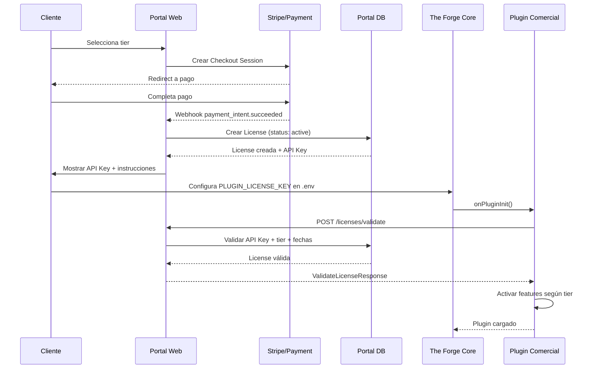

# Especificación del Portal de Licencias

**Versión:** 1.0.0  
**Status:** Draft  
**Servicio:** `licenses.theforge.dev`  

---

## 1. Visión General

El **Portal de Licencias** es un servicio REST externo que valida, emite y gestiona licencias comerciales para plugins de The Forge. Cada plugin comercial consulta este portal durante su inicialización para determinar si tiene permiso para ejecutarse.

### Principios del Portal

- **Stateless**: Cada request es autocontenida (API Key + timestamp + firma).
- **Idempotente**: Validar la misma licencia N veces devuelve el mismo resultado dentro de la ventana de cache.
- **Auditable**: Todo request se loguea con IP, pluginId, timestamp y outcome.
- **Escalable**: Diseñado para soportar validaciones en caliente sin bloquear el startup del core.

---

## 2. Base URL y Versionado

```
Production:  https://licenses.theforge.dev/api/v1
Staging:     https://licenses-staging.theforge.dev/api/v1
Health:      GET https://licenses.theforge.dev/health
```

### Headers Globales

| Header | Requerido | Descripción |
|--------|-----------|-------------|
| `Content-Type` | Sí | `application/json` |
| `X-Plugin-Id` | Sí | Identificador del plugin (ej: `mi-plugin-premium`) |
| `X-API-Key` | Sí | API Key del cliente (inicia con `tk_`) |
| `X-Request-Id` | No | UUID para trazabilidad |

---

## 3. Endpoints

### 3.1 POST `/licenses/validate` — Validar Licencia en Caliente

**Uso principal**: Llamado por `LicenseValidator.validate()` durante `onPluginInit`.

#### Request Body

```typescript
interface ValidateLicenseRequest {
  apiKey: string;
  pluginId: string;
  timestamp: string;
  pluginVersion?: string;
  coreVersion?: string;
  instanceId?: string;
}
```

#### Response 200 OK — Licencia Válida

```typescript
interface ValidateLicenseResponse {
  valid: true;
  tier: "personal" | "team" | "enterprise" | "trial";
  expiresAt: string;
  issuedAt: string;
  features: string[];
  usage?: {
    current: number;
    limit: number;
    period: string;
    resetsAt?: string;
  };
  license: {
    id: string;
    type: "subscription" | "perpetual" | "trial";
    organization?: string;
    contactEmail?: string;
  };
}
```

#### Response 200 OK — Licencia Inválida

```json
{
  "valid": false,
  "tier": "none",
  "errorMessage": "License expired on 2026-01-01T00:00:00.000Z",
  "errorCode": "LICENSE_EXPIRED"
}
```

#### Códigos de Error

| `errorCode` | Descripción | HTTP Status |
|-------------|-------------|-------------|
| `LICENSE_EXPIRED` | Licencia vencida | 200 (con valid:false) |
| `LICENSE_REVOKED` | Licencia revocada | 200 (con valid:false) |
| `LICENSE_SUSPENDED` | Licencia suspendida (pago pendiente) | 200 (con valid:false) |
| `INVALID_API_KEY` | API Key no existe | 401 |
| `INVALID_PLUGIN` | Plugin ID no reconocido | 403 |
| `RATE_LIMITED` | Demasiadas validaciones (100/min por IP) | 429 |
| `INTERNAL_ERROR` | Error interno del portal | 500 |

---

### 3.2 POST `/usage/report` — Reportar Uso

**Uso**: Llamado por el plugin periódicamente o después de operaciones costosas.

```typescript
interface ReportUsageRequest {
  apiKey: string;
  pluginId: string;
  operation: string;
  quantity?: number;
  metadata?: Record<string, unknown>;
}
```

Response: `202 Accepted` con uso actualizado.

---

### 3.3 GET `/licenses/me` — Información de la Licencia

**Uso**: Panel administrativo del cliente para ver estado de su licencia.

---

---

### 3.4 POST `/plugins/download` — Descargar paquete `.tfplugin`

**Uso:** The Forge core (`PluginInstallService`) cuando el admin instala con clave de licencia en Ajustes → Plugins.

```http
POST /api/v1/plugins/download
Content-Type: application/json
X-API-Key: tk_…
X-Plugin-Id: com.kreodevs.evd
```

```typescript
interface PluginDownloadRequest {
  pluginId?: string;
  coreVersion?: string;
}
```

**Response 200:** `Content-Type: application/zip` — cuerpo `.tfplugin` (ver `docs/PLUGINS-PACKAGING.md`).

| HTTP | Causa |
|------|--------|
| 401 | API Key inválida |
| 403 | Licencia no cubre el plugin |
| 404 | Versión no publicada para este core |

---

### 3.5 POST `/webhooks/license-changed` — Webhook de Cambios

El portal notifica al core cuando una licencia cambia de estado.

---

## 4. Modelo de Datos

### Entidad `License`

```typescript
interface LicenseRecord {
  id: string;
  apiKey: string;
  pluginId: string;
  status: "active" | "expired" | "revoked" | "suspended" | "trial";
  tier: "personal" | "team" | "enterprise" | "trial";
  type: "subscription" | "perpetual" | "trial";
  issuedAt: Date;
  expiresAt: Date;
  features: string[];
  usageLimit: number;      // -1 = ilimitado
  usagePeriod: "monthly" | "yearly" | "never";
  usageCurrent: number;
  organizationName?: string;
  contactEmail: string;
}
```

### Entidad `LicenseEvent` (Audit Log)

```typescript
interface LicenseEvent {
  id: string;
  licenseId: string;
  apiKey: string;
  eventType: string;
  ipAddress: string;
  createdAt: Date;
}
```

### Entidad `Plugin`

```typescript
interface PluginDefinition {
  id: string;
  name: string;
  version: string;
  isActive: boolean;
  pricing: Record<string, { monthly: number; yearly: number; features: string[] }>;
}
```

---

## 5. Flujo de Adquisición de Licencia



---

## 6. Cache y Performance

### Lado del Plugin

```typescript
// En LicenseValidator
private cachedResult: LicenseValidationResult | null = null;
private cachedAt = 0;
private readonly cacheTtlMs = 5 * 60 * 1000; // 5 minutos
```

### Lado del Portal

```
Redis/Memcached:
  Key:   license:{apiKey}:validation
  TTL:   60 segundos
  Value: JSON stringificado del resultado
```

---

## 7. Variables de Entorno (Portal)

```bash
DATABASE_URL=postgresql://user:pass@db:5432/licenses
REDIS_URL=redis://redis:6379/0
STRIPE_SECRET_KEY=sk_live_...
STRIPE_WEBHOOK_SECRET=whsec_...
WEBHOOK_SECRET=super-secret-webhook-signing-key
PORT=3000
NODE_ENV=production
```

---

## 8. Esquema de Base de Datos (PostgreSQL)

```sql
CREATE TABLE licenses (
  id UUID PRIMARY KEY DEFAULT gen_random_uuid(),
  api_key VARCHAR(64) NOT NULL UNIQUE,
  plugin_id VARCHAR(128) NOT NULL,
  status VARCHAR(32) NOT NULL DEFAULT 'active',
  tier VARCHAR(32) NOT NULL,
  type VARCHAR(32) NOT NULL DEFAULT 'subscription',
  issued_at TIMESTAMPTZ NOT NULL DEFAULT NOW(),
  expires_at TIMESTAMPTZ NOT NULL,
  features JSONB NOT NULL DEFAULT '[]',
  usage_limit INTEGER NOT NULL DEFAULT -1,
  usage_period VARCHAR(16) DEFAULT 'monthly',
  usage_current INTEGER NOT NULL DEFAULT 0,
  usage_resets_at TIMESTAMPTZ,
  organization_name VARCHAR(256),
  contact_email VARCHAR(256) NOT NULL,
  metadata JSONB DEFAULT '{}',
  created_at TIMESTAMPTZ NOT NULL DEFAULT NOW(),
  updated_at TIMESTAMPTZ NOT NULL DEFAULT NOW()
);

CREATE INDEX idx_licenses_api_key ON licenses(api_key);
CREATE INDEX idx_licenses_status ON licenses(status) WHERE status = 'active';
CREATE INDEX idx_licenses_expires ON licenses(expires_at);

CREATE TABLE license_events (
  id UUID PRIMARY KEY DEFAULT gen_random_uuid(),
  license_id UUID NOT NULL REFERENCES licenses(id),
  api_key VARCHAR(64) NOT NULL,
  event_type VARCHAR(64) NOT NULL,
  ip_address INET,
  payload JSONB DEFAULT '{}',
  created_at TIMESTAMPTZ NOT NULL DEFAULT NOW()
);

CREATE INDEX idx_events_license ON license_events(license_id, created_at DESC);

CREATE TABLE plugins (
  id VARCHAR(128) PRIMARY KEY,
  name VARCHAR(256) NOT NULL,
  version VARCHAR(32) NOT NULL,
  is_active BOOLEAN NOT NULL DEFAULT true,
  pricing JSONB NOT NULL,
  created_at TIMESTAMPTZ NOT NULL DEFAULT NOW(),
  updated_at TIMESTAMPTZ NOT NULL DEFAULT NOW()
);
```

---

## Implementación en Plugin

Cada plugin que requiera licenciamiento debe implementar `LicenseValidator` en su `onPluginInit`:

```typescript
async onPluginInit(context: PluginContext): Promise<void> {
  const apiKey = process.env.PLUGIN_LICENSE_KEY || process.env[`${this.id.toUpperCase()}_LICENSE_KEY`];
  if (!apiKey) {
    throw new Error(`${this.name}: PLUGIN_LICENSE_KEY no configurada`);
  }
  const validator = new LicenseValidator({
    apiKey,
    pluginId: this.id,
    portalUrl: 'https://licenses.theforge.dev/api/v1',
  });
  await validator.validate();
}
```

---

```
Copyright (c) 2026 The Forge Inc.
Documentación interna — Libre para uso en plugins de la comunidad.
```