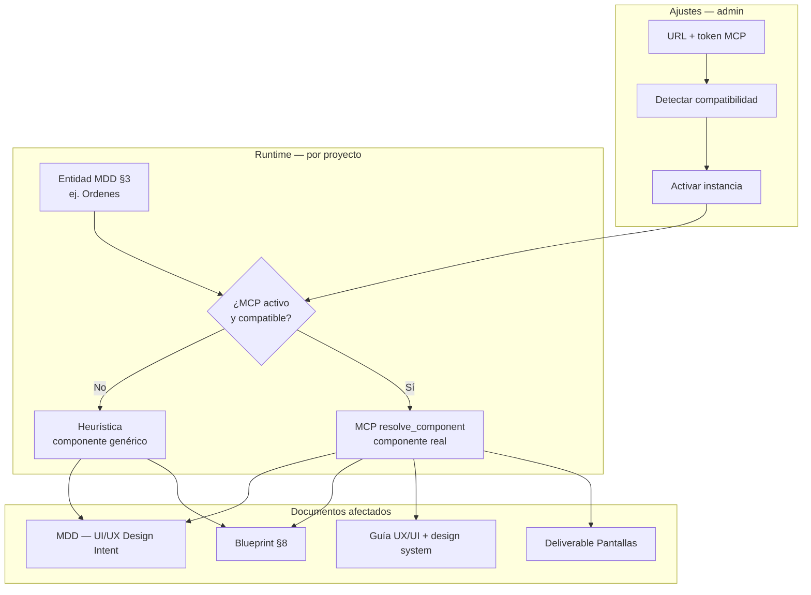

# MCP gráfico (componentes UI)

Documentación del módulo **MCP gráfico** de The Forge: conexión a MCPs externos de design system / componentes UI para enriquecer MDD, Blueprint, Guía UX/UI y el deliverable «Pantallas».

**Código:** `apps/api/src/modules/ui-mcp/` · **Contrato:** `packages/shared-types/src/ui-mcp-contract.ts` · **UI:** Ajustes → MCP gráfico (`UiMcpInstancesCard`).

---

## Resumen

El MCP gráfico es un **catálogo de componentes UI real** (p. ej. Kreo UI) que The Forge consulta durante la generación de documentos. Sustituye nombres genéricos heurísticos (`DataTable`, `KanbanBoard`, …) por componentes concretos del design system con import path, props y tokens.

Sin MCP compatible activo, **el comportamiento es el de siempre**: heurística interna + Ariadne. El MCP gráfico es una capa opcional encima.

---

## Arquitectura

### Piezas principales

| Pieza | Rol |
|-------|-----|
| `UiMcpService` | CRUD de instancias team-wide, activación exclusiva, detección de compatibilidad, token cifrado |
| `UiMcpClientService` | Cliente de alto nivel del MCP activo; errores → `null` + fallback heurístico |
| `ui-mcp-transport.util` | JSON-RPC HTTP/SSE con URL/token explícitos (no lee env) |
| `UiComponentResolver` | `HeuristicUiComponentResolver` (default) vs `McpUiComponentResolver` (MCP + fallback por entidad) |
| `UiScreensService` | Deliverable «Pantallas» → `Project.uiScreensContent` |
| Adaptadores (`adapters/`) | Shim para MCPs que no implementan el contrato nativo (p. ej. Kreo) |

---

## Configuración (Ajustes → MCP gráfico)

Solo **admin** o **super_admin**.

1. **Agregar instancia:** URL del MCP (ej. `https://uicompos.kreoint.mx/mcp`) y token M2M/Bearer (opcional si el servidor no exige auth).
2. **Detectar:** la API llama `tools/list` y evalúa compatibilidad (ver siguiente sección).
3. **Activar:** solo **una instancia activa** a la vez (team-wide). Las demás quedan inactivas.

El token se persiste **cifrado** en `UiMcpInstance`. Si cambias URL o token, se invalida la compatibilidad hasta volver a detectar.

### REST API

| Método | Ruta | Descripción |
|--------|------|-------------|
| `GET` | `/api/ui-mcp/active` | Gate: ¿hay MCP compatible activo? (cualquier rol autenticado) |
| `GET` | `/api/ui-mcp` | Listar instancias (admin) |
| `POST` | `/api/ui-mcp` | Crear instancia |
| `PUT` | `/api/ui-mcp/:id` | Actualizar |
| `DELETE` | `/api/ui-mcp/:id` | Eliminar |
| `POST` | `/api/ui-mcp/:id/activate` | Activar / desactivar |
| `POST` | `/api/ui-mcp/:id/detect` | Detectar y persistir compatibilidad |
| `POST` | `/api/ui-mcp/test` | Probar URL/token sin persistir |

---

## Compatibilidad

Un MCP es **compatible** si cumple **una** de estas vías:

### 1. Contrato nativo The Forge

`tools/list` expone al menos:

- `describe_capabilities`
- `list_components`
- `resolve_component`

Y `describe_capabilities` devuelve un `contractVersion` reconocido (actualmente major `1.x`, definido en `UI_MCP_CONTRACT_VERSION`).

**Opcionales** (habilitan capacidades extra):

- `list_screens` — deliverable Pantallas estructurado
- `get_design_tokens` — sección de design system en Guía UX/UI

### 2. Adaptador genérico

Si no cumple el contrato nativo, The Forge intenta emparejar un **adaptador** registrado por intersección de tools en `tools/list`.

| Adaptador | Tools mínimas requeridas | Id persistido |
|-----------|--------------------------|---------------|
| **Kreo UI MCP** | `resolve_component_for_entity`, `get_ui_component_catalog` | `kreo` |

Tools Kreo **opcionales** (mejoran capacidades, no bloquean compatibilidad):

- `pull_tokens_dtcg` → design tokens en Guía UX/UI
- `list_ui_project_screens` → marcado como `supports.listScreens`; **aún no mapeado** al contrato The Forge (workflow PROTOTYPE distinto)

### Auth HTTP

El transporte envía **ambos** headers cuando hay token:

- `Authorization: Bearer <token>`
- `X-M2M-Token: <token>`

Kreo UI exige Bearer; otros MCPs pueden usar solo X-M2M-Token.

---

## Adaptador Kreo (mapeo)

| Contrato The Forge | Tool Kreo | Notas |
|--------------------|-----------|-------|
| `describe_capabilities` | *(sintetizado)* | Desde `tools/list`; declara `kreo-ui` 5.3 |
| `resolve_component` | `resolve_component_for_entity` | JSON embebido en markdown → componente + path + props |
| `list_components` | `get_ui_component_catalog` | Parseo de tabla markdown → nombres |
| `get_design_tokens` | `pull_tokens_dtcg` | JSON W3C DTCG → colores, tipografía, spacing, etc. |
| `list_screens` | — | No implementado; Pantallas usa fallback por entidad |

---

## Consumo en generación de documentos

Cuando hay **MCP compatible activo**, estos flujos usan `McpUiComponentResolver`:

| Documento | Punto de integración |
|-----------|----------------------|
| **MDD — UI/UX Design Intent** | `mdd-enrich-uiux-intent` vía `prepareMddForOutput` |
| **Blueprint §8** | `enrichBlueprintWithUiDesignSystem` en `ProjectsService` |
| **Guía UX/UI (DESIGN.md)** | `appendUiMcpDesignSystem` — anexa sección «Design System (inferido del MCP gráfico)» |
| **Deliverable Pantallas** | `UiScreensService.syncUiScreens` → `POST /api/projects/:id/ui-screens/sync` |

### Fallback por entidad

Si el MCP falla al resolver **una** entidad (timeout, error, JSON inválido), esa entidad vuelve al componente heurístico. El resto del documento sigue con MCP. No se aborta la generación completa.

### Sin MCP activo

| Aspecto | Comportamiento |
|---------|----------------|
| Componentes UI | Heurística (`DataTable`, `DynamicForm`, …) |
| Design system | LLM / Ariadne (`extract_design_tokens`, etc.) |
| Pantallas | No disponible vía MCP (requiere instancia activa) |

---

## Deliverable «Pantallas / UI Screens Spec»

Genera markdown de texto (sin TSX, sin preview, sin iframe).

1. Lee entidades de **§3 Modelo de Datos** del MDD (`CREATE TABLE …`).
2. Cruza con **Historias de Usuario** (`userStoriesContent`): vincula HU por nombre de entidad, enriquece nombre/propósito/`uiHint`/clasificación y añade pantallas para HU sin tabla (p. ej. dashboard).
3. Intenta `list_screens` si el MCP lo soporta nativamente.
4. Si no, **fallback:** `resolve_component` por cada ítem del plan (Kreo recibe `ui_hint` y `context` de la HU).
5. Persiste en `Project.uiScreensContent` (y `Stage.uiScreensContent` cuando aplica).

En Workshop: acción de generar/sincronizar pantallas (requiere MCP activo y entidades en §3).

Con adaptador Kreo, el paso 2 no aplica; el paso 3 es el camino habitual.

---

## Qué NO hace el MCP gráfico

- **No renderiza** pantallas ni genera TSX en el repositorio del proyecto.
- **No es el MCP Ariadne** (`THEFORGE_MCP_URL`) — ese sirve para grafo de código, contratos indexados y flujo legacy.
- **No sustituye la entrevista** — solo enriquece la capa UI de documentos ya generados.
- **No requiere** `list_ui_project_screens` de Kreo (PROTOTYPE con slug + Storybook es otro workflow).

---

## Flujo operativo recomendado

1. **Ajustes → MCP gráfico:** registrar Kreo (o MCP nativo) → **Detectar** → **Activar**.
2. **Workshop:** entrevista normal; asegurar entidades en §3 del MDD.
3. Regenerar **MDD / Blueprint / Guía UX/UI** — componentes y tokens del MCP aparecen en los entregables.
4. *(Opcional)* Generar **Pantallas** desde el Workshop.

---

## Modelo de datos

Tabla `UiMcpInstance` (Prisma):

| Campo | Descripción |
|-------|-------------|
| `url`, `tokenCiphertext` | Conexión al MCP |
| `compatible`, `adapterId` | Resultado de detección (`adapterId`: `null` = nativo, `"kreo"` = adaptador) |
| `contractVersion`, `libraryName`, `libraryVersion` | Metadatos del handshake |
| `capabilitiesJson` | Soporte (`supports`) + `detectedTools` de la última detección |
| `isActive` | Solo una instancia activa a la vez |

Migración: `20260702_add_ui_mcp_instance`, `20260703180000_ui_mcp_adapter_id`.

---

## Relacionado

- Módulo API: [apps/api/src/modules/ui-mcp/README.md](../apps/api/src/modules/ui-mcp/README.md)
- MCP Ariadne (legacy / grafo): [notebooklm/integracion-theforge/README.md](notebooklm/integracion-theforge/README.md)
- Plan histórico validación UI corporativa (no implementado): [plans/PLAN-UI-COMPONENT-MCP-VALIDATION.md](plans/PLAN-UI-COMPONENT-MCP-VALIDATION.md)
