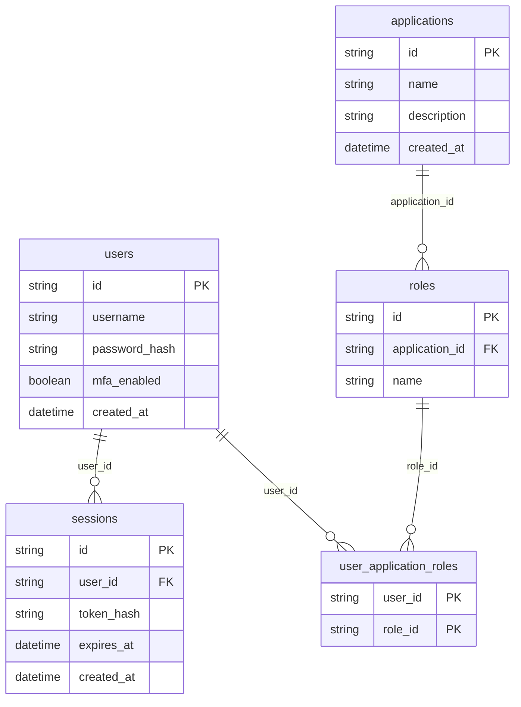

# Master Design Document

---
## 1. Contexto

(Pendiente)

---
## 2. Arquitectura y Stack

(Pendiente)

---
## 3. Modelo de Datos

```sql
CREATE TABLE users (
  id UUID PRIMARY KEY DEFAULT gen_random_uuid(),
  username VARCHAR(255) NOT NULL UNIQUE,
  password_hash VARCHAR(255) NOT NULL,
  mfa_enabled BOOLEAN NOT NULL DEFAULT false,
  created_at TIMESTAMPTZ NOT NULL DEFAULT now()
);
CREATE TABLE sessions (
  id UUID PRIMARY KEY DEFAULT gen_random_uuid(),
  user_id UUID NOT NULL REFERENCES users(id) ON DELETE CASCADE,
  token_hash VARCHAR(255) NOT NULL,
  expires_at TIMESTAMPTZ NOT NULL,
  created_at TIMESTAMPTZ NOT NULL DEFAULT now()
);
CREATE TABLE applications (
  id UUID PRIMARY KEY DEFAULT gen_random_uuid(),
  name VARCHAR(255) NOT NULL,
  description TEXT,
  created_at TIMESTAMPTZ NOT NULL DEFAULT now()
);
CREATE TABLE roles (
  id UUID PRIMARY KEY DEFAULT gen_random_uuid(),
  application_id UUID NOT NULL REFERENCES applications(id) ON DELETE CASCADE,
  name VARCHAR(255) NOT NULL
);
CREATE TABLE user_application_roles (
  user_id UUID NOT NULL REFERENCES users(id) ON DELETE CASCADE,
  role_id UUID NOT NULL REFERENCES roles(id) ON DELETE CASCADE,
  PRIMARY KEY (user_id, role_id)
);
```

```TechnicalMetadata
[high_security]
```

### Diagrama entidad-relación



---
## 4. Contratos de API

(SSO)

| Método | Ruta | Descripción | Auth |
|--------|------|-------------|------|
| POST | /api/users | Create a new user | Bearer |
| POST | /api/sessions | Create a new session (login) | Bearer |
| GET | /api/applications | List all applications | Bearer |
| POST | /api/applications | Create a new application | Bearer |
| GET | /api/roles | List all roles for an application | Bearer |
| POST | /api/roles | Create a new role for an application | Bearer |
| POST | /api/user-roles | Assign a role to a user | Bearer |

### POST /api/users

Create a new user

**Request body:**

```json
{
  "username": "string",
  "password": "string"
}
```

**Response 200:**

```json
{
  "id": "UUID",
  "username": "string",
  "mfa_enabled": "boolean",
  "created_at": "timestamp"
}
```

### POST /api/sessions

Create a new session (login)

**Request body:**

```json
{
  "username": "string",
  "password": "string"
}
```

**Response 200:**

```json
{
  "token": "string",
  "expires_at": "timestamp"
}
```

**Response 401:**

```json
{
  "error": "Invalid credentials"
}
```

### GET /api/applications

List all applications

**Response 200:**

```json
[
  {
    "id": "UUID",
    "name": "string",
    "description": "string",
    "created_at": "timestamp"
  }
]
```

### POST /api/applications

Create a new application

**Request body:**

```json
{
  "name": "string",
  "description": "string"
}
```

**Response 200:**

```json
{
  "id": "UUID",
  "name": "string",
  "description": "string",
  "created_at": "timestamp"
}
```

### GET /api/roles

List all roles for an application

**Response 200:**

```json
[
  {
    "id": "UUID",
    "application_id": "UUID",
    "name": "string"
  }
]
```

### POST /api/roles

Create a new role for an application

**Request body:**

```json
{
  "application_id": "UUID",
  "name": "string"
}
```

**Response 200:**

```json
{
  "id": "UUID",
  "application_id": "UUID",
  "name": "string"
}
```

### POST /api/user-roles

Assign a role to a user

**Request body:**

```json
{
  "user_id": "UUID",
  "role_id": "UUID"
}
```

**Response 200:**

```json
{
  "user_id": "UUID",
  "role_id": "UUID"
}
```

---
## 5. Lógica y Edge Cases

(Pendiente)

---
## 6. Seguridad

### 6.1 Autenticación y Autorización

- **Autenticación**: Implementación de autenticación basada en tokens JWT para asegurar que solo usuarios autenticados puedan acceder a los recursos.
- **Autorización**: Uso de roles y permisos para controlar el acceso a las aplicaciones y sus funcionalidades. Cada usuario puede tener diferentes roles en distintas aplicaciones.

### 6.2 Almacenamiento Seguro de Credenciales

- **Hash de Contraseñas**: Las contraseñas de los usuarios se almacenan utilizando un algoritmo de hash seguro (por ejemplo, bcrypt) para protegerlas contra accesos no autorizados.
- **Almacenamiento de Credenciales**: Las credenciales se almacenan en una base de datos segura con cifrado en reposo y en tránsito.

### 6.3 Seguridad de las Sesiones

- **Tokens de Sesión**: Las sesiones de usuario se gestionan mediante tokens seguros que expiran después de un tiempo definido para minimizar el riesgo de uso indebido.

### 6.4 Protección contra Ataques Comunes

- **Prevención de Ataques de Fuerza Bruta**: Implementación de medidas para detectar y bloquear intentos de inicio de sesión sospechosos.
- **Protección CSRF**: Uso de tokens CSRF para proteger las solicitudes de cambios de estado.
- **Validación de Entradas**: Validación y saneamiento de todas las entradas de usuario para prevenir inyecciones SQL y otros tipos de ataques de inyección.

### 6.5 Registro y Monitoreo

- **Registro de Eventos de Seguridad**: Implementación de un sistema de registro para monitorear eventos de seguridad importantes, como intentos de inicio de sesión fallidos y cambios de roles de usuario.
- **Monitoreo en Tiempo Real**: Uso de herramientas de monitoreo para detectar y responder rápidamente a actividades sospechosas.
- **Campos de Auditoría**: Inclusión de campos de auditoría en las tablas relevantes para rastrear cambios y accesos.

### 6.6 Cumplimiento y Auditoría

- **Cumplimiento Normativo**: Asegurar que el sistema cumpla con las normativas y estándares de seguridad aplicables (por ejemplo, GDPR, ISO 27001).
- **Auditorías de Seguridad**: Realización de auditorías de seguridad periódicas para identificar y mitigar vulnerabilidades potenciales.

---
## 7. Infraestructura

### 7.1 Flujo de Integración

Para la integración de la aplicación SSO con las aplicaciones in-house, se utilizará Docker para contenerizar los servicios. El despliegue se realizará en Dokploy, lo que facilitará la gestión de entornos y escalabilidad. El flujo de integración debe garantizar que los usuarios puedan autenticarse una sola vez y acceder a todas las aplicaciones internas mediante un sistema de roles y permisos.

### 7.2 Seguridad en la Integración

Se debe asegurar que la comunicación entre los contenedores Docker y Dokploy sea segura. Esto incluye:

**Certificados SSL**: Uso de certificados SSL para encriptar la comunicación entre servicios.

**Autenticación de Contenedores**: Configuración de políticas de acceso para asegurar que solo contenedores autorizados puedan comunicarse entre sí.

### 7.3 Orquestación y Despliegue

Dokploy permitirá la orquestación de contenedores Docker, asegurando que el sistema sea escalable y fácil de gestionar. Se deben definir políticas de despliegue automatizado para garantizar actualizaciones consistentes y mínimas interrupciones del servicio.

### 7.4 Monitoreo y Mantenimiento

Implementar herramientas de monitoreo para supervisar el estado de los contenedores y el rendimiento del sistema. Configurar alertas para detectar anomalías y problemas de seguridad en tiempo real.

### 7.5 Manifest de Infraestructura

```TechnicalMetadata
{
  "stack": ["Docker", "Dokploy"],
  "orchestration": "Dokploy para gestión de contenedores",
  "deployment": "Automatizado con Dokploy"
}
```
