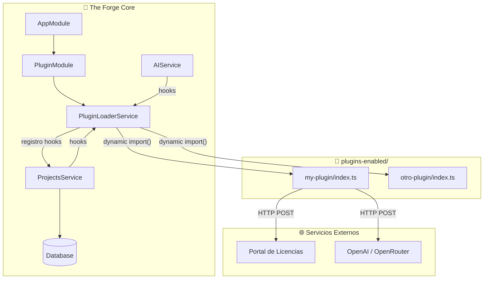
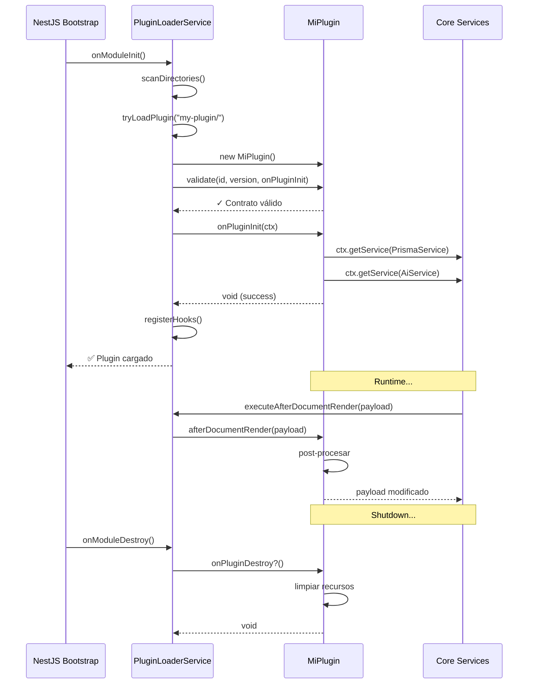

# Sistema de Plugins de The Forge

**Versión:** 1.1.0
**Estado:** Estable — motor de plugins genérico desde v1.1.0
**Última actualización:** 2026-07-13

---

## Tabla de Contenidos

1. [Visión General](#1-visión-general)
2. [Arquitectura](#2-arquitectura)
3. [La Interfaz `ITheForgePlugin`](#3-la-interfaz-itheforgeplugin)
4. [Ciclo de Vida de un Plugin](#4-ciclo-de-vida-de-un-plugin)
5. [Hooks Disponibles](#5-hooks-disponibles)
6. [Cómo Crear un Plugin (Paso a Paso)](#6-cómo-crear-un-plugin-paso-a-paso)
7. [Instalación de Plugins](#7-instalación-de-plugins)
8. [Ejemplo Completo: Plugin Mínimo](#8-ejemplo-completo-plugin-mínimo)
9. [Ejemplo Avanzado: Plugin con Servicios Internos](#9-ejemplo-avanzado-plugin-con-servicios-internos)
10. [Buenas Prácticas](#10-buenas-prácticas)
11. [Migración desde Código Acoplado](#11-migración-desde-código-acoplado)
12. [Troubleshooting](#12-troubleshooting)
13. [Referencia Rápida](#13-referencia-rápida)

---

## 1. Visión General

El **Sistema de Plugins de The Forge** permite extender la plataforma sin modificar el core. Es la respuesta a años de acoplamiento: en lugar de que cada feature viva dentro del monorepo principal, los desarrolladores pueden construir, distribuir e instalar plugins independientes.

### Filosofía

| Principio | Implementación |
|-----------|---------------|
| **Zero Static Imports** | El core nunca importa código de plugin en tiempo de compilación |
| **Inversión de Dependencias** | El plugin depende de la abstracción `ITheForgePlugin`, no del core concreto |
| **Graceful Degradation** | Si un plugin falla, el core continúa sin él |
| **Autocontenido** | Cada plugin tiene su propio package.json, dependencias y build |
| **Hook-based** | Comunicación vía eventos (before/after document render, lifecycle) |

### Casos de Uso

- **Plugins comerciales**: monetización vía validación de licencias
- **Plugins de integración**: conectar con servicios externos (Slack, Jira, Notion)
- **Plugins de exportación**: formatos adicionales (Word, LaTeX, Confluence)
- **Plugins de análisis**: métricas custom, dashboards, reportes
- **Plugins de dominio**: reglas de negocio específicas de industria

---

## 2. Arquitectura



### Componentes del Core

| Componente | Archivo | Rol |
|-----------|---------|-----|
| `ITheForgePlugin` | `apps/api/src/plugins/interfaces/the-forge-plugin.interface.ts` | Contrato que todo plugin debe implementar |
| `PluginContext` | `apps/api/src/plugins/types/plugin-payloads.ts` | Contexto de DI limitado pasado al plugin |
| `PluginLoaderService` | `apps/api/src/plugins/plugin-loader.service.ts` | Carga dinámica, validación y registro de hooks |
| `PluginModule` | `apps/api/src/plugins/plugin.module.ts` | Módulo NestJS que expone el loader |

---

## 3. La Interfaz `ITheForgePlugin`

```typescript
export interface ITheForgePlugin {
  /** Identificador único. Formato reverse-DNS: "com.miempresa.plugin" */
  readonly id: string;

  /** Versión semántica. Ej: "2.1.0" */
  readonly version: string;

  /** Nombre legible para humanos */
  readonly name: string;

  /** Descripción de la funcionalidad */
  readonly description: string;

  // ── Ciclo de Vida ──────────────────────
  onPluginInit(context: PluginContext): Promise<void> | void;
  onPluginDestroy?(): Promise<void> | void;

  // ── Hooks de Documentos ────────────────
  beforeDocumentRender?(
    payload: BeforeDocumentRenderPayload
  ): Promise<BeforeDocumentRenderPayload> | BeforeDocumentRenderPayload;

  afterDocumentRender?(
    payload: AfterDocumentRenderPayload
  ): Promise<AfterDocumentRenderPayload> | AfterDocumentRenderPayload;

  afterDocumentPersist?(
    payload: AfterDocumentPersistPayload
  ): Promise<void> | void;

  // ── Hooks de Proyecto ──────────────────
  onProjectCreate?(payload: ProjectLifecyclePayload): Promise<void> | void;
  onProjectUpdate?(payload: ProjectLifecyclePayload): Promise<void> | void;

  // ── Registro de Artifacts ──────────────
  /**
   * Registra tipos de documento que este plugin genera.
   * El core los expone vía GET /api/plugins/artifacts para que
   * el frontend muestre paneles dinámicos en el sidebar y Workshop.
   */
  getArtifactTypes?(): ArtifactTypeDefinition[];
}
```

### `PluginContext`

```typescript
export interface PluginContext {
  /** Resuelve un servicio del core por token */
  getService<T>(token: string | symbol | (new (...args: unknown[]) => T)): T;

  /** Logger con prefijo del plugin */
  logger: Logger;

  /** Configuración del core (sin secretos) */
  config: Record<string, unknown>;
}
```

> ⚠️ **Importante**: `getService()` solo expone servicios que el core **decide** exponer. El plugin **no** tiene acceso al contenedor DI completo de NestJS.

---

## 4. Ciclo de Vida de un Plugin



### Estados del Plugin

| Estado | Descripción |
|--------|-------------|
| `detected` | Directorio encontrado en `plugins-enabled/` |
| `validating` | Verificando que implementa `ITheForgePlugin` |
| `initializing` | Ejecutando `onPluginInit()` |
| `active` | Hooks registrados y listos |
| `failed` | Error en carga o inicialización (graceful skip) |
| `destroyed` | `onPluginDestroy()` ejecutado |

---

## 5. Hooks Disponibles

### 5.1 `beforeDocumentRender`

**Cuándo se ejecuta:** ANTES de enviar el prompt al LLM.

**Uso típico:**
- Modificar el prompt (añadir contexto, instrucciones)
- Cambiar el system prompt
- Rechazar la generación lanzando `Error`

```typescript
async beforeDocumentRender(payload) {
  if (payload.documentType !== "spec") return payload;

  // Añadir contexto adicional al prompt
  payload.prompt += "\n\n[Plugin: Contexto de seguridad]\n" +
    "Asegúrate de incluir la sección de autenticación OAuth 2.0.";

  return payload;
}
```

### 5.2 `afterDocumentRender`

**Cuándo se ejecuta:** DESPUÉS de que el LLM devuelve el documento.

**Uso típico:**
- Post-procesar el output (validar, enriquecer)
- Generar recursos adicionales (imágenes, diagramas)
- Transformar formato

```typescript
async afterDocumentRender(payload) {
  if (payload.documentType !== "spec") return payload;

  const doc = payload.parsedContent as any;

  // Enriquecer el documento generado
  doc.metadata = {
    ...(doc.metadata ?? {}),
    generatedBy: this.name,
    timestamp: new Date().toISOString(),
  };

  return { ...payload, parsedContent: doc };
}
```

### 5.3 `afterDocumentPersist`

**Cuándo se ejecuta:** DESPUÉS de guardar en DB.

**Uso típico:**
- Side effects: export, notificación, analytics
- Pre-warm de caches
- Webhooks a sistemas externos

```typescript
async afterDocumentPersist(payload) {
  if (payload.documentType !== "spec") return;

  // Notificar a Slack
  await this.slack.send({
    text: `✅ Spec generado para proyecto ${payload.projectId}`,
    duration: payload.metadata.durationMs,
  });
}
```

### 5.4 `onProjectCreate`

**Cuándo se ejecuta:** Cuando se crea un nuevo proyecto.

```typescript
async onProjectCreate(payload) {
  // Crear recursos específicos del plugin para el proyecto
  await this.createProjectResources(payload.projectId);
}
```

### 5.5 `onProjectUpdate`

**Cuándo se ejecuta:** Cuando un proyecto se actualiza (post-save).

```typescript
async onProjectUpdate(payload) {
  // Revalidar algo cuando cambia el proyecto
  await this.invalidateProjectCache(payload.projectId);
}
```

### 5.6 `getArtifactTypes` — Registro de Panel UI

**Cuándo se ejecuta:** Una sola vez al cargar el plugin, durante el registro de hooks.

**Uso típico:**
- Registrar un tipo de documento que el plugin genera
- El artifact aparece como panel en el sidebar del Workshop
- El frontend consulta `GET /api/plugins/artifacts` para descubrirlos

```typescript
getArtifactTypes(): ArtifactTypeDefinition[] {
  return [{
    id: "mi-export",
    label: "Mi Export",
    icon: "Presentation",
    showInSidebar: true,
  }];
}
```

Los datos del artifact se persisten en `pluginData` (JSON por proyecto) via:

| Método | Endpoint |
|--------|----------|
| GET | `/api/plugins/projects/:id/plugin-data/:pluginId` |
| PUT | `/api/plugins/projects/:id/plugin-data/:pluginId` |

El frontend renderiza automáticamente un `PluginDocPanel` cuando el usuario abre el artifact desde el sidebar.

### 5.7 `getSettingsPanels` — Ajustes enganchados en la UI

**Cuándo se ejecuta:** Al cargar el plugin; el core expone los paneles vía `GET /api/plugins/settings-panels`.

**Uso típico:**
- Configuración **propia del plugin** (modelo de imagen EVD, licencia, calidad visual, etc.)
- El core **no** debe mezclar estos campos en Ajustes → Proveedores de IA
- El frontend monta tarjetas dinámicas en **Ajustes → Plugins**

```typescript
getSettingsPanels() {
  return [{
    id: "image-generation",
    label: "Generación de imágenes",
    description: "Modelo OpenRouter para slides del Executive Visual Deck",
    order: 10,
    fields: [{
      key: "imageModel",
      label: "Modelo de imagen",
      type: "text",
      placeholder: "black-forest-labs/flux.2-pro",
      hint: "Modelos en openrouter.io/docs#image-models",
      required: true,
    }],
  }];
}
```

| Método | Endpoint |
|--------|----------|
| GET | `/api/plugins/settings-panels` |
| GET | `/api/plugins/user-settings` |
| GET | `/api/plugins/:pluginId/user-settings` |
| PUT | `/api/plugins/:pluginId/user-settings` |

Persistencia: `UserAISettings.pluginUserSettings` → `{ [pluginId]: { ...campos } }`.

Hooks opcionales:
- `validateUserSettings(settings)` — normalizar/validar antes de guardar (400 si falla)
- `onUserSettingsSaved(settings, { userId })` — side-effects post-guardado

El plugin lee su configuración en runtime con `context.getService(PluginUserSettingsService)` o resolviendo desde su propio servicio interno.

---

## 6. Cómo Crear un Plugin (Paso a Paso)

### Paso 1: Estructura de Directorios

```text
my-awesome-plugin/
├── package.json              # Metadata + peerDependencies
├── tsconfig.json             # TypeScript config
├── README.md                 # Documentación del plugin
├── LICENSE.md                # Licencia
├── src/
│   ├── core/
│   │   └── plugin-contract.ts  # Copia de ITheForgePlugin (autocontenido)
│   ├── services/
│   │   └── my-service.ts       # Lógica de negocio
│   ├── my-plugin.ts          # Implementación principal
│   └── index.ts              # Entry point (export default)
└── dist/                     # Output de tsc
```

> Nota: La copia autónoma de `ITheForgePlugin` evita que el plugin dependa del core en tiempo de compilación. El core y el plugin solo se conocen en runtime vía `dynamic import()`.

### Paso 2: `package.json`

```json
{
  "name": "@mycompany/my-awesome-plugin",
  "version": "1.0.0",
  "private": true,
  "main": "./dist/index.js",
  "types": "./dist/index.d.ts",
  "scripts": {
    "build": "tsc",
    "watch": "tsc --watch"
  },
  "peerDependencies": {
    "@nestjs/common": "^10.0.0",
    "@nestjs/core": "^10.0.0"
  },
  "dependencies": {},
  "devDependencies": {
    "@types/node": "^22.0.0",
    "typescript": "^5.6.0"
  }
}
```

### Paso 3: `tsconfig.json`

```json
{
  "compilerOptions": {
    "module": "NodeNext",
    "moduleResolution": "NodeNext",
    "declaration": true,
    "target": "ES2022",
    "outDir": "./dist",
    "strict": true,
    "skipLibCheck": true
  },
  "include": ["src/**/*"],
  "exclude": ["node_modules", "dist"]
}
```

### Paso 4: Copiar el Contrato del Core

Crea `src/core/plugin-contract.ts` copiando las interfaces del core:

```typescript
// src/core/plugin-contract.ts
import type { Logger } from "@nestjs/common";

export interface PluginContext {
  getService<T>(token: string | symbol | (new (...args: unknown[]) => T)): T;
  logger: Logger;
  config: Record<string, unknown>;
}

export interface BeforeDocumentRenderPayload {
  documentType: string;
  projectId: string;
  prompt: string;
  systemPrompt: string;
  context: Record<string, string | null | undefined>;
  llmRuntime: { providerId: string; model: string; apiKey: string; baseURL: string };
}

export interface AfterDocumentRenderPayload {
  documentType: string;
  projectId: string;
  rawContent: string;
  parsedContent: unknown;
  originalContext: BeforeDocumentRenderPayload;
}

export interface AfterDocumentPersistPayload {
  documentType: string;
  projectId: string;
  finalContent: string;
  metadata: { durationMs: number; tokensUsed?: number; provider: string; model: string };
}

export interface ProjectLifecyclePayload {
  projectId: string;
  projectName: string;
  userId: string;
  timestamp: Date;
  extra?: Record<string, unknown>;
}

export interface ITheForgePlugin {
  readonly id: string;
  readonly version: string;
  readonly name: string;
  readonly description: string;
  onPluginInit(context: PluginContext): Promise<void> | void;
  onPluginDestroy?(): Promise<void> | void;
  beforeDocumentRender?(payload: BeforeDocumentRenderPayload): Promise<BeforeDocumentRenderPayload> | BeforeDocumentRenderPayload;
  afterDocumentRender?(payload: AfterDocumentRenderPayload): Promise<AfterDocumentRenderPayload> | AfterDocumentRenderPayload;
  afterDocumentPersist?(payload: AfterDocumentPersistPayload): Promise<void> | void;
  onProjectCreate?(payload: ProjectLifecyclePayload): Promise<void> | void;
  onProjectUpdate?(payload: ProjectLifecyclePayload): Promise<void> | void;
}
```

### Paso 5: Implementar el Plugin

```typescript
// src/my-plugin.ts
import type { ITheForgePlugin, PluginContext } from "./core/plugin-contract.js";
import type { AfterDocumentRenderPayload } from "./core/plugin-contract.js";

export default class MyAwesomePlugin implements ITheForgePlugin {
  readonly id = "com.mycompany.my-awesome-plugin";
  readonly version = "1.0.0";
  readonly name = "My Awesome Plugin";
  readonly description = "Añade funcionalidad X a The Forge";

  private logger?: PluginContext["logger"];

  async onPluginInit(ctx: PluginContext): Promise<void> {
    this.logger = ctx.logger;
    this.logger.log(`✅ ${this.name} v${this.version} inicializado`);
  }

  async afterDocumentRender(payload: AfterDocumentRenderPayload): Promise<AfterDocumentRenderPayload> {
    if (payload.documentType !== "spec") return payload;

    this.logger?.log("[MyPlugin] Procesando spec...");

    // Tu lógica aquí
    return payload;
  }
}
```

### Paso 6: Entry Point

```typescript
// src/index.ts
export { default } from "./my-plugin.js";
```

### Paso 7: Build

```bash
npx tsc
```

---

## 7. Instalación de Plugins

### Método A: Git Clone (Desarrollo)

```bash
cd /ruta/al/theforge
git clone https://github.com/mycompany/my-awesome-plugin.git \
  apps/api/src/plugins-enabled/my-awesome-plugin
cd apps/api/src/plugins-enabled/my-awesome-plugin
npm install  # o pnpm install
npm run build
```

Reinicia el servidor NestJS. El `PluginLoaderService` detectará automáticamente el directorio.

### Método B: npm Private Registry (Producción)

```bash
# En el host
cd apps/api
pnpm add @mycompany/my-awesome-plugin \
  --registry https://npm.mycompany.com

# El post-install del plugin copia dist/ a plugins-enabled/
```

### Método C: Copia Manual (Docker)

```dockerfile
# Dockerfile del core
COPY ./my-awesome-plugin/dist \
     /app/plugins-enabled/my-awesome-plugin/dist
COPY ./my-awesome-plugin/package.json \
     /app/plugins-enabled/my-awesome-plugin/package.json
```

### Verificar Instalación

Al arrancar el core verás en los logs:

```
[Nest] 12345  - 2026-07-13 12:00:00   LOG [PluginLoaderService] 1 plugin(s) loaded: com.mycompany.my-awesome-plugin
```

---

## 8. Ejemplo Completo: Plugin Mínimo

```typescript
// src/index.ts
import type {
  ITheForgePlugin,
  PluginContext,
  AfterDocumentRenderPayload,
} from "./core/plugin-contract.js";

export default class MinimalPlugin implements ITheForgePlugin {
  readonly id = "dev.example.minimal";
  readonly version = "0.1.0";
  readonly name = "Minimal Plugin";
  readonly description = "Plugin mínimo de ejemplo";

  async onPluginInit(ctx: PluginContext): Promise<void> {
    ctx.logger.log("👋 Hola desde MinimalPlugin!");
  }

  async afterDocumentRender(
    payload: AfterDocumentRenderPayload
  ): Promise<AfterDocumentRenderPayload> {
    // Añadir metadata al output
    if (typeof payload.parsedContent === "object" && payload.parsedContent) {
      (payload.parsedContent as Record<string, unknown>)["_generatedBy"] = "MinimalPlugin";
    }
    return payload;
  }
}
```

---

## 9. Ejemplo Avanzado: Plugin con Servicios Internos

Este ejemplo muestra un plugin con servicios propios, validación de licencia y generación de assets.

```typescript
// src/services/license-validator.ts
export class LicenseValidator {
  async validate(apiKey: string): Promise<boolean> {
    const res = await fetch("https://licenses.example.com/validate", {
      method: "POST",
      headers: { "X-API-Key": apiKey },
      body: JSON.stringify({ apiKey }),
    });
    return res.ok;
  }
}

// src/services/image-generator.ts
export class ImageGenerator {
  async generate(prompt: string): Promise<string> {
    // Llamada a OpenAI, OpenRouter, etc.
    return "base64...";
  }
}

// src/my-plugin.ts
import type { ITheForgePlugin, PluginContext } from "./core/plugin-contract.js";
import { LicenseValidator } from "./services/license-validator.js";
import { ImageGenerator } from "./services/image-generator.js";

export default class PremiumPlugin implements ITheForgePlugin {
  readonly id = "com.miempresa.premium";
  readonly version = "2.0.0";
  readonly name = "Premium Visuals";
  readonly description = "Genera visuales automáticos con IA";

  private logger?: PluginContext["logger"];
  private licenseValidator = new LicenseValidator();
  private imageGenerator = new ImageGenerator();

  async onPluginInit(ctx: PluginContext): Promise<void> {
    this.logger = ctx.logger;

    const apiKey = process.env.PREMIUM_PLUGIN_API_KEY ?? "";
    if (!apiKey) {
      throw new Error("PREMIUM_PLUGIN_API_KEY no configurada");
    }

    const valid = await this.licenseValidator.validate(apiKey);
    if (!valid) {
      throw new Error("Licencia inválida");
    }

    ctx.logger.log(`✅ ${this.name} v${this.version} — licencia válida`);
  }

  async afterDocumentRender(payload) {
    if (payload.documentType !== "spec") return payload;

    const doc = payload.parsedContent as any;
    if (!doc?.sections) return payload;

    // Añadir secciones custom
    doc.sections.push({
      title: "Plugin Section",
      content: "Generado por PremiumPlugin",
    });

    return { ...payload, parsedContent: doc };
  }

  getArtifactTypes(): ArtifactTypeDefinition[] {
    return [{
      id: "premium-visuals",
      label: "Premium Visuals",
      icon: "Presentation",
      showInSidebar: true,
    }];
  }
}
```

---

## 10. Buenas Prácticas

### DO ✅

1. **Copiar el contrato** del core al plugin (no importar desde el core)
2. **Validar configuración** en `onPluginInit()` — fallar rápido
3. **Usar `try/catch`** en hooks — nunca dejar que el plugin crashee el core
4. **Loguear con `ctx.logger`** — trazabilidad consistente
5. **Documentar features** y requisitos en README.md
6. **SemVer** para versionado — `major.minor.patch`
7. **Graceful degradation** — si un feature depende de un servicio externo, manejar fallos

### DON'T ❌

1. **No uses `import` estático** desde el core en el plugin
2. **No modifiques la DB del core** directamente — usa hooks o APIs
3. **No bloquees** el startup con operaciones síncronas largas
4. **No expongas secretos** en `ctx.config` — el core no los envía
5. **No asumas que el core** tiene X versión — documenta compatibilidad
6. **No ignores los hooks** del core en los que no estás interesado — simplemente no los implementes

### Estilo de Código

```typescript
// ✅ BIEN: Plugin simple, hook enfocado
async afterDocumentRender(payload) {
  if (payload.documentType !== "spec") return payload;  // Early return
  // ... lógica
  return payload;
}

// ❌ MAL: Acoplamiento, side effects ocultos
async afterDocumentRender(payload) {
  await this.db.query("DELETE FROM projects");  // ¡NUNCA!
  fs.writeFileSync("/etc/passwd", "...");       // ¡ABSOLUTAMENTE NO!
  return payload;
}
```

---

## 11. Migración desde Código Acoplado

Si tienes lógica de negocio acoplada al core, sigue estos pasos:

### Paso 1: Extraer el código a un paquete independiente

```bash
mkdir packages/my-plugin
cp -r apps/api/src/modules/mi-logica/* packages/my-plugin/src/
```

### Paso 2: Crear el entry point (`index.ts`)

```typescript
export { default } from "./my-plugin.js";
```

### Paso 3: Implementar `ITheForgePlugin`

Convierte tu clase de servicio en una clase que implementa `ITheForgePlugin`.

### Paso 4: Mover inicialización a `onPluginInit()`

```typescript
// ANTES (acoplado)
@Injectable()
class MiServicio {
  constructor(private readonly ai: AiService) {}
}

// DESPUÉS (plugin)
class MiPlugin implements ITheForgePlugin {
  private ai!: AiService;

  async onPluginInit(ctx: PluginContext) {
    this.ai = ctx.getService(AiService);
  }
}
```

### Paso 5: Reemplazar llamadas directas por hooks

```typescript
// ANTES (en ProjectsService)
async generateDocument(projectId: string, type: string) {
  const content = await this.miServicio.generate(projectId);
  await this.update(projectId, { content });
}

// DESPUÉS (el core ejecuta hooks, no sabe de tipos concretos)
async generateDocument(projectId: string, type: string) {
  // ... LLM genera documento
  const afterPayload = await this.pluginLoader.executeAfterDocumentRender({
    documentType: type,
    projectId,
    rawContent: llmOutput,
    parsedContent: parsed,
    originalContext: beforePayload,
  });
  // El plugin intercepta documentType específico y enriquece
}
```

### Paso 6: Eliminar imports estáticos del core al plugin

```typescript
// ANTES
import { MiServicio } from "./modules/mi-logica/mi-servicio.js";

// DESPUÉS
// Nada — el core nunca referencia al plugin
```

---

## 12. Troubleshooting

### "Plugin skipped: missing 'id'"

**Causa:** La clase del plugin no tiene `id` o no es string.  
**Fix:** Verifica que tu clase exportada tenga:

```typescript
readonly id = "com.miempresa.mi-plugin";
```

### "Plugin skipped: missing 'onPluginInit'"

**Causa:** El método `onPluginInit` no existe o no es una función.  
**Fix:** Implementa el método:

```typescript
async onPluginInit(ctx: PluginContext): Promise<void> {
  // Inicialización
}
```

### "No plugins loaded"

**Causa:** El directorio `plugins-enabled/` no existe o está vacío.  
**Fix:** Verifica la ruta. Por defecto busca:

```
{process.cwd()}/plugins-enabled/
{process.cwd()}/../../plugins-enabled/
```

### "Hook failed but core continues"

**Causa:** El hook lanzó un error pero el core lo capturó (graceful).  
**Fix:** Revisa los logs. El error del hook se loguea con:

```
[PluginLoaderService] Hook 'afterDocumentRender' failed in plugin '...': <mensaje>
```

### "Service not found or not exposed"

**Causa:** El plugin intenta resolver un servicio que el core no expone.  
**Fix:** Verifica que el servicio exista en el core. El core solo expone servicios registrados explícitamente.

---

## 13. Referencia Rápida

### Estructura Mínima del Plugin

```text
my-plugin/
├── package.json
├── tsconfig.json
└── src/
    ├── index.ts              # export { default }
    ├── my-plugin.ts          # implements ITheForgePlugin
    └── core/
        └── plugin-contract.ts  # Copia de interfaces
```

### Template de Plugin

```typescript
import type { ITheForgePlugin, PluginContext } from "./core/plugin-contract.js";

export default class MyPlugin implements ITheForgePlugin {
  readonly id = "com.example.my-plugin";
  readonly version = "1.0.0";
  readonly name = "My Plugin";
  readonly description = "";

  async onPluginInit(ctx: PluginContext): Promise<void> {
    ctx.logger.log(`🔌 ${this.name} v${this.version}`);
  }

  // Implementa los hooks que necesites
}
```

### Variables de Entorno del Core Relacionadas

```bash
# Configuración de plugins
PLUGINS_DIRECTORY=/ruta/custom/plugins    # Opcional: ruta extra
PLUGINS_FAIL_ON_ERROR=false               # Default: false (graceful)

# Configuración por plugin (ejemplo)
MI_PLUGIN_API_KEY=tk_prod_xxx
MI_PLUGIN_PORTAL_URL=https://licenses.theforge.dev
OPENAI_API_KEY=sk-...
OPENROUTER_API_KEY=sk-or-...
```

### Dónde Preguntar

- **Issues del core:** https://github.com/kreodevs/theforge/issues
- **Discussions:** https://github.com/kreodevs/theforge/discussions
- **Plugin de ejemplo:** https://github.com/kreodevs/evd-plugin

---

## Recursos Relacionados

| Documento | Descripción |
|-----------|-------------|
| [ARCHITECTURE_PLUGINS.md](./ARCHITECTURE_PLUGINS.md) | Arquitectura técnica profunda del sistema de plugins |
| [LICENSE_PORTAL_SPEC.md](./LICENSE_PORTAL_SPEC.md) | Especificación del portal de licencias para plugins |

---

```
Copyright (c) 2026 The Forge Inc.
Documentación interna — Libre para uso en plugins de la comunidad.
```
