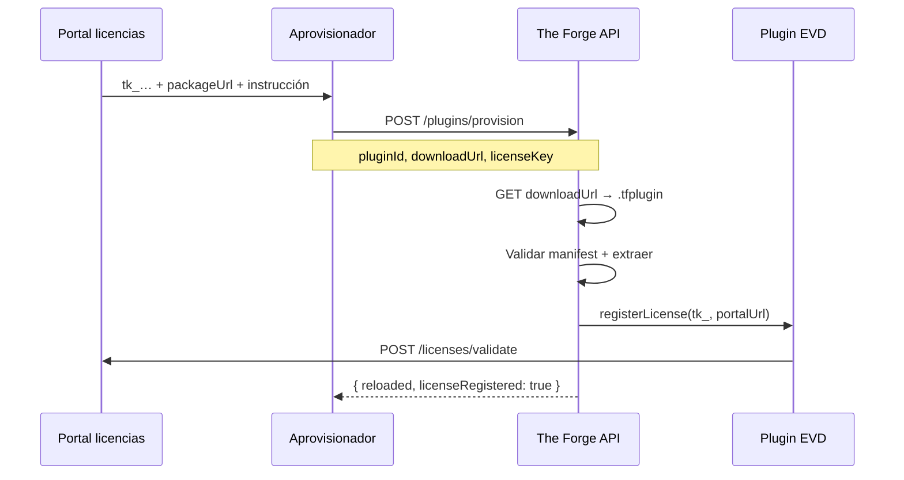

# Aprovisionamiento de plugins — modelo DBGA y API

Guía para documentar en el **DBGA** (Fase 0) cómo una instancia The Forge recibe plugins comerciales `.tfplugin`, licencias del portal y validación runtime.

---

## 1. Roles

| Actor | Responsabilidad |
|-------|-----------------|
| **Portal de licencias** | Emite `tk_…`, hospeda/sirve `.tfplugin`, valida tier/features |
| **Aprovisionador** | ForgeOps, script CI o el propio portal post-compra — llama `POST /api/plugins/provision` |
| **The Forge core** | Descarga/instala ZIP en `PLUGINS_DIRECTORY`, recarga plugin, llama `registerLicense()` |
| **Plugin (p. ej. EVD)** | Persiste licencia de instancia, valida en runtime, expone paneles en Ajustes |

La **UI de Ajustes → Plugins** solo sube `.tfplugin` manualmente. Licencia y config van en paneles del plugin o vía API.

---

## 2. Bloque DBGA (copiar/adaptar)

Incluir en *Integraciones externas* o *Infraestructura* del DBGA:

```markdown
## Aprovisionamiento de plugins comerciales

### Plugin: Executive Visual Deck (EVD)

| Campo | Valor |
|-------|-------|
| pluginId | com.kreodevs.evd |
| artifactId | evd |
| minCoreVersion | 1.6.0 |
| packageUrl | https://github.com/kreodevs/evd-plugin/releases/download/v1.2.0/com.kreodevs.evd@1.2.0.tfplugin |
| licensePortalUrl | https://licenses.theforge.dev/api/v1 |
| installMode | provision |

### API de aprovisionamiento (instancia)

POST https://{forge-host}/api/plugins/provision
Authorization: Bearer {admin-jwt}

{
  "pluginId": "com.kreodevs.evd",
  "downloadUrl": "https://…/com.kreodevs.evd@1.2.0.tfplugin",
  "licenseKey": "tk_prod_ent_…",
  "licensePortalUrl": "https://licenses.theforge.dev/api/v1"
}

### Verificación post-install

- GET /api/plugins/installed → plugin cargado
- GET /api/plugins/health → com.kreodevs.evd en pluginIds
- Ajustes → Plugins → panel «Licencia EVD» con tier/expira

### Variables de entorno (servidor)

| Variable | Uso |
|----------|-----|
| PLUGINS_DIRECTORY | /app/plugins-enabled (volumen API + worker) |
| LICENSE_PORTAL_URL | Base portal para install/registro |
| EVD_LICENSE_KEY | Override opcional (prioridad sobre panel) |
```

---

## 3. Modos de `POST /api/plugins/provision`

| Body | Comportamiento |
|------|----------------|
| `pluginId` + `licenseKey` | Core descarga ZIP del portal → install → `registerLicense()` |
| `pluginId` + `downloadUrl` + `licenseKey` | Core descarga URL (CDN/Release) → install → `registerLicense()` |
| `pluginId` + `downloadUrl` | Solo install (sin licencia) |

`pluginId` es **obligatorio** y debe coincidir con el `id` del manifest del `.tfplugin`.

### Respuesta

```typescript
interface PluginProvisionResult {
  ok: true;
  pluginId: string;
  version: string;
  name: string;
  reloaded: boolean;
  installSource: "portal" | "url";
  licenseRegistered: boolean;
  message?: string;
}
```

---

## 4. Secuencia (URL + licencia — caso DBGA típico)



---

## 5. Payload que el portal envía al aprovisionador

```json
{
  "pluginId": "com.kreodevs.evd",
  "licenseKey": "tk_prod_ent_a1b2c3",
  "licensePortalUrl": "https://licenses.theforge.dev/api/v1",
  "downloadUrl": "https://github.com/kreodevs/evd-plugin/releases/download/v1.2.0/com.kreodevs.evd@1.2.0.tfplugin",
  "provision": {
    "method": "POST",
    "path": "/api/plugins/provision",
    "requiresRole": "admin"
  },
  "verify": [
    "GET /api/plugins/installed",
    "GET /api/plugins/health"
  ]
}
```

---

## 6. Contrato del plugin: `registerLicense`

Plugins comerciales pueden implementar:

```typescript
registerLicense?(registration: {
  licenseKey?: string;
  licensePortalUrl?: string;
  source?: "portal" | "manual" | "env";
}): Promise<void> | void;
```

EVD (`com.kreodevs.evd`) lo implementa: persiste en `data/evd-instance-settings.json` y valida contra el portal.

---

## 7. Endpoints relacionados

| Método | Ruta | Uso |
|--------|------|-----|
| POST | `/api/plugins/provision` | **Aprovisionamiento compuesto** (recomendado) |
| POST | `/api/plugins/install` | Install simple (file / url / licenseKey) |
| GET | `/api/plugins/installed` | Estado en disco + cargado |
| POST | `/api/plugins/reload` | Re-escaneo |
| POST | `{portal}/plugins/download` | Portal sirve ZIP al core |
| POST | `{portal}/licenses/validate` | Plugin valida runtime |

---

## 8. Referencias

- [PLUGINS-PACKAGING.md](./PLUGINS-PACKAGING.md) — formato `.tfplugin`
- [LICENSE_PORTAL_SPEC.md](./LICENSE_PORTAL_SPEC.md) — portal REST
- [PLUGINS.md](./PLUGINS.md) — contrato `ITheForgePlugin`
- Repo EVD: `docs/PLUGINS_PROVISIONING_DBGA.md` — spec del plugin
