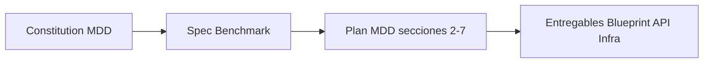

# The Forge — Índice de Arquitectura

**Fuentes:** `blueprint.md`, `mdd.md`  
**Propósito:** Single source of truth del flujo, contrato IA y despliegue. Uso por el agente y por implementaciones.

---

## 1. Flujo de The Forge (resumen)

```
[Entrada] → Entrevista proactiva (IA) → MDD en sesión → Semáforo → [ROJO|AMARILLO|VERDE]
                                                                         ↓
[VERDE]   → Motor de estimación (MXN/h) → Entregables: MDD, Blueprint, OpenAPI, Scaffold
```

- **Entrevista:** Trabajo asíncrono; cada interacción persiste en `Session.chatLog`; la IA retoma por `contextStep` y log.
- **Semáforo:** Valida el JSON del proyecto (entidades, business_core, edge_cases, field_types, mapeo UX). Ver §4.
- **Estimación:** Fórmula fija (no IA). Ver §5.
- **Entregables:** Solo cuando estado = VERDE: Master Design Doc, Implementation Blueprint, OpenAPI Spec, Project Scaffold + `.cursorrules`.
- **MDD como Constitución (SDD):** El MDD es el documento "Constitución" del proyecto (Source of Governance en Specification-Driven Development). Todos los entregables (Blueprint, OpenAPI, Scaffold) deben adherirse a él y validarse contra él antes de considerarse listos.



**Spec antes del MDD:** Spec = Benchmark + clarifiedScope. Es el paso explícito antes de cerrar el MDD; el Clarifier usa el Spec (si está presente) para §1. Revísalo en la pestaña Spec antes de dar por cerrado el MDD.

**Estructura MDD:** El MDD tiene exactamente 7 secciones: 1. Contexto, 2. Arquitectura y Stack, 3. Modelo de Datos, 4. Contratos de API, 5. Lógica y Edge Cases, 6. Seguridad, 7. Infraestructura. Semáforo y estimador dependen de esta numeración.

**Validación SDD:** Ver [Entregables y validación SDD](ENTREGABLES-SDD-VALIDACION.md) para la estructura canónica del MDD, el mapeo de documentos (Guía UX/UI, Blueprint, API, Flujos, Infra) con Specification-Driven Development y Architecting Agentic Systems. **Plan 10/10:** mismo doc §6 (plan por fases). §7 estado de implementación: Spec, Tasks, Conformance, Verifier, HITL y orden en UI implementados.

---

## 2. Estructura del monorepo (Turborepo)

```
/
├── apps/
│   ├── api/          # NestJS
│   └── web/          # React (Vite) + Tailwind
├── packages/
│   ├── database/     # Prisma schema + client
│   ├── shared-types/ # DTOs e interfaces
│   └── config/       # TS, ESLint, Tailwind
├── docker-compose.yml
├── turbo.json
└── .cursor/rules/
```

---

## 3. IA agnóstica (OpenAI / Gemini)

### 3.1 Contrato del proveedor (adapters)

La capa de **adapters** implementa una interfaz técnica común. No debe haber imports de `openai` o `@google/generative-ai` fuera de `apps/api/src/modules/ai/adapters/`.

**Interfaz mínima (blueprint):**

- `generateResponse(prompt: string, history: Array<{role, content}>): Promise<string>`
- `parseChecklist(text: string): Promise<ChecklistResult>`

**Capacidades de negocio (MDD) construidas sobre el contrato:**

- `entrevistar()` → uso de `generateResponse` + persistencia en Session.
- `analizarContexto()` → idem.
- `generarBlueprint()` → idem + posible uso de `parseChecklist`.

### 3.2 Reglas de implementación

| Regla             | Detalle                                                                                                               |
| ----------------- | --------------------------------------------------------------------------------------------------------------------- |
| **Strategy**      | `LLMProvider` (o nombre equivalente) como interfaz; `OpenAIAdapter` y `GeminiAdapter` como implementaciones.          |
| **Configuración** | Un solo punto: `process.env.AI_PROVIDER` (`openai` \| `google`). Sin branching por proveedor en servicios de negocio. |
| **Factory**       | Clase/función que devuelve la instancia del adapter según `AI_PROVIDER`. Inyectada en Nest (DI).                      |
| **Resiliencia**   | try/catch y logs estructurados en todas las llamadas a los adapters (regla en architect-behavior).                    |

### 3.3 Variables de entorno por proveedor

- **OpenAI:** `OPENAI_API_KEY` (y opcionalmente modelo).
- **Google:** `GOOGLE_GENERATIVE_AI_API_KEY` (y opcionalmente modelo).
- **Común:** `AI_PROVIDER`.

Nada de lógica acoplada a un proveedor fuera de `adapters/` y del factory.

---

## 4. Semáforo del MDD

Servicio en backend que analiza el JSON del proyecto (p. ej. en `Project.mddContent` o equivalente).

| Estado       | Condición                                                                |
| ------------ | ------------------------------------------------------------------------ |
| **ROJO**     | `db_entities.length === 0` **o** `business_core == null`. Bloqueado.     |
| **AMARILLO** | Hay entidades pero faltan `edge_cases` o `field_types` (precisión ~70%). |
| **VERDE**    | Checklist completo y, si aplica, mapeo UX. Precisión +95%.               |

El agente debe comprobar estado VERDE antes de generar código (architect-behavior).

---

## 5. Motor de estimación (MXN, México 2026)

- **Fórmula:**  
  `H_total = ((Entidades × 12) + (Pantallas × 16)) × 1.25`  
  Coste = horas × tarifas por rol.
- **Tarifas hora (MXN):** Architect $1 500, Backend $950, Frontend $850, UX $750.
- **Implementación:** `apps/api/src/modules/engine/cost-calculator.service.ts`. Lógica pura; no IA. No alterar fórmulas ni tarifas sin acuerdo explícito.

---

## 6. Despliegue Dokploy (Docker)

### 6.1 Servicios

| Servicio  | Rol                  | Imagen/build                             |
| --------- | -------------------- | ---------------------------------------- |
| **api**   | NestJS               | Build desde `apps/api` (multi-stage)     |
| **web**   | Front estático       | Build desde `apps/web`, servir con Nginx |
| **db**    | PostgreSQL           | `postgres:15-alpine` (o versión fijada)  |
| **redis** | Cache + colas BullMQ | `redis:alpine`                           |

### 6.2 Variables de entorno (api)

- `DATABASE_URL`
- `AI_PROVIDER`
- `OPENAI_API_KEY` / `GOOGLE_GENERATIVE_AI_API_KEY` (según proveedor)
- Cualquier variable que use BullMQ/Redis (p. ej. `REDIS_URL`)

### 6.3 Criterios “Dokploy-ready”

- **docker-compose.yml** en raíz: servicios `api`, `web`, `db`, `redis`; env y volúmenes necesarios para DB y Redis.
- **Builds:** `api` y `web` con Dockerfile multi-stage (build + producción), sin depender de host.
- **Sin hardcode:** Puertos y URLs por env; mismo `docker-compose` usable en Dokploy.
- **Healthchecks** recomendados para `api`, `db` y `redis` para orquestación estable.

Cualquier nuevo servicio o variable debe reflejarse en `docker-compose.yml` (architect-behavior).

---

## 7. Base de datos (Prisma)

Modelos principales: **Project** (incl. `mddContent`, `figmaMapping`, `status`), **Session** (`chatLog`, `contextStep`), **Estimation** (horas, MXN, `teamStructure`). Enum **Status**: ROJO, AMARILLO, VERDE. Detalle en `blueprint.md` §2.

---

## 8. Checklist de verificación (Principal Engineer)

- [ ] IA: Solo `AI_PROVIDER` + factory; adapters solo en `ai/adapters/`; sin `openai`/`gemini` en servicios.
- [ ] Semáforo: Reglas ROJO/AMARILLO/VERDE implementadas y usadas antes de generar código.
- [ ] Estimación: Fórmula y tarifas únicas en `cost-calculator.service.ts`.
- [ ] Docker: `docker-compose` con api, web, db, redis; Dockerfiles multi-stage; env documentados.
