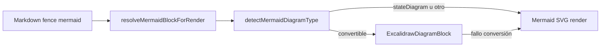
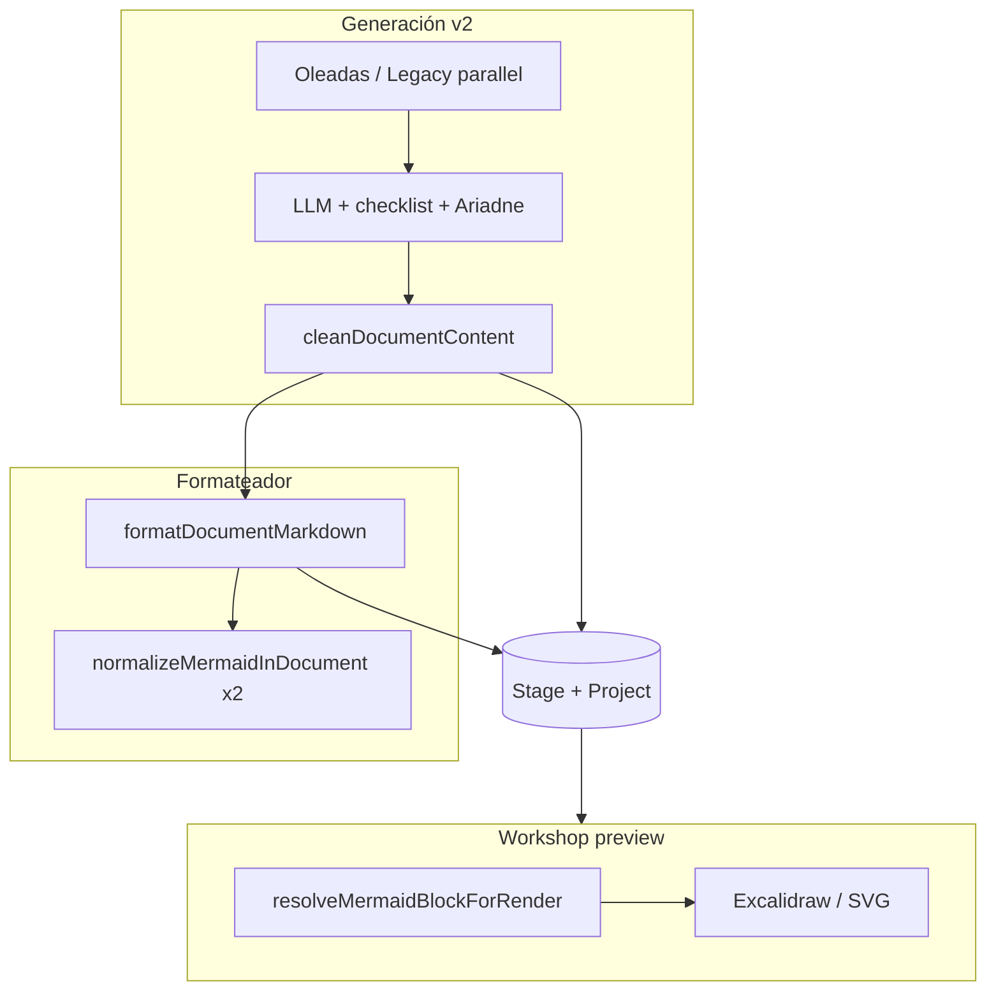

# The Forge — Release v1.0.0

**Tag:** `v1.0.0-rc.3`  
**Fecha de corte:** 2026-07-15  
**Rama de referencia:** `master`

Este documento resume los tres cambios estructurales del release: **generación documental v2** (greenfield y brownfield), **visor híbrido Mermaid/Excalidraw** y el **formateador/reconstructor de Markdown** determinista. Está pensado como guía técnica para el equipo y para agentes que consuman el repositorio.

---

## Resumen ejecutivo

The Forge deja de tratar los entregables SDD como texto frágil del LLM y pasa a un modelo en capas:

1. **Generación** — oleadas con dependencias reales, inventario de dominio, post-pase de exactitud ≥90 % (greenfield), contexto Ariadne v2 multi-repo (brownfield) y **cola MDD en background** (greenfield + legacy).
2. **Persistencia** — `formatDocumentMarkdown` en cada guardado; Tasks v2 → `tasksJson`; snapshots por etapa.
3. **Visualización** — Mermaid reparado en preview; Excalidraw por defecto cuando la conversión es viable; SVG como fallback estable.

Los tres pilares comparten el mismo SSOT de reparación Mermaid en `@theforge/shared-types` (`mermaid.ts`).

---

## 1. Generación documental v2

La «v2» no es un único módulo: combina cascada por oleadas, motor de exactitud, Document Engine (RFC-001) y persistencia enriquecida.

### 1.1 Greenfield (proyectos NEW)

**Endpoint:** `POST /projects/:id/generate-deliverables`  
**Orquestador:** `ProjectsService.generateDeliverablesCascade`

#### Antes (v1)

- Los ~11 entregables se lanzaban en **paralelo total** (`Promise.allSettled`).
- Spec, API, Tasks y Blueprint podían leer siblings **vacíos o desactualizados**.
- El checklist de cobertura existía en legacy AS-IS pero **no** llegaba a greenfield.
- Sin métrica de «¿el paquete documenta el producto?» más allá del semáforo heurístico.

#### Ahora (v2)

**Oleadas secuenciales** definidas en `packages/shared-types/src/deliverables-matrix.ts`:

| Complejidad | Oleadas |
|-------------|---------|
| LOW | HU → tasks + gobernanza |
| MEDIUM | spec + API + UX → tasks + gobernanza |
| HIGH | noop MDD → spec + architecture → UC + HU + API + flows + UX + blueprint → sync pantallas (MCP) → tasks + infra + gobernanza → **W4 post-pase** |

Reglas clave:

- **Paralelo intra-oleada**, **secuencial entre oleadas** con `findOne` que refresca BD.
- Antes de cada oleada: mapa de gaps de conformidad (Blueprint §3, API vs MDD, logic-flows, infra) inyectado como `gapsFeedback`.
- Al inicio: `syncDomainInventoryForStage` → `Stage.domainInventory` (capacidades BRD/DBGA + entidades MDD).
- Prompts enriquecidos vía `greenfieldGenerateOptions` + `buildGreenfieldCoverageChecklist` (Phase0, `[OPEN-GAP]`, anti auth-skew, ProcessInventory journeys).

**W4 — post-pase de precisión** (`runCascadePostPassRetry`):

- `collectSddPrecisionGaps` + `computeCascadeAccuracy` (DocAccuracy / TaskAccuracy, umbral **90**).
- Reintento dirigido: architecture + logic-flows + api en paralelo; **tasks al final**.
- Sustituye reintentos inline duplicados en W1/W3 (~20 min → ~10–14 min en proyectos con muchos gaps).

**Router unificado:** `generateDocument(kind)` atiende cascada y endpoints individuales (`generate-spec`, `generate-tasks`, etc.).

**Jobs en segundo plano:** cola por defecto para entregables SDD (`ProjectGenerationGuardService`, BullMQ con `REDIS_URL`); gates de orden vía `GET /projects/:id/generation-status`. **MDD** (greenfield y legacy) usa la misma infraestructura — ver §1.6.

### 1.2 Brownfield (proyectos LEGACY)

**Endpoint:** `POST /projects/:id/legacy/generate-deliverables`  
**Orquestador:** `LegacyCoordinatorService.generateDeliverables`

Brownfield **no** adoptó oleadas: mantiene generación **paralela** de entregables planificados, pero con mejoras v2 relevantes:

| Capa | Comportamiento v2 |
|------|-------------------|
| Contexto codebase | `generate_legacy_documentation_v2_multi_repo` — una llamada MCP por repo, fusión con `## Repositorio: …` |
| Etapa 1 / AS-IS | Generación completa desde MDD o `codebaseDoc` (ingeniería inversa) |
| Etapa 2+ / cambio | `trySectionMergeDeliverable` — merge incremental por sección |
| Gates | `assertLegacyIndexSddGate`, `assertLegacyChangeGate` |
| Tasks | Coordenadas exactas (Ariadne navigation map, ChangeScope, `ResolveChangeToFilesService`) |
| Post-tasks | Gate 2 `validate_change_plan` si hay `theforgeProjectId` |
| UX | Design tokens extraídos del codebase vía MCP |

### 1.3 Document Engine v2 (RFC-001)

Capa transversal orientada al **MDD** (generación y edición), no al bulk de los 11 entregables:

```
LLM → DocumentResponseParser (dual JSON + chat)
    → Zod (MddDocumentAstSchema)
    → DocumentPatchEngine (ADD/MODIFY/DELETE sección, ADD_FIELD)
    → MddMarkdownTranspiler (AST → Markdown determinista)
    → Stage.documentAst + documentVersion + mddContent
```

- **Dual Output Protocol:** opt-in; si el LLM no emite ` ```json `, fallback transparente al parser legacy.
- **Prisma:** `Stage.documentAst Json?`, `documentVersion Int`.
- Módulo: `apps/api/src/modules/engine/document-engine/`.

Documentación canónica: [rfc/001-document-engine-v2.md](rfc/001-document-engine-v2.md).

### 1.4 Persistencia v2 de entregables

`persistStageAndProjectDeliverables` (`stage-deliverable-persist.util.ts`):

- Escribe en **Stage** (live) y sincroniza campos planos de **Project**.
- Cabecera de timestamps en cada entregable (`prependDocumentTimestamps`).
- Auto-parse `tasksContent` → **`tasksJson`** (Tasks v2, YAML front-matter).
- Snapshot al terminar cascada (`source: "cascade"`).

### 1.5 Exactitud ≥90 % (PLAN-CASCADE-90-ACCURACY)

Métricas en `cascade-accuracy.util.ts`, expuestas en `GET …/analyze`:

| Score | Qué mide |
|-------|----------|
| **DocAccuracy** | Cobertura BRD → MDD → API → flows → pantallas → coherencia cross-artifact |
| **TaskAccuracy** | Capacidades → tasks, CRUD, procesos, anti auth-skew, paths vs Blueprint |

Hard gate opcional: `REQUIRE_DOC_ACCURACY_90` (off por defecto).

Plan: [plans/PLAN-CASCADE-90-ACCURACY.md](plans/PLAN-CASCADE-90-ACCURACY.md).

### 1.6 Jobs MDD en background

Hasta este release, la generación del MDD dependía del **SSE del navegador** (greenfield) o de un **HTTP síncrono largo** (legacy). Al cerrar la pestaña, el stream se destruía y la persistencia final recaía en el cliente (`persistMddContent` tras evento `done`). Los entregables SDD ya iban en cola; el MDD era la excepción.

#### Antes

| Flujo | Comportamiento |
|-------|----------------|
| Benchmark → MDD (greenfield) | `POST /ai-analysis/mdd/stream` — NDJSON en vivo; `res.destroy()` al cerrar cliente |
| Regenerar §N (`/seguridad`, etc.) | `POST …/mdd/stream/regenerate-section` — SSE |
| MDD legacy | `POST …/legacy/generate-mdd` — respuesta bloqueante hasta terminar |
| Persistencia | Frontend llama `persistMddContent` al recibir `done` |

#### Ahora

Cola dedicada **`theforge-mdd`** (`MddQueueService`, `apps/api/src/modules/ai-analysis/mdd/mdd-queue.service.ts`). Misma semántica que entregables: BullMQ con `REDIS_URL` (job sobrevive cerrar navegador) o cola **in-memory** secuencial por proyecto sin Redis (no sobrevive reinicio del API).

**Modos (`MddJobMode`):**

| Modo | Origen | Generador |
|------|--------|-----------|
| `pipeline` | Greenfield — benchmark → MDD completo | `streamMddAnalysis` |
| `section` | Greenfield — comandos `/` por sección (§1–§7) | `streamMddRegenerateSection` |
| `manager` | Greenfield — arranque del Manager (no HITL) | `streamMddAnalysisWithManager` |
| `legacy` | Proyectos `LEGACY` | `LegacyCoordinatorService.generateMdd` |

**Persistencia en servidor:** `AiAnalysisService.runMddGenerationJob` escribe borradores (`draft`) y resultado final (`done`) en BD vía `projects.update` + `cleanDocumentContent`. El Workshop ya no depende de `persistMddContent` tras encolar.

**Endpoints:**

| Método | Ruta | Uso |
|--------|------|-----|
| `POST` | `/ai-analysis/mdd/jobs` | Encola greenfield (`pipeline` \| `manager` \| `section`) |
| `GET` | `/projects/:id/mdd-jobs/:jobId` | Polling (web) |
| `POST` | `/projects/:id/legacy/generate-mdd` | Encola legacy **por defecto** (`?queue=false` = sync legacy) |
| `GET` | `/projects/:id/legacy/mdd-jobs/:jobId` | Polling legacy |

**Frontend:** `apps/web/src/utils/pollMddJob.ts` (`enqueueAndPollMddJob`, `enqueueAndPollLegacyMdd`); `workshopStore` — `generateMddFromBenchmark`, `legacyGenerateMdd` y regeneración §N vía cola + `fetchGenerationStatus`.

**Gates:** `ProjectGenerationGuardService` incluye `mddQueue.isProjectBusy()` en `mddStreamActive`; un job MDD activo o en cola bloquea entregables downstream (igual que antes con el stream).

**Excepción deliberada:** el chat interactivo del **Manager** (HITL, aprobación de plan, `resume`) sigue en **SSE** (`POST …/mdd/stream/manager`). Solo arranques masivos (benchmark, legacy, `/sección`) van en background.

Los endpoints SSE (`/mdd/stream`, `/regenerate-section`) permanecen para compatibilidad; el Workshop los sustituyó por jobs.

---

## 2. Visor híbrido Mermaid / Excalidraw

**Fase:** Hybrid Phase 1 (release `v1.0.0-rc.2` + endurecimiento en `694dfac4` / `707e5272`).

### 2.1 Principio de diseño

- **Fuente de verdad:** siempre DSL Mermaid en el markdown del documento (MDD, BRD, Handoff, tutorial, ayuda).
- **Preview:** reparación determinista → conversión Excalidraw si el tipo lo permite → SVG Mermaid si no.

No se persiste Excalidraw en BD; el canvas es una **vista derivada** reconstruible desde Mermaid.

### 2.2 Componentes web

| Archivo | Rol |
|---------|-----|
| `mermaid-diagram-type.util.ts` | SSOT: tipo de diagrama, `isMermaidCodeBlock`, `defaultMermaidViewMode`, soporte Excalidraw |
| `MarkdownMermaid.tsx` | Bloques en markdown; reintento Excalidraw al editar fuente; toggle Excalidraw/SVG; pantalla completa |
| `ExcalidrawDiagramBlock.tsx` | Lazy load `@excalidraw/excalidraw` + `@excalidraw/mermaid-to-excalidraw`; export PNG; rebuild manual |
| `MddViewer.tsx` | Misma ruta híbrida para MDD, BRD, Blueprint, Handoff Spec |

### 2.3 Modo de vista por defecto

| Tipo Mermaid | Vista por defecto | Notas |
|--------------|-------------------|-------|
| `flowchart` / `graph` | **Excalidraw** | Elementos nativos editables en canvas |
| `erDiagram` | Excalidraw (imagen) | Fallback de imagen si la conversión no es editable |
| `sequenceDiagram` | Excalidraw (imagen) | Idem |
| `classDiagram` | Excalidraw (imagen) | Idem |
| `stateDiagram` / `stateDiagram-v2` | **SVG** | No convertible de forma fiable a Excalidraw editable |

Detección unificada: `flowchart` sin dirección explícita (`flowchart` solo) ya se reconoce como flowchart.

### 2.4 Flujo de preview



- **`rebuildKey`:** al editar el DSL en modo fuente, al volver a preview se reconvierte automáticamente.
- **Toolbar:** Reparar/Regenerar (LLM solo si `assessMermaidFixStrategy` → `regenerate`), toggle PenLine/Code, pantalla completa.

### 2.5 Dependencias

- `@excalidraw/excalidraw@^0.18.1`
- `@excalidraw/mermaid-to-excalidraw@^2.2.2`

Carga lazy (~45 MB) para no penalizar el bundle inicial del Workshop.

---

## 3. Formateador y reconstructor de Markdown

Pipeline **sin LLM** que normaliza documentos tras generación, pegado o edición manual. Es el contrapeso del Document Engine: el LLM produce texto; el formateador lo hace **estable y renderizable**.

### 3.1 Punto de entrada de producción

Todo entregable persistido pasa por:

```typescript
// apps/api/src/modules/sessions/document-content.util.ts
cleanDocumentContent(text) = ensureDocumentChangelog(formatDocumentMarkdown(text))
```

Usado en cascada, endpoints `generate-*`, BRD, DBGA, Handoff export, y `MddViewer` (preview).

### 3.2 Pipeline clásico (`formatDocumentMarkdown`)

Archivo: `packages/shared-types/src/format-document-markdown.ts`

Orden aproximado:

1. Deduplicar bloques DBGA duplicados.
2. Reparar markdown pegado (`repairPastedMarkdown`, fences huérfanos, tablas).
3. Normalizar headings pegados y viñetas (`*` → `-`).
4. Tablas GFM (`normalizeAllTables`).
5. **Mermaid** — `normalizeMermaidInDocument` (primera pasada).
6. SQL fragmentado, árboles de directorio, fences SQL huérfanos.
7. **Mermaid** — segunda pasada (aristas/fences huérfanos tras reparar SQL/árboles).

La doble pasada Mermaid es crítica: reparaciones de SQL o `directory-tree` pueden dejar diagramas rotos que solo la segunda pasada corrige.

### 3.3 Reparación Mermaid (SSOT)

Archivo: `packages/shared-types/src/mermaid.ts`

Capacidades principales:

| Función | Uso |
|---------|-----|
| `repairUnfencedMermaidInDocument` | Envuelve `flowchart`/`erDiagram`/`sequenceDiagram` sueltos en fences |
| `repairFragmentedSequenceMermaidInDocument` | Fusiona fences partidos, re-absorbe aristas en listas markdown |
| `normalizeMermaidDiagramBody` | `subgraph ID["…"]`, etiquetas, participantes sequence |
| `resolveMermaidBlockForRender` | Preview: aplica fix local si `validateMermaid` pasa |
| `assessMermaidFixStrategy` | `repair` local primero; `regenerate` con LLM solo si falla validación |

En preview web (`mermaid-fix.util.ts`, `mermaid-render-prep.util.ts`) se usa `resolveMermaidBlockForRender` antes de Mermaid.js o Excalidraw.

### 3.4 Motor remark AST (fases 1–3)

Archivo: `packages/shared-types/src/format-document-markdown-ast.ts`

Migración incremental con toggle `useAst`:

- **remark adapter** — parse/stringify GFM + frontmatter.
- **Pattern classifier** — 10 patrones (mermaid, sql, dockerfile, json, yaml, directory-tree, …).
- **Repair pipeline** — classify → repair → replace en dos fases.
- **Presets** — `minimal`, `standard`, `strict` (`formatter-presets.ts`).
- **TOC generator**, **GFM task lists**, tablas y headings vía AST.

Roadmap: [FORMATTER_IMPROVEMENT_PLAN.md](FORMATTER_IMPROVEMENT_PLAN.md) (Fase 4 integración pendiente).

El path de producción actual sigue siendo `formatDocumentMarkdown` (regex + dominio); el motor AST está listo para adopción progresiva.

### 3.5 Comando `/format` en Workshop

`/format` (alias `/formatear`, `/reformatear`) opera sobre el documento **guardado** de la pestaña activa (MDD, BRD, Handoff Spec, etc.), persiste el resultado y repara Mermaid de forma definitiva en BD — no solo en el render del cliente.

---

## 4. Cómo interactúan los tres pilares



1. **Generación** produce markdown crudo del LLM.
2. **`cleanDocumentContent`** lo normaliza y añade changelog antes de persistir.
3. **MDD en cola** persiste borradores y `done` en servidor sin depender del cliente (§1.6).
4. **Preview** vuelve a reparar Mermaid en memoria (`resolveMermaidBlockForRender`) y elige Excalidraw o SVG.
5. Documentos **viejos** en BD pueden necesitar **Reformatear MDD** (`reapplyMddFormat`) o `/format` para materializar fixes del pipeline nuevo.

---

## 5. Operación y migración

### Greenfield

1. Confirmar complejidad en el chat (sin `complexityPending`).
2. Semáforo **VERDE** → **Generar entregables** (cola background).
3. **Generar MDD desde benchmark** o **regenerar §N** — job en cola; puedes cerrar el navegador (con Redis).
4. Revisar badge de exactitud en **Analizar** si Doc/Task Accuracy < 90.
5. W4 puede disparar un segundo pase automático; no hace falta regenerar todo manualmente.

### Brownfield

1. **MDD Inicial** o MDD de etapa con doc. partida ≥ 300 caracteres.
2. **`POST …/legacy/generate-mdd`** encola por defecto — mismo criterio de background que greenfield (§1.6).
3. Gates de índice SDD y cambio (etapa 2+).
4. `POST …/legacy/generate-deliverables` — traza en `lastDeliverablesDebug`.
5. Converge y Gate 2 son flujos **post-generación**, no parte de la cascada bulk.

### Diagramas y markdown

- Si un diagrama se ve mal pero el DSL en fuente parece correcto: **toggle SVG** para diagnosticar; luego **Reparar** en toolbar.
- Si el documento fue generado antes del release: **/format** o guardar tras reformatear en Workshop.
- Excalidraw no sustituye Mermaid en export SpecKit/handoff — el artefacto sigue siendo markdown con fences.

---

## 6. Referencias

| Tema | Documento / código |
|------|-------------------|
| RFC Document Engine v2 | [rfc/001-document-engine-v2.md](rfc/001-document-engine-v2.md) |
| Cascada exactitud ≥90 | [plans/PLAN-CASCADE-90-ACCURACY.md](plans/PLAN-CASCADE-90-ACCURACY.md) |
| Oleadas y matriz | `packages/shared-types/src/deliverables-matrix.ts` |
| Greenfield cascada | `apps/api/src/modules/projects/projects.service.ts` → `generateDeliverablesCascade` |
| Brownfield cascada | `apps/api/src/modules/legacy-flow/legacy-coordinator.service.ts` → `generateDeliverables` |
| Cola MDD background | `apps/api/src/modules/ai-analysis/mdd/mdd-queue.service.ts`, `runMddGenerationJob` |
| Polling MDD (web) | `apps/web/src/utils/pollMddJob.ts` |
| Ayuda background jobs | `apps/web/src/content/help/generacion-en-segundo-plano.md` |
| Formateador | `packages/shared-types/src/format-document-markdown.ts` |
| Mermaid SSOT | `packages/shared-types/src/mermaid.ts` |
| Excalidraw UI | `apps/web/src/components/MarkdownMermaid.tsx`, `ExcalidrawDiagramBlock.tsx` |
| Changelog release | `CHANGELOG.md` → `[v1.0.0-rc.3]` |
| Tag Git | [v1.0.0-rc.3](https://github.com/kreodevs/theforge/releases/tag/v1.0.0-rc.3) |

---

## 7. Alcance explícito fuera de este release

- **Document Engine AST** como única fuente de generación MDD (dual output sigue siendo opt-in).
- **Oleadas en brownfield** (legacy mantiene paralelo planificado).
- **Excalidraw Phase 2** (persistencia de ediciones manuales en canvas como fuente).
- **Formatter AST** como path por defecto en API (pendiente Fase 4 del plan remark).
- **Plugins comerciales** (EVD extraído a repositorio aparte en `v1.0.0-RC`).
- **Manager MDD con HITL en cola** — aprobación de plan y `resume` siguen en SSE; no hay job reanudable para el bucle interactivo del Manager.

---

*Documento generado para el release técnico v1. Mantener alineado con `CHANGELOG.md` y los README de `packages/shared-types` y `apps/web/src/components` cuando cambien los pipelines.*
