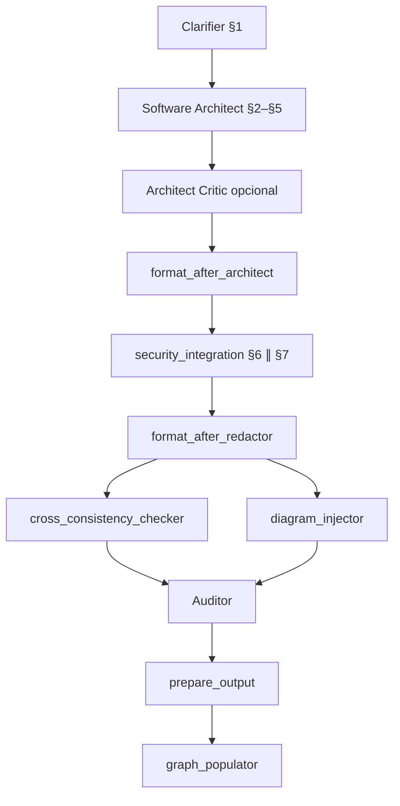
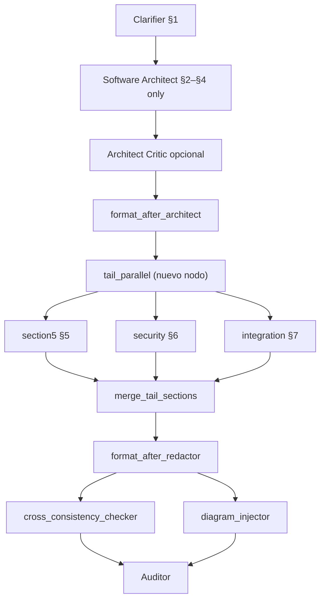

# Propuesta: §5 ∥ §6 ∥ §7 en el grafo MDD

**Estado:** propuesta (no implementada).  
**Objetivo:** reducir latencia de la pasada completa del MDD sin romper la matriz de trazabilidad §1–§7.  
**Contexto:** hoy `security_integration` ya paraleliza §6+§7; el cuello principal es el bloque §2→§3→§4→§5 del **Software Architect** (una sola llamada LLM).

---

## 1. Grafo actual vs propuesto

### Actual (pasada completa, one-shot)



**Tiempo dominante (orden de magnitud):** SA (~90–180s) + max(§6, §7) (~60s) + consistencia + auditor.

### Propuesto (Fase A — mínimo viable)

Separar §5 del SA; ejecutar **§5 ∥ §6 ∥ §7** tras cerrar §2–§4.



**Ahorro esperado:** ~40–70s por job (tiempo de §5 ya no suma secuencialmente a SA ni a max(§6,§7)), asumiendo §5 ≈ 45–90s.

---

## 2. Dependencias que permiten el paralelo

| Sección | Inputs mínimos | ¿Puede correr en paralelo tras §2–§4? |
| ------- | ---------------- | ------------------------------------- |
| §5 Lógica | §1, §2, §4 (endpoints) | **Sí** — no requiere §6/§7 en primera pasada |
| §6 Seguridad | §1, §4 (API expuesta), stack §2 | **Sí** — el nodo Security ya hidrata desde draft sin §5 |
| §7 Infra | §2, §3 (SQL/manifest) | **Sí** — Integration ya corre en paralelo con §6 hoy |

**Lo que NO se paraleliza:** §2→§3→§4 (paridad SQL ↔ contratos).  
**Lo que sigue al final:** `cross_consistency_checker` + `diagram_injector` + `auditor` (necesitan borrador §1–§7).

---

## 3. Cambios de código (touch points)

### 3.1 Nuevo nodo `tail_parallel` (o extender `security_integration`)

**Archivo nuevo sugerido:**  
`apps/api/src/modules/ai-analysis/nodes/mdd-tail-parallel.node.ts`

```typescript
// Pseudocódigo — mismo patrón que createMddSecurityIntegrationNode
const [s5, sec, int] = await Promise.all([
  section5Fn(stateWithPlaceholder§5),
  securityFn(state),
  integrationFn(state),
]);
return mergeTailSections(state.mddDraft, s5, sec, int);
```

**Merge determinista (orden canónico §5→§6→§7):**

1. Base = draft post-SA (§1–§4 + placeholder §5).
2. `replaceMddSection5Body(base, §5 de section5)`.
3. `replaceSection6Or7InDraft(..., 6, §6 de security)`.
4. `replaceSection6Or7InDraft(..., 7, §7 de integration)`.
5. `mergeMddStructured` igual que hoy en `security_integration` (§6 real + `integracion` de Integration).

Reutilizar helpers existentes en `mdd-sanitize/section-merge.ts`.

### 3.2 Grafo LangGraph

**Archivo:** `apps/api/src/modules/ai-analysis/graph/mdd-graph.ts`

| Función | Cambio |
| ------- | ------ |
| `createMddGraph` | Tras `format_after_architect` (cuando no hay delivery gate loop), ir a `tail_parallel` en lugar de `security_integration`. |
| `createMddGraphWithManager` | Igual en pasada completa; conservar `security`/`integration`/`section5` **individuales** en `sectionsToRun` y delivery gate. |
| `routeAfterFormatArchitectGateLoop` | Sin cambio de semántica: si §6/§7 ya sustanciales, saltar a `format_after_redactor`. |

**Feature flag (rollout seguro):**

```typescript
const useTailParallel = process.env.MDD_TAIL_PARALLEL !== "0";
```

Default `1` tras estabilizar tests; `0` restaura comportamiento actual.

### 3.3 Software Architect — dejar de generar §5 en pasada completa

**Archivos:**

- `apps/api/src/modules/ai-analysis/prompts/mdd/software-architect-prompt.md`
- `apps/api/src/modules/ai-analysis/nodes/mdd-software-architect.node.ts`

**Cambios:**

1. Prompt: generar **§2, §3, §4**; insertar §5 placeholder canónico:

   ```markdown
   ## 5. Lógica y Edge Cases

   (Pendiente: paso dedicado Lógica y Edge Cases)
   ```

2. Nodo SA: no extraer/persistir `logicaEdgeCases` en `mddStructured` en pasada completa (o dejar stub vacío); el nodo `section5` rellena structured al merge.

3. **Architect Critic** sigue validando §3+§4; no exige §5 sustancial en la primera pasada.

### 3.4 Nodo `section5` — modo «primera pasada»

**Archivo:** `apps/api/src/modules/ai-analysis/nodes/mdd-section5.node.ts`

Hoy el prompt dice que el LLM ve §1–§4 **y §6–§7** para no contradecirlos. En paralelo, §6–§7 **aún no existen**.

- Añadir flag de estado `tailParallelFirstPass?: boolean` o detectar placeholder §6/§7.
- En primera pasada: prompt acota contexto a **§1–§4 + DBGA + directivas**; instrucción explícita: «§6 y §7 se generan en paralelo; no los cites como hechos».
- Tras merge, `cross_consistency_checker` corrige desalineaciones §5↔§6 (lockout, MFA, etc.).

### 3.5 Delivery gate y regen §5

**Archivo:** `apps/api/src/modules/ai-analysis/utils/mdd-delivery-gate.util.ts`

Sin cambio de contrato: si solo §5 falla substance check → `deliveryGateFixTarget === "section5"` → nodo `section5` solo (ya existe).

El loop **no** debe re-disparar `tail_parallel` completo; solo el nodo afectado.

### 3.6 Modo `sectionsToRun` (Manager / regen parcial)

**Archivo:** `apps/api/src/modules/ai-analysis/nodes/mdd-manager/manager-heuristics.ts`

`agentsForMddSection(5) → software_architect` hoy. Opciones:

| Opción | Comportamiento |
| ------ | -------------- |
| A (conservadora) | `/5` o regen §5 sigue yendo a `software_architect` (status quo). |
| B (alineada) | §5 → nodo `section5` dedicado (más rápido, coherente con pasada completa). |

Recomendación: **B** en la misma PR o PR follow-up.

---

## 4. Matriz de regresiones (tests)

Basada en casos ya cubiertos en `apps/api/src/modules/ai-analysis/utils/mdd-sanitize.spec.ts` y `mdd-section5.node.spec.ts`.

### 4.1 Tests nuevos (obligatorios)

| ID | Archivo sugerido | Qué valida |
| -- | ---------------- | ---------- |
| T1 | `nodes/mdd-tail-parallel.node.spec.ts` | `Promise.all` mock: merge §5+§6+§7 preserva §1–§4 intactos |
| T2 | idem | Si §5 falla (vacío), draft conserva placeholder y gate dispara loop |
| T3 | idem | Si §6 OK y §7 falla, §6 persistido y §7 placeholder |
| T4 | `graph/mdd-graph.integration.spec.ts` (smoke) | Con flag on, orden de nodos: `format_after_architect → tail_parallel → format_after_redactor` |
| T5 | `nodes/mdd-section5.node.spec.ts` | Modo first-pass: prompt no incluye §6–§7; output sustancial ≥200 chars |

### 4.2 Regresiones cross-consistency (re-ejecutar / extender)

Estos escenarios **deben seguir pasando** tras merge paralelo (el checker corre **después** del merge):

| Tema | Test existente (referencia) | Riesgo del paralelo |
| ---- | --------------------------- | ------------------- |
| §3 ↔ §4 campos JSON/SQL | `detectCrossConsistencyIssues` varios | Bajo — §2–§4 siguen secuenciales en SA |
| §5 lockout ↔ §6 OWASP | `inyecta párrafo OWASP cuando §5 exige bloqueo` | **Alto** — §5 y §6 generados sin verse |
| §6 RS256 ↔ §7 manifest | `alinea §7 HS256 → RS256 cuando §6 documenta RS256` | Medio |
| §3 outbox ↔ §7 mención | `añade CREATE TABLE outbox cuando §7 la menciona` | Medio — §7 paralelo con §5 |
| §6 tablas sin DDL §3 | `detecta tablas §6 sin DDL en §3` | Bajo |
| Dual approval §3/§4/§5 | prompts SA + cross-consistency | Medio — §5 ya no co-generado con §3/§4 |
| ER diagram ↔ SQL | `diagram_injector` / `regenerateErDiagramFromSql` | Bajo — corre post-merge |
| Delivery gate §5 solo | `deliveryGateFixTarget === section5` | Medio — validar que tail_parallel no enmascara fallo §5 |

**Acción:** añadir fixture `fixtures/mdd-tail-parallel-merge-sample.md` con borrador post-merge deliberadamente inconsistente (§5 pide lockout, §6 genérico) y assert que `applyDeterministicCrossConsistencyFixes` + LLM patch lo reparan.

### 4.3 Tests E2E manuales (Workshop)

1. MDD desde benchmark (pipeline completo) — banner background, documento 7 secciones, semáforo calculable.
2. Regenerar `/5` — solo §5 cambia.
3. Regenerar `/seguridad` — §6 sin reescribir §3–§5.
4. Proyecto con dual approval en §1 — §3/§4/§5 coherentes tras auditor ≥85.

---

## 5. Riesgos y mitigaciones

| Riesgo | Mitigación |
| ------ | ---------- |
| §5 y §6 contradicen políticas (MFA, lockout) | Cross-consistency determinista + LLM patches **obligatorio** post-merge; no saltar |
| SA deja §5 ausente (sin placeholder) | Formatter inserta placeholder canónico; delivery gate detecta |
| `sectionsToRun` desincronizado | Mantener nodos individuales; solo pasada completa usa `tail_parallel` |
| Mayor coste LLM (3 llamadas vs 2 bloques) | Latencia ↓; coste ≈ similar (mismos tokens totales, mejor UX) |
| Manager/Executor plan menciona «Software Architect §2–§5» | Actualizar `manager-prompt.md` y labels en `state-to-markdown.ts` |

---

## 6. Plan de implementación (PRs sugeridos)

| PR | Alcance | Esfuerzo |
| -- | ------- | -------- |
| **PR-1** | `mdd-tail-parallel.node.ts` + tests T1–T3 + flag env | 1–2 días |
| **PR-2** | Wire en `mdd-graph.ts` (one-shot + manager pasada completa) | 0.5 día |
| **PR-3** | SA prompt/nodo §2–§4 + section5 first-pass mode (T5) | 1 día |
| **PR-4** | Regresiones cross-consistency + fixture merge (§5↔§6) | 1 día |
| **PR-5** | `agentsForMddSection(5) → section5` + docs | 0.5 día |

**Total estimado:** 4–5 días dev + QA Workshop.

---

## 7. Referencias en repo

- Grafo actual: `apps/api/src/modules/ai-analysis/graph/mdd-graph.ts`
- Paralelo §6∥§7: `apps/api/src/modules/ai-analysis/nodes/mdd-security-integration.node.ts`
- §5 dedicado: `apps/api/src/modules/ai-analysis/nodes/mdd-section5.node.ts`
- Consistencia cruzada: `apps/api/src/modules/ai-analysis/utils/mdd-sanitize/cross-consistency.ts`
- Matriz trazabilidad: `docs/notebooklm/ENTREGABLES-SDD-VALIDACION.md` §0
- Patrones flujo: `docs/notebooklm/MDD-PATRONES-FLUJO.md`

---

*Propuesta Kreo / The Forge — Jul 2026.*
