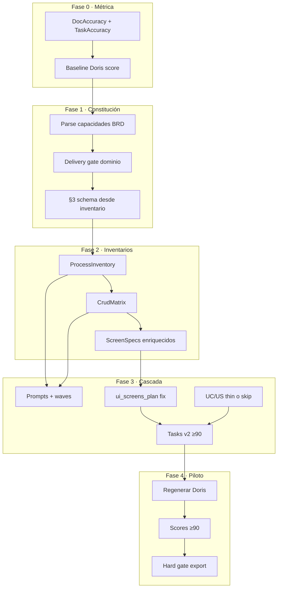

# Plan: Exactitud ≥90 % en Tasks y documentos de cascada

> **Estado:** Implementación inicial **Fases 0–4 en código** (métrica, gates, inventarios, prompts, UI, hard gate). Piloto regeneración Doris pendiente de corrida en Workshop.  
> **Piloto de medición:** proyecto Doris (`c9872698-e5bc-45fa-8189-97ebd516d0dc`) — copiloto Bitrix/WhatsApp.  
> **Documento canónico:** este archivo.  
> **Relacionados:** [ENTREGABLES-SDD-VALIDACION.md](../notebooklm/ENTREGABLES-SDD-VALIDACION.md), [PLAN-SPECKIT-ALIGNMENT.md](PLAN-SPECKIT-ALIGNMENT.md), [PLAN-MDD-SECCION-GOBERNANZA-IA.md](PLAN-MDD-SECCION-GOBERNANZA-IA.md).

## Resumen ejecutivo

| Qué | Cuándo | Alcance |
|-----|--------|---------|
| **Fase 0** — Métrica de exactitud + baseline Doris | **Ahora** | Definir score ≥90, medirlo en Doris *sin* regenerar todo |
| **Fase 1** — Constitución fiel al dominio (MDD §3/§4/§5) | Tras F0 | Gates BRD→MDD; bloquear entrega auth-only |
| **Fase 2** — Inventarios accionables (Process + CRUD + Screens) | Tras F1 | Artefactos/estructuras antes de oleadas LLM |
| **Fase 3** — Cascada alineada + Tasks v2 coverage | Tras F2 | Prompts, ui_screens, UC/US thin, gate Tasks ≥90 |
| **Fase 4** — Piloto Doris + hardening | Tras F3 | Regenerar Doris; medir; cerrar gaps |

**Objetivo del usuario:** documentación generada que permita a un agente implementar una aplicación **~90 % completa** (CRUD inferible, pantallas complejas, procesos no obvios), con **exactitud ≥90 %** en **Tasks** y en el **paquete documental** (trazabilidad BRD ↔ MDD ↔ API ↔ Flows ↔ Pantallas ↔ Tasks).

**Principio rector:** el MDD es la constitución; si §3/§4/§5 colapsan al dominio erróneo (caso Doris: auth LDAP en vez de copiloto), **ningún post-proceso arregla la cascada**. Primero fidelidad de constitución; luego inventarios deterministas; luego LLM.

---

## 0. Diagnóstico que motiva el plan (Doris)

| Capa | Hallazgo |
|------|----------|
| **BRD / DBGA** | Producto real: WhatsApp, multi-agente, MCP/Bitrix, memoria, bitácora, tareas programadas |
| **MDD §3** | Solo tablas auth/RBAC/outbox; `sessions` duplicado |
| **CU / HU / Flows / Tasks** | Amplifican auth; HU corta en US-011; journeys Spec rotos |
| **uiScreens** | ~411 palabras; casi todo `Table`; rutas incorrectas; CRUD admin “fuera de alcance” |
| **Conformance** | Verde *entre* docs derivados del MDD auth — no contra BRD |
| **Extra en API (analyze)** | Endpoints de dominio existen como “extra” vs MDD §4 canónico |

**Conclusión:** el score de semáforo hoy **no mide** “¿documenta el producto?”. Hay que añadir **Capability Coverage** y **Task Domain Coverage**.

---

## 1. Definición de “≥90 % de exactitud”

### 1.1 Score documental (`DocAccuracyScore`, 0–100)

Ponderación sugerida (ajustable tras Fase 0):

| Componente | Peso | Criterio “ok” |
|------------|------|----------------|
| **C1 Capability coverage** | 30 | ≥90 % de capacidades BRD §3 tienen: ≥1 entidad §3 **o** proceso **o** endpoint |
| **C2 Process coverage** | 20 | ≥90 % de flujos críticos BRD tienen secuencia en Logic Flows / ProcessInventory |
| **C3 CRUD matrix fidelity** | 15 | Entidades admin/persistidas con operaciones C/R/U/D explícitas y trazadas a API |
| **C4 Screen fidelity** | 15 | Cada pantalla admin/canal tiene ruta + región UI + API + estados ≠ placeholder |
| **C5 Cross-artifact consistency** | 10 | Spec↔MDD, API↔§4, HU↔UC (si existen) sin conflictos bloqueantes |
| **C6 Hallucination / scope drift** | 10 | Península: tablas/endpoints sin ancla BRD-MDD; pantallas huérfanas |

**Exactitud documental ≥90** ⇔ `DocAccuracyScore ≥ 90` y **cero blockers** en C1 (capacidades core sin ancla).

### 1.2 Score Tasks (`TaskAccuracyScore`, 0–100)

| Componente | Peso | Criterio |
|------------|------|----------|
| **T1 Capability→task map** | 35 | ≥90 % capacidades BRD tienen ≥1 task `[P]` trazable |
| **T2 CRUD task coverage** | 25 | Ampliar `checkCrudCoverage` (`task-auditor.ts`) a entidades de dominio, no solo heurística genérica |
| **T3 Process→task map** | 20 | Cada proceso ProcessInventory tiene tasks de implementación + edge cases |
| **T4 Path / stack fidelity** | 10 | Paths y módulos coherentes con Blueprint |
| **T5 No auth-only skew** | 10 | Si BRD dominio > auth, ratio tasks dominio/(dominio+auth) ≥ 0.7 |

**Exactitud Tasks ≥90** ⇔ `TaskAccuracyScore ≥ 90`.

### 1.3 Dónde vive el score

- Nuevo módulo: `apps/api/src/modules/engine/doc-accuracy-score.util.ts` (+ `.spec.ts`).
- Exponer en `analyzeArtifacts` / `GET :id/analyze` y en columna métricas Workshop.
- **No** sustituye semáforo VERDE; es **gate adicional** opcional primero (soft), luego hard antes de export SpecKit / “listo para codegen”.

---

## 2. Arquitectura por fases



---

## 3. Decisiones fijadas (propuesta)

| Decisión | Valor | Razón |
|----------|-------|-------|
| **Fuente de verdad de capacidades** | BRD §3 (+ Phase0 matrix si no hay BRD) | Doris: BRD ya describe el producto; MDD lo perdió |
| **MDD §3** | Debe cubrir entidades de **negocio** del inventario; auth es subconjunto | Evitar colapso auth-only |
| **Nuevos entregables LLM masivos** | **No** en Fase 2: inventarios **estructurados** (JSON/MD determinista + LLM extract) | YAGNI + mensurable |
| **UC / HU** | HIGH: generar **thin** o **omitir** si ProcessInventory + Spec journeys + Tasks AC cubren trazabilidad | Caso Doris: 87k CU con ~0 valor dominio |
| **Pantallas** | Seguir sin LLM prompt file; **arreglar plan** desde CrudMatrix + ProcessInventory + US thin | `ui-screens-plan.util.ts` ya existe |
| **Hard gate 90** | Soft en F0–F3; hard en F4 para export / “codegen ready” | No romper proyectos en curso |

---

## 4. Fase 0 — Métrica y baseline (1–3 días)

### Objetivo
Medir el problema; acordar umbrales; no regenerar Doris todavía.

### Trabajo

1. **Parser de capacidades BRD**  
   - `apps/api/src/modules/engine/brd-capability-extract.util.ts`  
   - Extraer headings `### 3.x …` + bullets de MVP.  
   - Tests con fragmento Doris (fixture).

2. **Implementar `computeDocAccuracyScore` / `computeTaskAccuracyScore`**  
   - Inputs: BRD, MDD, apiContracts, logicFlows, uiScreens, tasks, (opcional UC/US).  
   - Salida: score + lista de gaps priorizados.

3. **Wire a analyze**  
   - `sdd-integration.service.ts` → campo `accuracy` en reporte.  
   - Workshop: badge “Exactitud docs XX% / Tasks YY%” (solo lectura).

4. **Baseline Doris**  
   - Documentar scores reales en este plan (§8 Resultados) tras primera corrida.  
   - Hipótesis: DocAccuracy ≪ 50; TaskAccuracy sesgado a auth.

### Criterio de salida F0
- [ ] Scores reproducibles en CI (unit tests + fixture Doris truncado).  
- [ ] Baseline publicado en §8.  
- [ ] Acuerdo de pesos (o ajuste documentado).

---

## 5. Fase 1 — Constitución fiel al dominio (3–7 días)

### Objetivo
Impedir que un MDD “VERDE” entregue un esquema que **no ancle** las capacidades BRD (fallo Doris).

### Trabajo

1. **Inventario de negocio pre-§3 (extract, no doc largo)**  
   - Reutilizar patrón legacy `BRD_BUSINESS_INVENTORY_SYSTEM` (`legacy-coordinator.service.ts`) para proyectos **NEW**.  
   - Salida estructurada: `{ capabilities[], entities[], processes[], adminSurfaces[] }` persistida (campo JSON en stage o anexo MDD TechnicalMetadata).

2. **Ampliar delivery gate** (`mdd-delivery-gate.util.ts` + `schema-owner.util.ts`)  
   - Blocker nuevo: `domain-entities-missing-vs-brd` si cobertura entidades BRD en §3 &lt; umbral (p.ej. 70 % de entidades inventario).  
   - Blocker: `auth-only-skew` si §3 solo contiene family auth (`users|roles|sessions|…`) y BRD tiene ≥3 capacidades no-auth.  
   - Critic prompt (`architect-critic-prompt.md`): exigir entity coverage vs inventario.

3. **Software Architect** (`software-architect-prompt.md` + skeleton)  
   - Orden: entidades de negocio **antes** que glue auth.  
   - Prohibir §3 que omita entidades del inventario sin `OUT_OF_SCOPE` explícito.

4. **BRD ↔ MDD en analyze**  
   - Extender `checkSpecVsMdd` / nuevo `checkBrdVsMddDomain` en `sdd-cross-artifact.util.ts`.

### Criterio de salida F1
- [ ] Fixture Doris: MDD auth-only **falla** delivery gate (o score C1 bloqueante).  
- [ ] Test de regresión: MDD con entidades copiloto + auth **pasa**.  
- [ ] Documentado en `ENTREGABLES-SDD-VALIDACION.md`.

### Archivos ancla
- `apps/api/src/modules/ai-analysis/utils/mdd-delivery-gate.util.ts`  
- `apps/api/src/modules/ai-analysis/utils/schema-owner.util.ts`  
- `apps/api/src/modules/ai-analysis/prompts/mdd/software-architect-prompt.md`  
- `apps/api/src/modules/ai-analysis/prompts/mdd/architect-critic-prompt.md`  
- `apps/api/src/modules/engine/phase0-brd-spec-bridge.util.ts`  
- `apps/api/src/modules/engine/sdd-cross-artifact.util.ts`

---

## 6. Fase 2 — Inventarios accionables (4–8 días)

### Objetivo
Dar a la cascada **estructuras** para inferir CRUD, pantallas complejas y procesos no obvios **sin** depender de prosa UC/US.

### 6.1 ProcessInventory

- **Formato:** JSON + render MD (sección en Spec o campo `processInventoryContent` YAGNI: preferir **bloquear en Spec § journeys + Logic Flows input** primero; campo Prisma solo si el MD se pierde).  
- **Schema Zod** en `packages/shared-types`:  
  `id, name, trigger, steps[], compensations[], entities[], apis[], screens[], brdCapabilityIds[]`.  
- **Generación:** extract LLM corto **desde BRD+MDD** *antes* de oleada Logic Flows; o prompt Logic Flows **obligado** a consumir inventario.  
- **Gate:** Logic Flows coverage ≥90 % de procesos `critical: true`.

### 6.2 CrudMatrix

- **Formato:** tabla/JSON  
  `entity, ops[], actor, endpoint?, screen?, rules[], mvp: boolean`.  
- **Derivación determinista** desde §3 + señales BRD (“gestión”, “panel”, “admin”, “registro”).  
- **Consumidores:** api-contracts prompt, ui-screens-plan, task-auditor `checkCrudCoverage`.  
- **Ubicación código:** `packages/shared-types/src/crud-matrix.ts` + `apps/api/src/modules/engine/crud-matrix.util.ts`.

### 6.3 ScreenSpecs enriquecidos

- Extender plan en `ui-screens-plan.util.ts`:  
  - No crear pantalla CRUD para tablas infra (`outbox_events`) salvo BRD admin.  
  - Crear pantallas desde `adminSurfaces` + procesos con `screens[]`.  
  - Tipos: `crud-list`, `crud-form`, `chat-shell`, `hitl-inbox`, `config-wizard`, `metrics`.  
- Endurecer `ScreenSpec` en `ui-mcp-contract.ts` (regiones, estados, bindings).  
- Si MCP gráfico inactivo: aún generar markdown plan **sin** omitir filas (hoy se silencia sync).

### Criterio de salida F2
- [ ] Dado fixture BRD Doris, inventarios producen ≥8 procesos y ≥10 entidades con CRUD flags.  
- [ ] Pantallas plan no mapean login→`/dashboard` con solo `Table`.  
- **Archivos ancla:**  
  - `apps/api/src/modules/ui-mcp/ui-screens-plan.util.ts`  
  - `packages/shared-types/src/ui-mcp-contract.ts`  
  - nuevos `crud-matrix` / process inventory utils

---

## 7. Fase 3 — Cascada y Tasks ≥90 (5–10 días)

### Objetivo
Propagar inventarios a prompts y gates; subir exactitud Tasks.

### 7.1 Oleadas / dependencias

Ajustar `DELIVERABLE_WAVES_BY_COMPLEXITY` solo si hace falta un paso `domain_inventory` o `ui_screens_sync` **después** de CrudMatrix estable:

```
HIGH (propuesto conceptual):
  mdd_canonical
  → domain_inventory (extract Process+CRUD)   // o embebido post-MDD
  → spec + architecture
  → api_contracts + logic_flows + blueprint + ux_ui_guide (+ use_cases/user_stories thin|skip)
  → ui_screens_sync
  → tasks + infra + agent_governance
```

Archivos: `deliverables-matrix.ts`, `project-generation-guard.ts`, `projects.service.ts`.

### 7.2 Prompts (apéndice de inventarios)

Inyectar en system prompts (o user preamble) el JSON inventarios:

| Prompt | Cambio |
|--------|--------|
| `api-contracts-prompt.md` | Endpoints desde CrudMatrix + ProcessInventory; prohibir inventar solo auth si inventario tiene dominio |
| `logic-flows-prompt.md` | Un diagrama por proceso critical |
| `architecture-prompt.md` / `blueprint-prompt.md` | Módulos por bounded context del inventario |
| `tasks-prompt.md` | Tasks por capability + CRUD + process; anti-skew auth |
| `spec-prompt.md` | Journeys numerados válidos (fix headings vacíos Doris) |
| `use-cases-prompt.md` / `user-stories-prompt.md` | Modo **thin**: máx N stories; o flag `skipLiteraryUcUs` |

### 7.3 Política UC / HU

| Complejidad | Política |
|-------------|----------|
| LOW | Mantener US cortas → tasks (como hoy) |
| MEDIUM | Spec + API + Tasks; US opcionales |
| HIGH | **Default:** Spec journeys + ProcessInventory + Tasks AC; UC/US **thin** o skip; toggle proyecto `generateLiteraryUcUs` |

Documentar en prompts README + help Workshop.

### 7.4 Tasks v2 auditor

- Extender `checkCrudCoverage` con CrudMatrix MVP.  
- Nuevo `checkCapabilityTaskCoverage`.  
- Nuevo `checkAuthSkew`.  
- `runCascadePostPassRetry`: regenerar tasks si `TaskAccuracyScore < 90`.

### 7.5 Conformance

- `conformance.service.ts`: gaps de dominio, no solo paths §4.  
- Analyze: fallar soft/hard según fase.

### Criterio de salida F3
- [ ] Suite unitaria: inventarios Doris → tasks mock cubren ≥90 TaskAccuracy en fixture.  
- [ ] Post-pass retry regenera tasks cuando falla T1/T2.  
- [ ] ui_screens plan usa CrudMatrix (test).

---

## 8. Fase 4 — Piloto Doris + hard gate (2–5 días)

### Objetivo
Demostrar ≥90 en proyecto real; luego endurecer producto.

1. Regenerar MDD Doris (HITL §3–§5) **o** pipeline con gates F1.  
2. Cascada completa.  
3. Medir DocAccuracy / TaskAccuracy; listar gaps residuales.  
4. Si ≥90 en ambos: activar hard gate en export SpecKit / repo-handoff / badge “Codegen ready”.  
5. Actualizar § Resultados de este plan + CHANGELOG.

### Criterio de salida F4
- [ ] Doris: DocAccuracy ≥ 90 y TaskAccuracy ≥ 90.  
- [ ] Checklist manual: al menos 1 pantalla chat/HITL, 1 admin MCP/bitácora, 1 flujo Wasender→MCP documentados.  
- [ ] Hard gate documentado (feature flag `REQUIRE_DOC_ACCURACY_90`).

---

## 9. Fuera de alcance (YAGNI)

- Nueva sección canónica MDD §8 solo por este plan (ver plan gobernanza IA).  
- Reescribir AEM / Figma mapping.  
- Sustituir semáforo MDD por DocAccuracy (coexisten).  
- Multiplicar entregables literarios (UC de 80k).  
- Entrenar modelo propio.

---

## 10. Riesgos y mitigaciones

| Riesgo | Mitigación |
|--------|------------|
| Gates F1 rechazan proyectos legacy auth-first legítimos | Eximir si BRD/capabilities auth-dominant; flag `acknowledgeDomainGaps` |
| Inventarios LLM alucinan entidades | Preferir extract determinista de headings BRD; LLM solo classify |
| Oleada extra aumenta tiempo/costo | Domain inventory extract &lt; 30s; no full doc |
| ui_screens sin MCP sigue pobre | Plan markdown independiente de MCP activo |
| UC/US thin enfada a PMs | Toggle `generateLiteraryUcUs`; export UAT desde ProcessInventory |

---

## 11. Orden de implementación sugerido (tickets)

| ID | Ticket | Fase | Dep |
|----|--------|------|-----|
| ACC-01 | `brd-capability-extract` + tests | 0 | — |
| ACC-02 | `doc-accuracy-score` + `task-accuracy-score` | 0 | ACC-01 |
| ACC-03 | Wire analyze + badge Workshop (read-only) | 0 | ACC-02 |
| ACC-04 | Baseline Doris en este plan | 0 | ACC-03 |
| ACC-05 | Delivery gate domain / auth-skew | 1 | ACC-01 |
| ACC-06 | Architect prompts + schema-owner vs inventario | 1 | ACC-05 |
| ACC-07 | `checkBrdVsMddDomain` analyze | 1 | ACC-05 |
| ACC-08 | CrudMatrix util + Zod | 2 | ACC-06 |
| ACC-09 | ProcessInventory extract + Logic Flows gate | 2 | ACC-06 |
| ACC-10 | ui-screens-plan desde matrices | 2 | ACC-08, ACC-09 |
| ACC-11 | Prompt injections + UC/US thin flag | 3 | ACC-08–10 |
| ACC-12 | Task auditor coverage + post-pass | 3 | ACC-11 |
| ACC-13 | Piloto Doris regeneración + medición | 4 | ACC-12 |
| ACC-14 | Hard gate feature flag + docs | 4 | ACC-13 |

---

## 12. Archivos ancla (checklist de ingeniería)

### Orquestación
- `packages/shared-types/src/deliverables-matrix.ts`
- `packages/shared-types/src/project-generation-guard.ts`
- `apps/api/src/modules/projects/projects.service.ts`
- `apps/api/src/modules/projects/deliverables-queue.service.ts`
- `apps/web/src/utils/deliverableCascadeProgress.ts`

### MDD / gates
- `apps/api/src/modules/ai-analysis/utils/mdd-delivery-gate.util.ts`
- `apps/api/src/modules/ai-analysis/utils/schema-owner.util.ts`
- `apps/api/src/modules/ai-analysis/prompts/mdd/software-architect-prompt.md`
- `apps/api/src/modules/ai-analysis/prompts/mdd/architect-critic-prompt.md`

### Exactitud / analyze
- `apps/api/src/modules/projects/sdd-integration.service.ts`
- `apps/api/src/modules/engine/sdd-cross-artifact.util.ts`
- `apps/api/src/modules/engine/sdd-precision-checks.util.ts`
- `apps/api/src/modules/engine/task-v2/task-auditor.ts` *(nuevo: accuracy utils)*

### Pantallas
- `apps/api/src/modules/ui-mcp/ui-screens-plan.util.ts`
- `packages/shared-types/src/ui-mcp-contract.ts`

### Prompts cascada
- `apps/api/src/modules/ai/prompts/{spec,api-contracts,logic-flows,tasks,architecture,blueprint,use-cases,user-stories}-prompt.md`
- `apps/api/src/modules/ai/prompts/README.md`

### Docs
- Este plan + `docs/notebooklm/ENTREGABLES-SDD-VALIDACION.md` + `CHANGELOG.md`

---

## 13. Resultados (rellenar tras Fase 0 / 4)

### Baseline Doris (Fase 0)

| Métrica | Valor | Fecha | Notas |
|---------|-------|-------|-------|
| DocAccuracyScore | **61** | 2026-07-14 | Snapshot MCP Doris; C6 drift=10, C4 screens=10, C3 CRUD=27 |
| TaskAccuracyScore | **50** | 2026-07-14 | T5 skew=16, T2/T3 bajos |
| C1 gaps top | C1=100 (anclas léxicas), blocker real = C6 auth-only §3 | | |

### Post-piloto (Fase 4)

| Métrica | Valor | Fecha | Notas |
|---------|-------|-------|-------|
| DocAccuracyScore | _TBD_ | | Target ≥90 tras regenerar MDD §3 dominio |
| TaskAccuracyScore | _TBD_ | | Target ≥90 |

### Entregado en código (0.14.0)

- Inventario persistido (`Stage.domainInventory`), stubs §3 deterministas, pantallas/tasks/auditor dominio, aliases C1/T1, Spec journeys + omit UC/US literarios HIGH, hard gate env.

---

## 14. Primera acción recomendada

Regenerar MDD §3 piloto Doris → `analyze` → si ≥90 activar `REQUIRE_DOC_ACCURACY_90=true` en prod.
