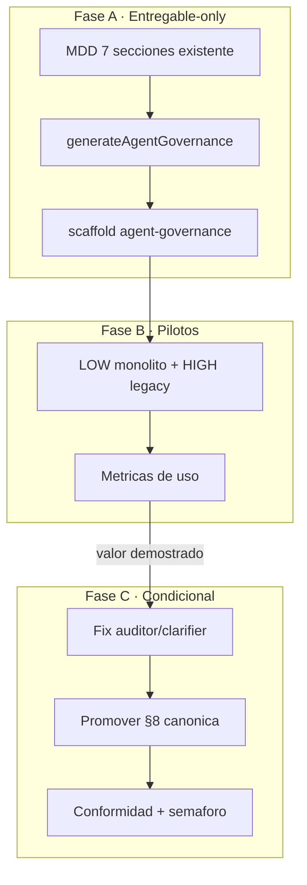

# Plan: Gobernanza de Agentes IA en TheForge

> **Estado:** Reformado tras revisión técnica (2026-06-09). Listo para **Fase A**.
> **Documento canónico:** este archivo. El plan Cursor (`.cursor/plans/`) debe mantenerse alineado.

## Resumen ejecutivo

| Qué | Cuándo | Alcance |
|-----|--------|---------|
| **Fase A** — Entregable `agent_governance` | **Ahora** | Genera `AGENTS.md` + `.cursor/**` desde MDD existente (7 §). **No toca** pipeline MDD. |
| **Fase B** — Pilotos | Tras Fase A | 2 proyectos (LOW + HIGH); medir si el scaffold se usa. |
| **Fase C** — §8 canónica | **Condicional** | Solo si Fase B aporta valor **y** se resuelve el loop auditor/clarifier (~16 min). |

**Objetivo final (usuario):** modo híbrido — §8 en MDD + entregable con archivos listos — alcanzado **por fases**, no de golpe.

**Principio rector:** en Fase A los archivos generados son la **única SSOT** → cero drift, cero conformidad §8↔archivos.

---

## Decisiones fijadas

- **Modo híbrido** (§8 + entregable) — objetivo final vía fases A → B → C.
- **Complejidad:** LOW, MEDIUM, HIGH (mínimo en LOW).
- **Stack-agnóstico:** derivación desde señales genéricas del MDD; IMJ = *familia de plantillas*, no output por defecto.
- **Entregable:** archivos reales + `MANIFEST.json` + descarga ZIP en Workshop.

---

## 0. Por qué se reformó el plan original

La propuesta original iba directa a **§8 canónica** + entregable + conformidad + semáforo. Revisión contra el código encontró tensiones:

| Hallazgo | Evidencia | Consecuencia |
|----------|-----------|--------------|
| **§8 canónica empeora runtime ya degradado** | MDD ~16 min por loop auditor/clarifier + `missingSections` fantasma. `validateMddStructure` exige TODAS las secciones canónicas. | 8.ª sección = +1 nodo LLM + más superficie de auditoría sobre problema activo. |
| **Drift §8↔archivos es auto-infligido** | `MANIFEST.json` + `conformance.checkAgentGovernanceVsMdd()` solo hacen falta si §8 es canónica (dos SSOT). | En entregable-only los archivos **son** la SSOT. |
| **Topología desactualizada** | Grafo fusionó Security+Integration en `security_integration` ([`mdd-graph.ts`](../../apps/api/src/modules/ai-analysis/graph/mdd-graph.ts)). | "Paralelo a Security" ya no aplica. |
| **Overfit IMJ en derivación** | Tabla original citaba Ariadne/Dokploy/`@scope/ui` como default. | Contradice "funcionar para todo". |

**Decisión:** cortar ~60 % del alcance inicial; entregar valor en Fase A sin comprometer el pipeline MDD.

---

## 1. Problema y oportunidad

Hoy TheForge gobierna **cómo se escribe el MDD** (7 § + wizard inmutable), pero **no** gobierna **cómo un agente implementa** en el repo destino.

| Existe hoy | Falta |
|------------|-------|
| Wizard de patrones (`mdd-governance-patterns`) | Derivar **skills, rules, roles, MCP, subflujos** del stack y dominio |
| [`THEFORGE-DOC-CONSUMPTION-GUIDE.md`](../THEFORGE-DOC-CONSUMPTION-GUIDE.md) (manual) | Artefactos ejecutables versionados con el proyecto |
| Mención aspiracional a `.cursorrules` | `AGENTS.md` + `.cursor/**` generados |

**Patrón de referencia:** monorepo IMJ (`AGENTS.md` + `.cursor/rules` + `.cursor/skills` + orquestador). Usar como **patrón**, no copiar verbatim.

**Estándares externos (2026):** [AGENTS.md](https://agents.md/), [Cursor Rules](https://cursor.com/docs/rules), Kurka Labs starter kit, AAIF (AGENTS.md + MCP).

---

## 2. Arquitectura por fases



### Fuera de alcance inmediato (Fase A)

- `mdd-structured.schema.ts`, grafo LangGraph, manager, sanitize
- `semaphore.service.ts`, `conformance.service.ts` (§8)
- `mddSectionRegen.ts` (regenerar §8)
- `ai-governance-prompt.md` (nodo MDD §8)

---

## 3. Fase A — Entregable `agent_governance` (IMPLEMENTAR AHORA)

### 3.1 Contrato

- **Clave:** `agent_governance` en `DeliverableKind` + [`DELIVERABLES_BY_COMPLEXITY`](../../packages/shared-types/src/deliverables-matrix.ts).

```typescript
LOW:    ["user_stories", "tasks", "agent_governance"]
MEDIUM: ["spec", "api_contracts", "ux_ui_guide", "agent_governance", "tasks"]
HIGH:   [
  "mdd_canonical", "blueprint", "spec", "architecture", "use_cases",
  "user_stories", "ux_ui_guide", "api_contracts", "logic_flows",
  "agent_governance", "tasks", "infra",
]
```

| Nivel | Posición de `agent_governance` | Motivo |
|-------|-------------------------------|--------|
| LOW | Tras `tasks` | Proyecto pequeño; checklist primero |
| MEDIUM / HIGH | Antes de `tasks` | Scaffold antes del checklist de implementación |

### 3.2 Implementación API

| Pieza | Archivo / acción |
|-------|------------------|
| Tipo + matriz | [`deliverables-matrix.ts`](../../packages/shared-types/src/deliverables-matrix.ts) |
| Despacho cascada | [`projects.service.ts`](../../apps/api/src/modules/projects/projects.service.ts) |
| Generación LLM | `generateAgentGovernance()` en capa `ai` |
| Prompt | `apps/api/src/modules/ai/prompts/agent-governance-prompt.md` (nuevo) |

**Inputs del prompt:** MDD markdown (7 §) + `appendMddGovernancePatternsToPrompt()` + Blueprint (si existe) + complejidad.

### 3.3 Salida del entregable

```
agent-governance/
├── MANIFEST.json              # archivos + templateVersion
├── AGENTS.md
├── CLAUDE.md                  # @AGENTS.md
├── .cursor/
│   ├── rules/                 # git-commits, stack-*, orchestrator
│   ├── skills/                # <project>-package/SKILL.md
│   ├── references/            # workflows.md, handoff prompt
│   └── mcp.json               # placeholders
└── docs/
    └── agent-onboarding.md    # derivado; enlaza THEFORGE-DOC-CONSUMPTION-GUIDE
```

### 3.4 Derivación stack-agnóstica

| Señal genérica en MDD | Artefacto |
|-----------------------|-----------|
| §2 backend (NestJS/Express/Django/…) | `stack-backend.mdc` parametrizado |
| §2 frontend (React/Vue/Svelte/…) | `stack-frontend.mdc` |
| §2 monorepo multi-paquete | `AGENTS.md` anidados (solo HIGH) |
| §2 design system / paquete UI | skill paquete UI |
| §4 API + validación (Zod/OpenAPI/…) | `api-contracts.mdc` |
| §6 auth (JWT/OAuth/MFA/…) | `security-auth.mdc` |
| §7 contenedores/PaaS | skill deploy parametrizado |
| Wizard [X] Hexagonal/CQRS/… | `architecture-patterns.mdc` |
| §1 MCP externo (Ariadne/Figma/…) | skill + rule MCP + anclaje template |

> IMJ (Ariadne, Dokploy, `@scope/ui`) se activa **solo** si el MDD los menciona.

### 3.5 Profundidad por complejidad

| Nivel | Contenido |
|-------|-----------|
| **LOW** | `AGENTS.md` + 1–2 rules `alwaysApply`; sin skills obligatorias |
| **MEDIUM** | + 3–5 rules + 1 skill dominio + `workflows.md` |
| **HIGH** | Árbol `.cursor` completo + `mcp.json` + handoff + nested `AGENTS.md` si monorepo |

**Caps LOW:** máx. 8 rules, máx. 5 skills; `alwaysApply` solo 1–2.

### 3.6 Subflujos (`references/workflows.md`)

| Nivel | Subflujos |
|-------|-----------|
| Todos | Feature, Debug, Consumo docs TheForge |
| MEDIUM+ | Refactor (MCP si declarado), PR/Review |
| HIGH | Auditoría módulo, Publicación paquete (explícito + QA) |

Cada uno: **trigger** + **roles** + **gates** + **archivos a cargar**.

### 3.7 UI Workshop

- Entrada en cascada de entregables.
- Visualización del árbol generado.
- Descarga ZIP del scaffold.

### 3.8 Checklist Fase A

- [x] `agent_governance` en `DeliverableKind` + `DELIVERABLES_BY_COMPLEXITY`
- [x] `generateAgentGovernance()` en cascada de entregables
- [x] `agent-governance-prompt.md` (LOW/MEDIUM/HIGH + derivación stack-agnóstica)
- [x] `MANIFEST.json` + árbol `agent-governance/` (parse + persistencia `agentGovernanceContent`)
- [x] UI: generar + visualizar + ZIP (`AgentGovernancePanel`, `downloadAgentGovernanceZip`)
- [x] Fila en [`ENTREGABLES-SDD-VALIDACION.md`](../notebooklm/ENTREGABLES-SDD-VALIDACION.md)
- [x] **Sin tocar:** schema MDD, grafo, manager, parser, semáforo, sanitize, conformidad
- [ ] **Smoke E2E:** migración DB aplicada + generación real en Workshop

---

## 4. Fase B — Pilotos y medición

**Cuándo:** tras cerrar checklist Fase A.

| Piloto | Perfil |
|--------|--------|
| P1 | LOW — monolito simple |
| P2 | HIGH — monorepo legacy |

**Métricas:**
- ¿Se usa `AGENTS.md`/rules o se ignoran?
- ¿El agente implementador arranca más rápido?
- ¿Cuántas rules/skills se editan manualmente post-generación?

**Salida:** ajustar plantillas del prompt; **go/no-go** para Fase C.

---

## 5. Fase C — §8 canónica (CONDICIONAL)

### Precondiciones (ambas obligatorias)

1. Fase B demuestra valor real del scaffold.
2. Resuelto loop auditor/clarifier + `missingSections` fantasma.

### 5.1 Agente §8

| Opción | Veredicto |
|--------|-----------|
| **A) Nodo `ai_governance`** | ✅ Elegido para Fase C |
| B) Extender `security_integration` | Rechazado — mezcla infra+IDE |
| C) Extender `clarifier` | Rechazado — clarifier saturado |

**Slot en grafo actual:** tras `security_integration`, antes de `llm_formatter` (o paralelo a `diagram_injector`).

### 5.2 Esqueleto §8

```markdown
## 8. Gobernanza de agentes IA
### 8.1 Herramientas y runtime
### 8.2 Entrada cross-tool (AGENTS.md + shim)
### 8.3 Reglas (.cursor/rules/)
### 8.4 Skills (.cursor/skills/)
### 8.5 Roles y subflujos
### 8.6 MCP y contexto externo
### 8.7 Memoria y docs de apoyo
### 8.8 Checklist de arranque
```

### 5.3 Archivos a tocar (solo Fase C)

`mdd-structured.schema.ts`, `mdd-structured-to-markdown.ts`, `mdd-merge-structured.ts`, `mdd-graph.ts`, `mdd-manager.node.ts`, `mdd-sanitize.ts`, `auditor-prompt.md`, `mdd-constitution-skeleton.md`, `ai-governance-prompt.md`, `mddSectionRegen.ts`, `mdd-markdown-parser.ts`, `semaphore.service.ts`, `conformance.service.ts`, `estimation.service.ts`, `agent-sdd-tools.ts`, `legacy-mdd-constitution-sections.util.ts`.

### 5.4 Semáforo / conformidad (Fase C)

| Nivel | Comportamiento §8 |
|-------|-------------------|
| LOW | Informativo — no bloquea VERDE |
| MEDIUM+ | Cuenta para score auditor |
| HIGH | Conformidad entregable↔§8 bloqueante si falta plan `AGENTS.md` |

---

## 6. Riesgos y mitigaciones

| Riesgo | Mitigación |
|--------|------------|
| Runtime: §8 suma minutos al MDD lento | Fase C bloqueada hasta fix auditor/clarifier |
| Drift §8↔archivos | Fase A: archivos = SSOT. Fase C: `MANIFEST.json` + conformidad |
| Overfit IMJ | Derivación stack-agnóstica §3.4 |
| Explosión de rules | Caps por complejidad; `alwaysApply` 1–2 |
| Plantillas obsoletas | `MANIFEST.templateVersion` |
| Scaffold sin uso | Fase B mide antes de 15 archivos de pipeline |

---

## 7. Acta de debate (cerrada 2026-06-09)

| # | Pregunta | Decisión | Motivo |
|---|----------|----------|--------|
| 1 | ¿§8 canónica o `customSections`? | Entregable-only primero; canónica en Fase C condicional | Runtime + drift |
| 2 | ¿Agente `ai_governance` vs Integration? | Nodo nuevo (A), solo Fase C | Separación; slot tras `security_integration` |
| 3 | ¿Orden en cascada? | Antes de `tasks` en MEDIUM/HIGH; tras `tasks` en LOW | Scaffold antes del checklist en proyectos grandes |
| 4 | ¿Archivos reales o spec? | Archivos + `MANIFEST.json` + ZIP Workshop | Decisión usuario |
| 5 | ¿Nested `AGENTS.md`? | Solo HIGH si §2 declara monorepo multi-paquete | Evitar ruido |
| 6 | ¿Hooks Claude? | Fuera de alcance; AGENTS.md + shim CLAUDE.md | Portabilidad cross-tool |
| 7 | ¿Duplicar consumption guide? | `agent-onboarding.md` derivado + enlace | Evitar drift |
| 8 | ¿Límite tokens? | LOW: máx. 8 rules, 5 skills; `alwaysApply` 1–2 | Proteger context window |

**Revisor:** agente revisor (debate técnico contra código TheForge). **Validación humana:** pendiente antes de ejecutar Fase A.

---

## 8. Prompt para el agente implementador (Fase A)

> Implementa **solo Fase A** de `docs/plans/PLAN-MDD-SECCION-GOBERNANZA-IA.md`.
> Añade `agent_governance` a la matriz de entregables, crea `generateAgentGovernance()` + `agent-governance-prompt.md`, integra en cascada y Workshop (árbol + ZIP).
> **No toques** schema MDD, grafo LangGraph, semáforo ni conformidad.
> Derivación stack-agnóstica desde MDD §1–§7; IMJ solo si el MDD lo menciona.
> Tras implementar: actualizar checklist §3.8 y documentar en `ENTREGABLES-SDD-VALIDACION.md`.

---

## 9. Todos del plan (alineados a fases)

| ID | Fase | Tarea | Estado |
|----|------|-------|--------|
| `write-plan-md` | 0 | Materializar este documento + acta | ✅ Hecho |
| `reviewer-debate` | 0 | Debate 8 preguntas | ✅ Hecho |
| `deliverable-agent-governance` | A | Matriz + `generateAgentGovernance()` + prompt | ✅ Hecho |
| `workshop-ui` | A | UI generar + árbol + ZIP | ✅ Hecho |
| `doc-entregables` | A | Fila en ENTREGABLES-SDD-VALIDACION | ✅ Hecho |
| `pilots-phase-b` | B | 2 pilotos + métricas | Bloqueado (Fase A) |
| `fix-auditor-perf` | C | Loop auditor/clarifier | Bloqueado (Fase B) |
| `design-s8-skeleton` | C | Esqueleto §8 + `ai-governance-prompt.md` | Bloqueado (precondiciones) |
| `schema-pipeline-s8` | C | Schema, grafo, manager, render | Bloqueado |
| `conformance-semaphore` | C | Parser §8, semáforo, conformidad | Bloqueado |
