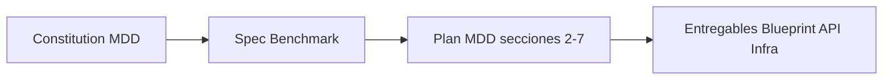

# TheForge — Índice de Arquitectura

**Fuentes:** `blueprint.md`, `mdd.md`, [STAGE-SDD.md](STAGE-SDD.md) (Stage / Prisma / Falkor SDD).  
**Propósito:** Single source of truth del flujo, contrato IA y despliegue. Uso por el agente y por implementaciones.

---

## 1. Flujo de TheForge (resumen)

```
[Entrada] → Entrevista proactiva (IA) → MDD en sesión → Semáforo → [ROJO|AMARILLO|VERDE]
                                                                         ↓
[VERDE]   → Motor de estimación (MXN/h) → Entregables: MDD, Blueprint, OpenAPI, Scaffold
```

- **Entrevista:** Trabajo asíncrono; cada interacción persiste en `Session.chatLog`; la IA retoma por `contextStep` y log.
- **Semáforo:** Valida el JSON del proyecto (entidades, business_core, edge_cases, field_types, mapeo UX). Ver §4.
- **Estimación:** Fórmula fija (no IA). Ver §5.
- **Entregables:** Solo cuando estado = VERDE: Master Design Doc, Implementation Blueprint, OpenAPI Spec, Project Scaffold + `.cursorrules`.
- **MDD como Constitución (SDD):** El MDD es el documento "Constitución" del proyecto (Source of Governance en Specification-Driven Development). Todos los entregables (Blueprint, OpenAPI, Scaffold) deben adherirse a él y validarse contra él antes de considerarse listos.



**Spec antes del MDD:** Spec = Benchmark + clarifiedScope. Es el paso explícito antes de cerrar el MDD; el Clarifier usa el Spec (si está presente) para §1. Revísalo en la pestaña Spec antes de dar por cerrado el MDD.

**Estructura MDD:** El MDD tiene exactamente 7 secciones: 1. Contexto, 2. Arquitectura y Stack, 3. Modelo de Datos, 4. Contratos de API, 5. Lógica y Edge Cases, 6. Seguridad, 7. Infraestructura. Semáforo y estimador dependen de esta numeración.

**Validación SDD:** Ver [Entregables y validación SDD](ENTREGABLES-SDD-VALIDACION.md) para la estructura canónica del MDD, el mapeo de documentos (Guía UX/UI, Blueprint, API, Flujos, Infra) con Specification-Driven Development y Architecting Agentic Systems. **Plan 10/10:** mismo doc §6 (plan por fases). §7 estado de implementación: Spec, Tasks, Conformance, Verifier, HITL y orden en UI implementados.

**MCP AriadneSpecs vs Grafo SDD:** El MCP **AriadneSpecs** (código indexado del cliente) es **externo** al monorepo The Forge y se invoca por HTTP desde la API (`THEFORGE_MCP_URL`, JSON-RPC Streamable HTTP). Especificación del servidor: monorepo **Ariadne** (`MCP_HTTPS.md`, `mcp_server_specs.md`, `MCP_AYUDA.md`). El grafo documental SDD vive en **FalkorDB local** (`FALKORDB_SDD_URL`). No son intercambiables. Detalle: [MCP-ARQUITECTURA-THEFORGE.md](MCP-ARQUITECTURA-THEFORGE.md), [integracion-theforge/README.md](integracion-theforge/README.md). Histórico / roadmaps no prioritarios: [../archive/README.md](../archive/README.md).

**Etapas como cambios legacy (junio 2026):** Cada cambio es un `Stage` (`ordinal`). **Etapa 1** = línea base **AS-IS** (MDD Inicial vía Ariadne + MDD canónico con inyección §3–§5). **Etapas 2+** = MDD de **cambio** con línea base de la etapa anterior. FalkorDB sincroniza `:LegacyStage` con `DERIVED_FROM`. BRD/To-Be siguen siendo **opcionales** por etapa (ver gates en legacy-flow; el flag `requireBrdTobeGate` en Prisma ya no bloquea el pipeline MDD lean). Detalle: [LEGACY-FLOW-AS-IS-MDD.md](LEGACY-FLOW-AS-IS-MDD.md), [PLAN-BRD-TOBE-MANUAL-PROCESOS-THEFORGE.md](PLAN-BRD-TOBE-MANUAL-PROCESOS-THEFORGE.md). **Integración legacy + producto nuevo (dos equipos):** [LEGACY-NEW-INTEGRATION-GUIDE.md](LEGACY-NEW-INTEGRATION-GUIDE.md) (también en Ayuda Workshop → *Integración Legacy ↔ Nuevo*).

**Pipeline MDD lean (LangGraph):** vive en `apps/api/src/modules/ai-analysis/` (no en `modules/ai`). Cuatro generadores LLM (Clarifier §1, Architect §2–§5, Security §6, Integration §7) + **Quality Gate** + Manager delgado + formatter/diagram deterministas. Detalle de migración: [mdd-lean-migration.md](mdd-lean-migration.md). Implementación: [apps/api/src/modules/ai-analysis/README.md](../../apps/api/src/modules/ai-analysis/README.md).

**Quality Gate:** nodo `mdd-quality-gate.node.ts` — paso determinista + paso LLM opcional (tier B). Salida `{ ok, blockers, gaps[] }`. Si hay gaps, el Manager re-enruta generadores (máx. 2 rondas). Sustituye el antiguo Auditor + loop `delivery_gate`. El semáforo Workshop sigue siendo heurístico (`SemaphoreService`); el QG valida coherencia del MDD antes de `graph_populator`.

**Tiers de modelo C / B / A:** por instancia BYOK (`ProviderInstance`): `chatModel` (**C**, Ligero), `graphChatModel` (**B**, Estándar), `architectChatModel` (**A**, Premium). Fallback runtime: architect → graph → chat. Labels UI: `apps/web/src/utils/provider-model-tier-labels.ts`.

**Cola MDD BullMQ (`theforge-mdd`):** `MddQueueService` encola modos `pipeline`, `manager`, `section`, `legacy`. Jobs largos con worker BullMQ (`REDIS_URL`); fallback in-memory en dev. **Cancelación cooperativa:** `POST /projects/:id/mdd/cancel` — botón **Detener** en Workshop; jobs activos abortan entre pasos del grafo vía `cancelledProjects`. Tras reinicio del API, `recoverOrphanedActiveJobs` marca jobs huérfanos como fallidos.

**Chat → jobs de sección:** `direct_edit` en tab MDD no usa perfil document 32K en chat; delega a job `section` del pipeline y el front hace poll (`pollMddJob`). Comandos `/` regeneran una § concreta.

**MCP servidor The Forge (`@theforge/mcp-server`):** paquete en `packages/mcp-server` que expone la **API Nest** como herramientas MCP (stdio o HTTP); auth `MCP_M2M_SECRET`. Documentación: [THEFORGE-MCP-SERVER.md](THEFORGE-MCP-SERVER.md). No sustituye a AriadneSpecs.

**Grupos de proyectos:** agrupan proyectos en la lista Home (`ProjectGroup`, API `GET/POST/PATCH/DELETE /project-groups`). Admin puede crear/renombrar/borrar grupos, mover proyectos (`PATCH /projects/:id` con `groupId`) y reordenar (`move-to-first`). Tools MCP: `list_project_groups`, `create_project_group`, etc. (ver [THEFORGE-MCP-SERVER.md](THEFORGE-MCP-SERVER.md)).

**Merge de proyectos (Paso 0):** `POST /projects/merge` combina varios proyectos fuente en uno destino (modo `targetMode`: proyecto existente o nuevo). Útil para unificar DBGA/Spec de exploraciones paralelas antes de cerrar el MDD. Tool MCP: `merge_projects`. Detalle en [THE-FORGE-V1-RELEASE.md](../THE-FORGE-V1-RELEASE.md) §9.

**Flujo Workshop agéntico:** Chat → `AgentSupervisor` (etapa activa `Stage`) → ingest MDD a Falkor SDD por `stageId` → evaluador legacy opcional → respuesta puede incluir `evaluatorCritique`. Memoria episódica: `GET /agent-supervisor/episodic/:projectId`. **API REST:** `GET/PATCH /projects/:id` devuelve y acepta `mddContent` / `status` / `precisionScore` / `estimation` **aplanados** desde la etapa principal; `PATCH` admite `stageId` opcional para escribir el MDD en otra etapa.

---

## 2. Estructura del monorepo (pnpm + Turborepo)

Gestor: **pnpm** (`pnpm-workspace.yaml`, `pnpm-lock.yaml`, `.npmrc` con `node-linker=hoisted`). Scripts en `package.json` raíz vía Turbo; filtros: `pnpm --filter @theforge/api …`.

```
/
├── apps/
│   ├── api/          # NestJS
│   └── web/          # React (Vite) + Tailwind
├── packages/
│   ├── database/       # Prisma schema + client
│   ├── shared-types/   # DTOs e interfaces
│   ├── business-rules/ # Reglas puras compartidas (estimación MXN, parse infra)
│   ├── mcp-server/     # MCP propio (API Nest como tools)
│   └── config/         # TS, ESLint, Tailwind
├── docker-compose.yml
├── pnpm-workspace.yaml
├── turbo.json
└── .cursor/rules/
```

Desarrollo local: `pnpm install` → `pnpm run db:generate` → `pnpm run dev:local` (ver [README-LOCAL.md](../../README-LOCAL.md)).

---

## 3. IA agnóstica: BYOK + OpenRouter (contrato estable)

### 3.1 Contrato del proveedor (adapters)

La capa de **adapters** implementa una interfaz técnica común (`LLMProvider`). En producción el runtime resuelve **instancias BYOK del tenant** (`ProviderInstance` en Ajustes → Proveedores de IA): clave cifrada por usuario, tres modelos por tier (C/B/A). Fallback de plataforma: **OpenRouter** vía env (`OPENROUTER_API_KEY` o alias). No debe haber imports de SDKs de LLM fuera de `apps/api/src/modules/ai/adapters/` y factories en `ai-analysis/llm/`.

**Interfaz mínima (blueprint):**

- `generateResponse(prompt: string, history: Array<{role, content}>): Promise<string>`
- `parseChecklist(text: string): Promise<ChecklistResult>`

**Capacidades de negocio (MDD) construidas sobre el contrato:**

- `entrevistar()` → uso de `generateResponse` + persistencia en Session.
- `analizarContexto()` → idem.
- `generarBlueprint()` → idem + posible uso de `parseChecklist`.

### 3.2 Reglas de implementación

| Regla             | Detalle                                                                                                               |
| ----------------- | --------------------------------------------------------------------------------------------------------------------- |
| **Strategy**      | `LLMProvider` como interfaz; implementación `OpenRouterAdapter` (OpenAI SDK + `baseURL` OpenRouter).                    |
| **Configuración** | Instancia activa del usuario (`UserProvidersService` / `ProviderInstancesService`) o `resolvePrimaryChatRuntime()` en `llm-config.ts` (env OpenRouter). |
| **Factory**       | `createDbgaLLM` (C), `createGraphLLM` (B), `createArchitectLLM` (A) en `ai-analysis/llm/`; legacy `createLLMProvider()` → `OpenRouterAdapter`. |
| **Resiliencia**   | try/catch y logs estructurados en todas las llamadas a los adapters (regla en architect-behavior).                    |

### 3.3 BYOK tenant (UI Ajustes)

- **Instancias:** cada usuario administra proveedores (OpenRouter, OpenAI-compatible, etc.) con `chatModel`, `graphChatModel`, `architectChatModel`.
- **Tiers:** C = chat Workshop / intent router; B = generadores §1/§6/§7, Quality Gate, entregables; A = Architect §2–§5 y coordinador legacy.
- **UI:** `SettingsView` → pestaña **Proveedores de IA** (`ProviderInstancesCard`, badges Premium / Estándar / Ligero).

### 3.4 Variables de entorno (fallback plataforma / OpenRouter)

- **Clave:** `OPENROUTER_API_KEY` (o alias `AI_API_KEY` / `OPENAI_API_KEY`) cuando no hay instancia BYOK activa.
- **URL / modelos:** `OPENROUTER_BASE_URL` (default `https://openrouter.ai/api/v1`), `OPENROUTER_CHAT_MODEL` (default `nousresearch/hermes-3-llama-3.1-405b`), `OPENROUTER_EMBEDDING_MODEL` (default `openai/text-embedding-3-small`), opcional `OPENROUTER_EMBEDDING_API_KEY`, cabeceras `OPENROUTER_HTTP_REFERER` / `OPENROUTER_APP_TITLE`.
- **Embeddings off:** `LLM_EMBEDDINGS_PROVIDER=none`.
- **Grafo MDD:** `LANGGRAPH_RECURSION_LIMIT` (10–500, default 100).

Lógica de conexión en `adapters/`, `llm-config.ts` y resolución BYOK en `user-providers/`.

---

## 4. Semáforo del MDD

Servicio en backend (`SemaphoreService`) que combina **complejidad del proyecto** (`ComplexityLevel`), **entregables** (LOW/MEDIUM) y **JSON normalizado del MDD** de la **etapa activa** (`normalizeMddContent` → string JSON con `db_entities`, `business_core`, `edge_cases`, `field_types`, opcionalmente `constitution`). El API expone el MDD también como campos de primer nivel del proyecto por compatibilidad.

### 4.1 Por complejidad

| Nivel   | Resumen |
| ------- | ------- |
| **LOW** | Historias de usuario + tareas sustanciales; Figma si `hasUxTeam`. |
| **MEDIUM** | Cinco gates: spec o casos de uso, contratos API, guía UX **o** flujos, **historias de usuario**, tareas. Los cinco cumplidos → VERDE (~95); 3–4 → AMARILLO (~70); menos → ROJO. |
| **HIGH** | Ver §4.2. |

### 4.2 HIGH (MDD canónico + alivio de grafo + Constitución Cursor)

| Estado       | Condición (orden conceptual) |
| ------------ | ---------------------------- |
| **ROJO**     | Sin JSON válido; o sin entidades / sin `business_core` sustancial. |
| **AMARILLO** | Hay entidades y núcleo de negocio pero faltan `edge_cases` o `field_types` **y** no hay alivio de grafo SDD; o falta Figma con equipo UX (~85); o incumplen puertas **Constitución Cursor** cuando `constitution.template_detected` (mapa de contextos, glosario, Gherkin §5, bloqueantes abiertos, «¿Por qué?»/ADR en §2 — ver `semaphore.service.ts`). |
| **VERDE**    | Checklist MDD completo y Figma si aplica (~95). **O** faltan textos edge/field pero el **Grafo SDD** (Falkor) no reporta dependencias huérfanas entre endpoint de API y entidad de dominio (`sddDomainGraphOk`) → VERDE con precisión **92** (The Forge conserva esta señal frente a solo MaxPrime). |

Las puertas de constitución **no** sustituyen ROJO por entidades vacías; pueden bajar un VERDE (p. ej. 95 o 92) a AMARILLO si la plantilla §1–§5 está incompleta. Si el resultado base ya es AMARILLO con score más bajo que el de constitución, se conserva el más estricto.

El agente debe comprobar estado VERDE antes de generar código (architect-behavior).

---

## 5. Motor de estimación (MXN, México 2026)

- **Fórmula (detalle en código):** horas base = entidades×12 + pantallas×16 + endpoints extra×4; multiplicadores por etiquetas `TechnicalMetadata`; horas fijas (metadata + sección infra); si el semáforo **no** es VERDE, buffer **1.25**; **total MXN** = horas totales × **$1 050/h** (tarifa única del estimador). Las cifras **Architect $1 500, Back $950, Front $850, UX $750** son referencia por rol / vista de equipo (mismo paquete).
- **Fuente única de verdad:** `packages/business-rules` (`computeCostEstimation`, constantes y multiplicadores). El servicio Nest `CostCalculatorService` delega allí; el front (`apps/web/src/utils/costCalculator.ts`) importa el mismo paquete para el panel del Workshop.
- **Lógica pura; no IA.** No alterar fórmulas ni tarifas sin acuerdo explícito y sin actualizar este índice.

---

## 6. Despliegue Dokploy (Docker)

### 6.1 Servicios (`docker-compose.yml` en la raíz)

| Servicio                 | Rol                                                                 | Imagen / build                          |
| ------------------------ | ------------------------------------------------------------------- | --------------------------------------- |
| **theforge-db**          | PostgreSQL                                                          | `postgres:15-alpine`                    |
| **theforge-redis-queue** | **Redis dedicado a BullMQ** (cola de cascada `generate-deliverables`; obligatorio en el stack documentado) | `redis:7-alpine`                        |
| **theforge-falkor-sdd**  | Grafo documental SDD (Cypher, MDD, ingest); **no** es el grafo índice de código TheForge | `falkordb/falkordb:latest`              |
| **theforge-api**         | NestJS API                                                          | Build multi-stage `apps/api/Dockerfile` |
| **theforge-web**         | Front estático                                                      | Build `apps/web/Dockerfile` (Nginx)     |

**Importante:** Hay **dos** usos de protocolo Redis en el stack: (1) **FalkorDB** para el grafo SDD (`FALKORDB_SDD_URL`); (2) **Redis de cola** para **BullMQ** (`REDIS_URL` → `theforge-redis-queue`). No son intercambiables. En despliegue oficial, **BullMQ + Redis de cola son obligatorios** para entregables asíncronos resilientes (evitar timeouts HTTP en cascadas largas); vaciar `REDIS_URL` fuerza fallback síncrono solo para desarrollo excepcional.

### 6.2 Variables de entorno (api) — resumen

- **Core:** `DATABASE_URL`, `PORT` (opcional)
- **Cola asíncrona (obligatorio en stack Dokploy/compose de referencia):** `REDIS_URL` (p. ej. `redis://theforge-redis-queue:6379`) para **BullMQ**
- **IA:** `OPENROUTER_API_KEY` (o `AI_API_KEY` / `OPENAI_API_KEY`), opcional `OPENROUTER_*`; opcional `OPENAI_EMBEDDING_DIM` (dimensión sin probe al arranque)
- **Grafo SDD:** `FALKORDB_SDD_URL` y/o `FALKORDB_URL` (en Docker: `redis://theforge-falkor-sdd:6379`) — **distinto** del Redis de cola
- **TheForge (opcional, legacy):** `THEFORGE_MCP_URL`, `MCP_AUTH_TOKEN`, `THEFORGE_MCP_TIMEOUT_MS`, `THEFORGE_MCP_ASK_CODEBASE_TIMEOUT_MS` (solo `ask_codebase`; default API 15 min si omites)
- **Orquestador:** `AGENT_EVALUATOR_LEGACY` (opcional; crítica en respuesta chat)

Detalle TheForge vs IDE vs Falkor: [MCP-ARQUITECTURA-THEFORGE.md](MCP-ARQUITECTURA-THEFORGE.md).

### 6.3 Criterios "Dokploy-ready"

- **docker-compose.yml:** servicios anteriores; volúmenes para Postgres, Falkor SDD y **Redis de cola** (`theforge_redis_queue_data`).
- **Builds:** `api` y `web` multi-stage; sin depender del host.
- **Healthchecks** en `docker-compose` para `db`, `falkor-sdd`, `api`, `web`.

Cualquier nuevo servicio o variable debe reflejarse en `docker-compose.yml` y en `.env.example`.

---

## 7. Base de datos (Prisma)

Modelos principales: **Project** (entregables globales: SPEC, Blueprint, API, Infra, etc.; sin MDD monolítico), **Stage** (`mddContent`, semáforo `status`, `precisionScore`, `workflowStatus`, `estimation` 1:1), **Session** (`chatLog`, `contextStep`). **Estimation** cuelga de **Stage** (`stageId`). Enum **Status** (semáforo SDD): ROJO, AMARILLO, VERDE. Resumen visual y API: [STAGE-SDD.md](STAGE-SDD.md). Detalle Prisma en `blueprint.md` §2 y migración `packages/database/migrations/*stage_sdd*`.

---

## 8. Checklist de verificación (Principal Engineer)

- [ ] IA: ¿Runtime BYOK o fallback OpenRouter? ¿Tiers C/B/A mapeados? ¿Adapters solo en `ai/adapters/`?
- [ ] Semáforo: Reglas ROJO/AMARILLO/VERDE implementadas y usadas antes de generar código.
- [ ] Estimación: Fórmula y tarifas únicas en `packages/business-rules` (consumidas por API y web).
- [ ] Docker: `docker-compose` con api, web, db, **Redis cola (BullMQ)**, Falkor SDD; Dockerfiles multi-stage; env documentados (`.env.example`).

---

*Corpus «The Forge - by Kreo» — NotebookLM sync 2026-07-16 (pnpm). Rutas relativas al monorepo `theforge`.*
